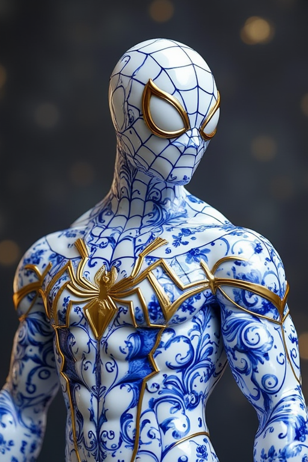
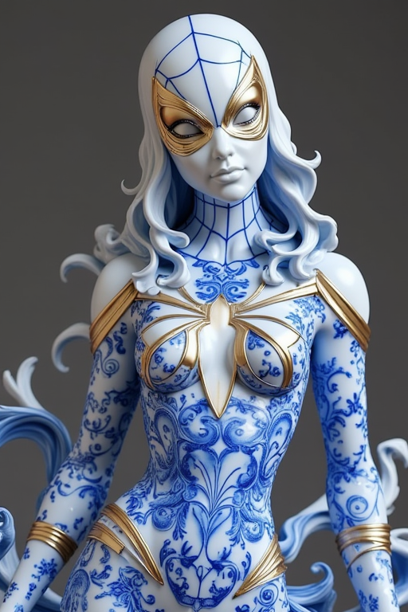
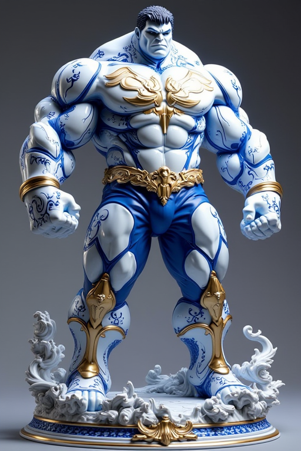
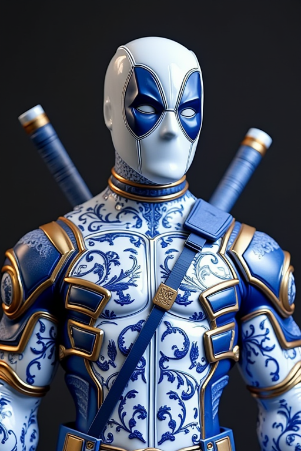
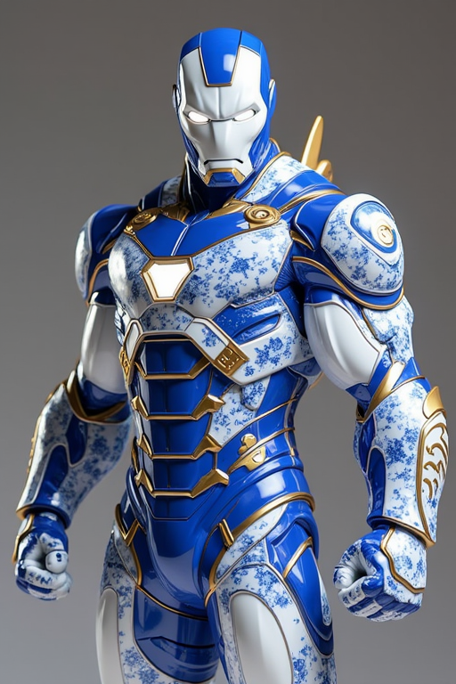
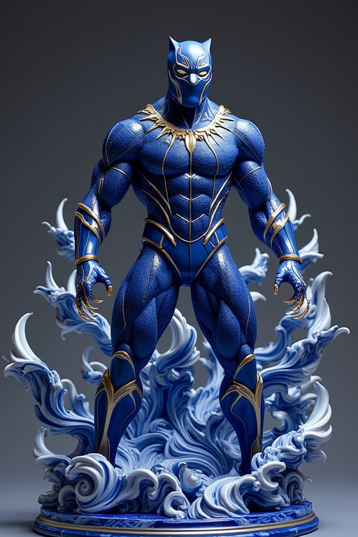

At the start of August, [Black Forest Labs](https://bfl.ai/) launched Flux - a
new image generation model. Playing with it for the last few weeks, it's
pretty great - especially if you can run it locally for maximum tweakability.
Being able to prompt without a lot of arcane directions (eg high definition,
8K, good hands, masterpiece, high quality etc) and get a good result means
much faster iteration and more experimentation. Both of which are critical for
pushing boundaries and tool adoption.

Now we're a month in, we're starting to get fine tuned models ([LoRAs - Low Rank
Adapters](https://en.wikipedia.org/wiki/LoRA_(machine_learning))) from the
community that allow you to force the generated images in a particular direction
beyond what the text prompt will do naturally.

So for example, you can take a LoRA trained on porcelain objects and apply it
to pop culture heroes. These were quick to produce and without any clean up -
which speaks to how impressive Flux is as a step up from the original Stable
Diffusion and newer SDXL models.

The next few months are going to be interesting, as the full weight of
community creators starts experimenting with these new image generation
capabilities.
