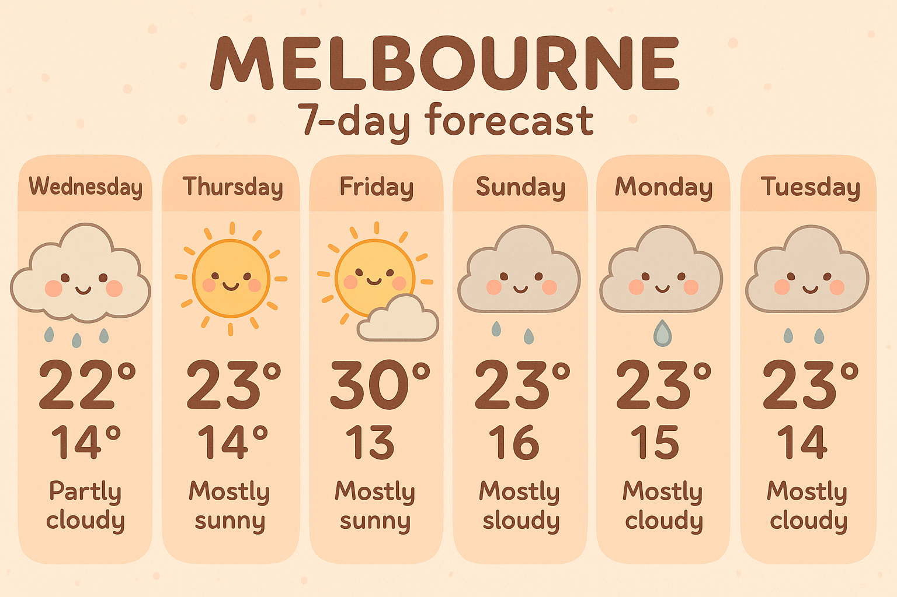
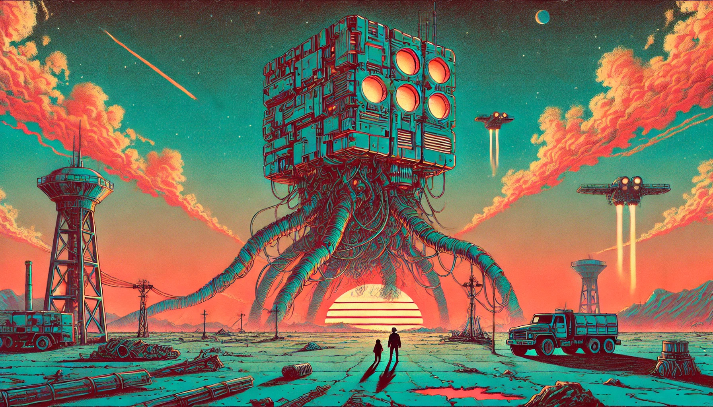
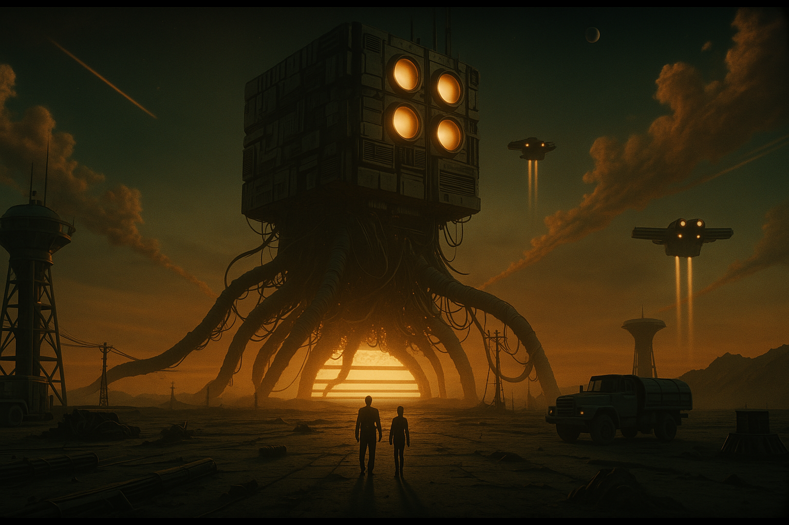
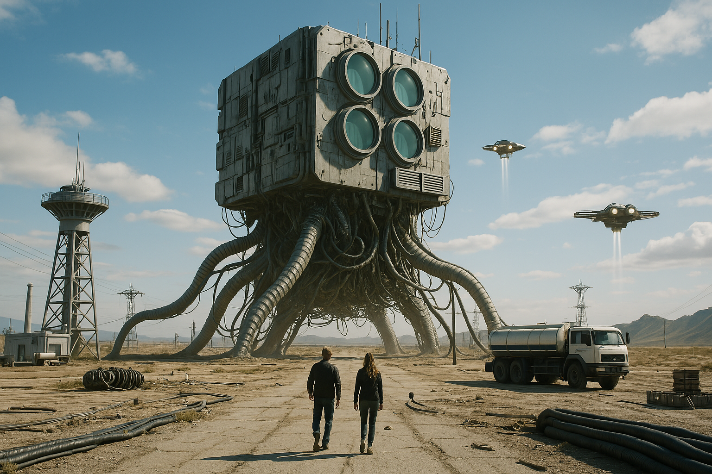

Today I have been playing around with the new image capabilities
[OpenAI](https://openai.com) rolled out into ChatGPT-4o. These changes more or
less brings it on par with what Google released recently via their Imagen model.

Probably the biggest change is leveraging the multi-modal nature of ChatGPT and
bringing its various abilities to bear in the image generation process. For
example, asking it to search the web and compile a weather forecast then turn
that into an infographic.

It's worth pointing out that this isn't perfect (as can be seen in the image
above where it misses Saturday).

The other big improvement from what image generations in ChatGPT did before is
being able to take turns and then work on the same image consistently such as
starting with an image, asking it to update the style or update elements
conceptually. While it is mostly limited to "style transfer" which is something
you can do very easily in various dedicated image generation tools already
(eg [A1111](https://github.com/AUTOMATIC1111/stable-diffusion-webui) or
[ComfyUI](https://www.comfy.org/)), being able to do this from a chat interface
feels very natural.

The images below show a starting image I created and then asked it to update
it into different styles. As you can see, it maintains image composition,
structure etc all pretty well as it recreates each one.

*A huge robot with a sunset in an illustrative style*

*A huge robot with a sunset in a cinematic style*

*the same robot but translated into an Unreal Engine game style*

Overall, this is a big update and should be interesting to see how you can blend
uploaded information and generative capabilities together.
