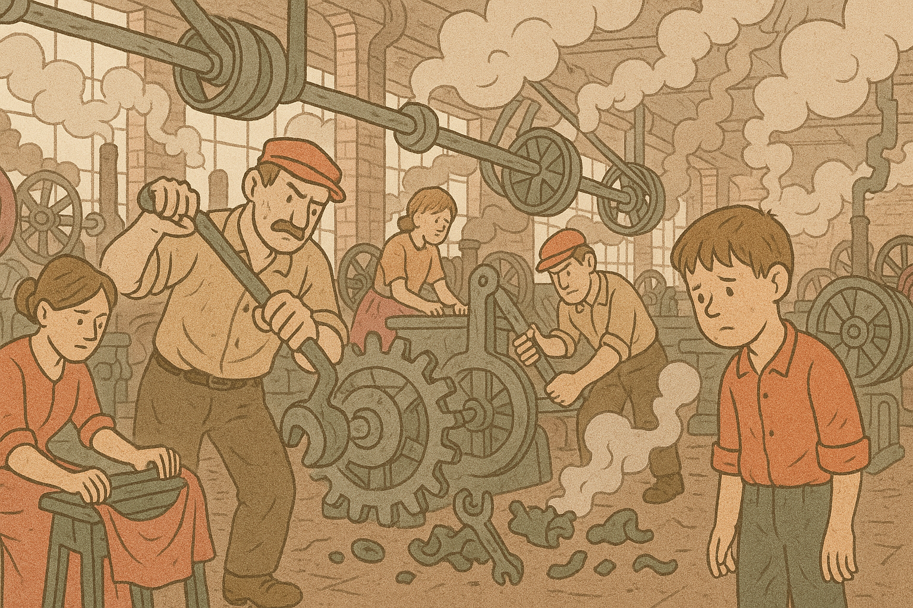
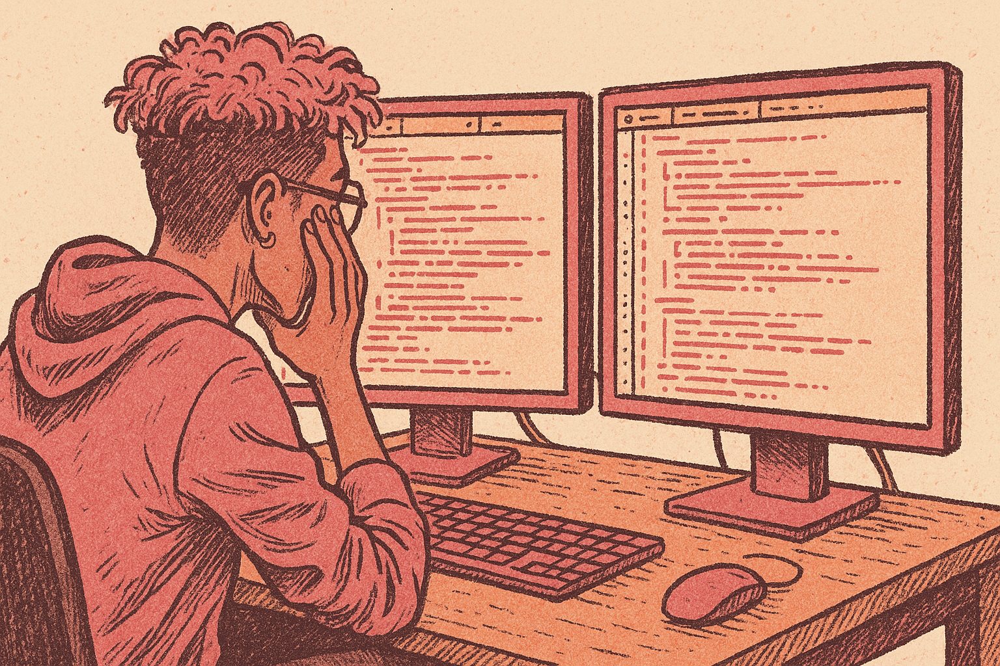
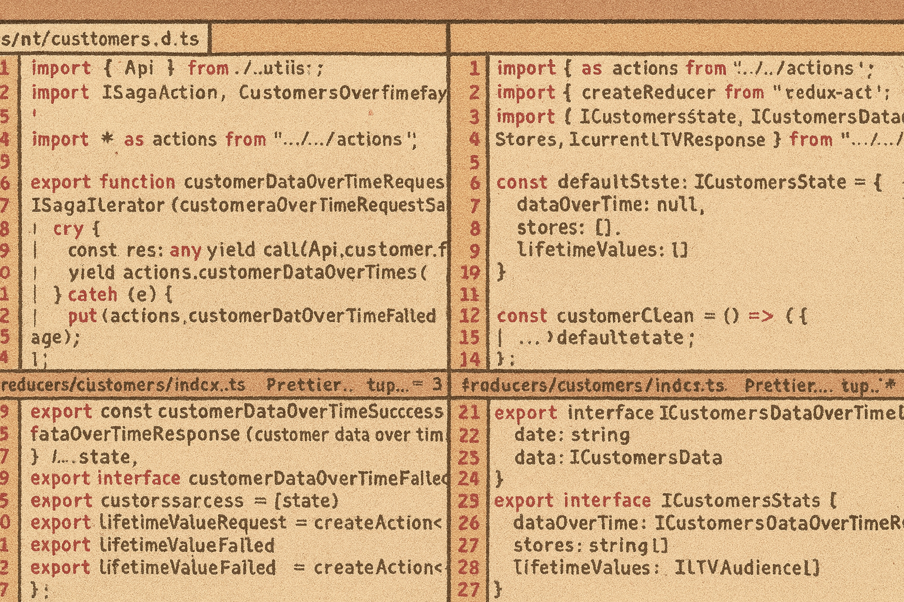
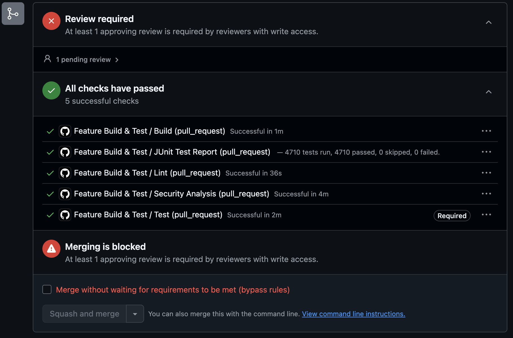
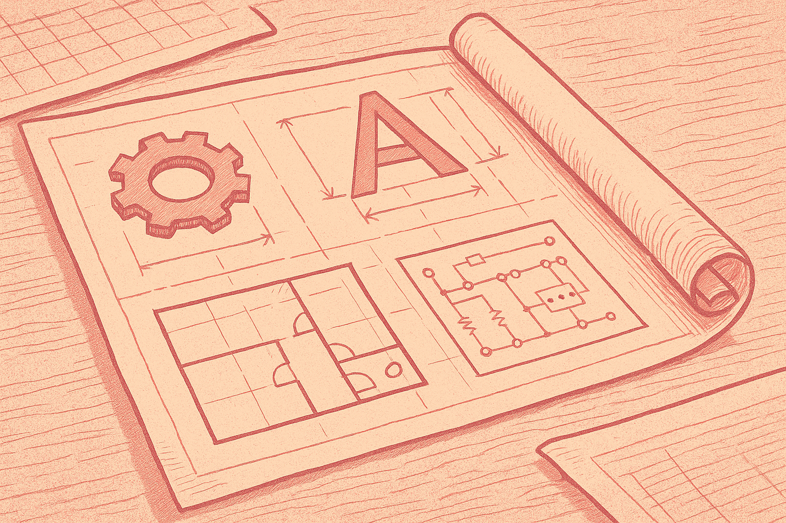
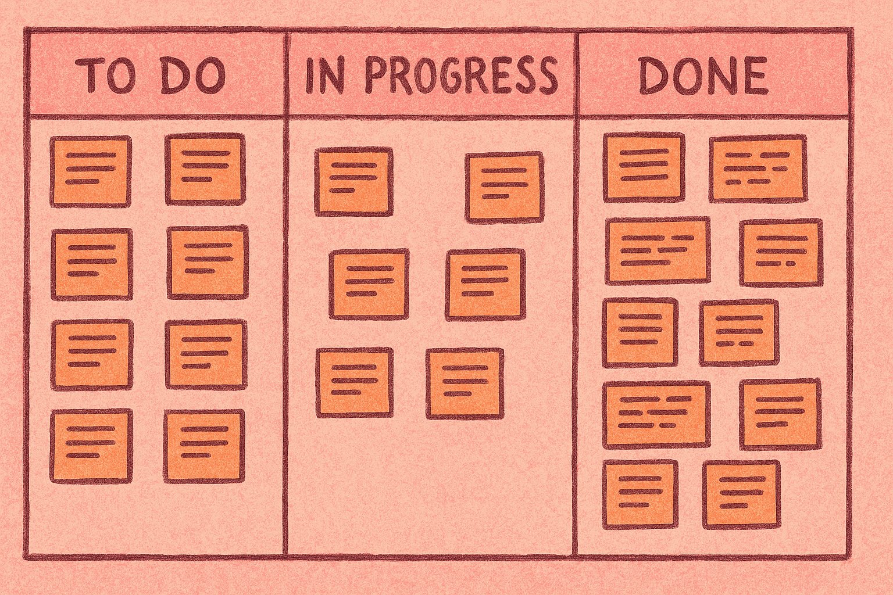
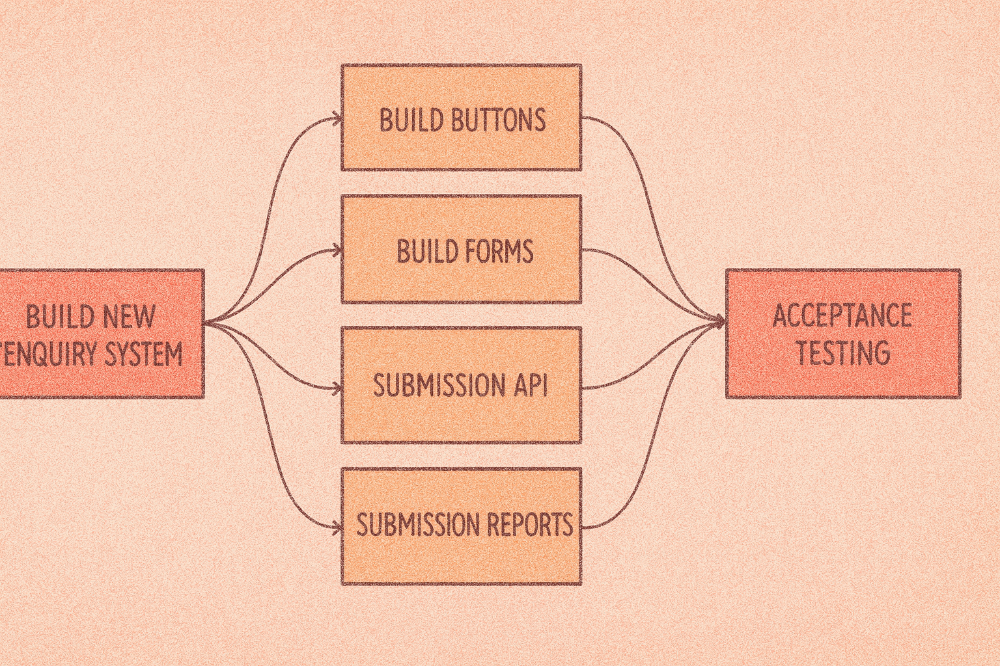

I gave this talk at Web Directions AI Engineering 2025. The slides from the
talk are embedded below, and the full transcript of the talk with key slides is
presented after that.

<iframe title="Scaling coding agents slides"
  src="https://aieng.ajf.io/?embed"></iframe>

<a href="https://aieng.ajf.io/">Scaling coding agents
(without breaking your dev team)</a> - (CC) ajfisher

A large version is available at [aieng.ajf.io](https://aieng.ajf.io/), the
slides are available as a [PDF
download](https://aieng.ajf.io/static/scaling_coding_agents.pdf), and the
supporting resources are collected at [ajfisher.me/aieng/](/aieng/).

The full talk transcript follows:

## Scaling coding agents (without breaking your dev team)

I work at the intersection of tech, business and experience, focusing on team
performance systems for  transformation and innovation.

As you can imagine, AI has rapidly become a huge part of what I work on with my
teams.

So it’s been a pretty wild couple of years.

AI coding tools have gone from no good (and expensive), to good enough, and now
cheap enough and effective enough to deploy at scale across teams.

### From scarcity to abundance

*The world has moved to abundance, but we haven't realised it yet. (cc)
ajfisher - ChatGPT / DALL-E*

For 50+ years of software engineering, dev time has been the most precious,
scarce commodity we had. Suddenly - almost overnight - we’ve gone from famine…
to flood.

And this flood of capacity changes things dramatically.

But this isn’t the first time. History shows it happening again and again - but
the Industrial Revolution feels the most similar to what is happening to us now.

#### History rhymes

*Mechanisation and AI have a lot in common. (cc) ajfisher - ChatGPT / DALL-E*

Before mechanisation, goods were handcrafted and scarce. Output was linear -
proportional to the skilled labour you could bring to bear.

Mechanisation unleashed chaos. Factories churned out shoddy goods, cities
exploded overnight, professions collapsed, accidents maimed workers. Fast,
messy, frightening.

Feels familiar? More merge conflicts, code sprawling everywhere, agents going
rogue - same chaos, different century.

But out of that chaos came supply chains, labour laws, standardised parts,
quality assurance, and management science.

We needed new systems to tame the chaos of abundance.

#### Outdated work systems

*Checkpoints everywhere won't work. (cc) ajfisher - ChatGPT / DALL-E*

With the scarcity of developer time. Our systems evolved to protect it -
filtering, prioritising, saying “no” more than “yes.”

Now that scarcity is being removed, those systems are less relevant.

As we shift into code generation abundance, we’ll be forced to redesign our
systems to capitalise on it.

#### Agenda

- Making context cheap
- The right way is the easy way
- Orchestrate activity

So today’s focus is these three areas. Each one will help both your agents and
your humans scale.

### Making context cheap

*Reduce the code overwhelm for everyone. (cc) ajfisher - ChatGPT / DALL-E*

Over the last 20 years, codebases have exploded in size and complexity. What
once took a dev a day or two to onboard now takes weeks.

For a new mid-level engineer, that’s fine. For an agent? You’ve got about ten
seconds before it goes off the rails. Can your systems deliver context that fast?.

If you don’t get them context instantly, they spin off into rabbit holes, burn
tokens, and deliver junk.

So - need to build context faster, more accurately.

#### Context drivers

- Logical structures
- Deep documentation

There are two levers to pull: logical repo structures and deep, layered
documentation.

#### Logical structures

*Make code easy to contextualise. (cc) ajfisher - ChatGPT / DALL-E*

Agents are bad at spanning repos. Helper libs are invisible to training data.
Just like a dev staring at an import and asking: “What is this? Where are the
docs?”

So we need to adopt a monorepo mindset. Co-locate what belongs together.
Clear app delineation, shared libs, utilities.

And watch file sprawl - in JS land, a single button might mean one file for the
component, another for types, another for routes. For humans it’s annoying; for
agents it’s confusing. Sometimes it’s better to scroll more and give them the
whole picture in one place.

A rule of thumb: if a change routinely spans three or more files just to “see
the picture,” co-locate them.

#### Deep documentation

*Documentation ladders help with depth. (cc) ajfisher - ChatGPT / DALL-E*

Docs should zero in humans and agents alike. Think of it like a ladder
leading you down into your codebase:

- Root README (run sheet)
- App/component READMEs (how-to)
- JSDoc/PyDoc (why/how at the code seam)

This layering helps get everyone up and going fast.

Every tool wants you to have an agents file as well. These are fine, but they
are for quirks you’ve seen agents struggle with. Agents and humans look at the
readme - agents files are to specifcally nudge code agents in a particular
direction.

#### Homework

- Build documentation ladders
- Validate completeness

Obviously where you're deficient you can use agents to help produce docs and
your code assistants to produce things like in-code JS Doc or Pydoc info. That
speeds things up.

Once that’s in place, get an agent to sanity-check: “Are these docs still
valid?” They’ll flag drift, you apply the expertise. Everyone gets the benefit

And with that we’ll look at tool use and automation.

### The easy way should be the right way

*Make it easy and development will follow. (cc) ajfisher - ChatGPT / DALL-E*

How often does someone forget conventional commits? Or not run the schema build
script for validating API payloads? Happens all the time.

Culture and team norms fill the documentation gap for humans. Agents don’t
have culture.

So you need systems to drive these behaviours for consistency as consistency
enables scaling:

#### Automation > documentation

`make clean && make install && make dev`

That should be all it takes to spin up a dev environment.

Docs are a suggestion. Scripts are a guarantee.

If twenty grads joined tomorrow, you could hand them a wiki page and hope… or a
script that just works. Same with agents.

Every common action needs a script or CLI command.

Then you add it to your README file so all developers know it exists and what
it does and when you might use it.

Output good help text. So humans and agents alike can recover when something
goes wrong.

#### Hooks for quality

*Add code checks where you can in the process. (cc) ajfisher*

Add guardrails right where code gets created such as Linting and tests on
commit. But we want to do deeper checks on push — vuln scans, static analysis
and this should happen somewhere else.

Use red flags for risk:

1. Package changes
2. New external URLs/hosts
3. New shell commands

As things scale up reviewers need alarms, not Easter eggs.

#### Reference patterns

*Develop reference patterns to guide best practices. (cc) ajfisher - ChatGPT / DALL-E*

Reference code shows both humans and agents “this is how we do it.” It’s style
transfer - a superpower for LLMs but really handy for new members of the team too.

Consistency helps humans and agents alike.

Skeletons, boilerplates, templates: they save time, reduce variance, and make
reviews faster.

#### Homework

- Scripts for common tasks
- Local and remote hooks for quality
- Build boiler plate / reference implementations

Here's a few things you might want to consider as homework

Now lets turn our attention to getting agents to use all this structure and
tools to build things with us.

### Orchestrate work

*Herding goldfish is the new job. (cc) ajfisher - ChatGPT / DALL-E*

Now let’s talk about the work itself.

Every dev is about to become an agent herder. And it’s nothing like managing
people.

You’re asking developers to manage a school of super-intelligent goldfish,
with the lifespan of a fruit fly.

That’s coding agents: brilliant, forgetful, relentless, ephermeral.

If everyone spins them up ad hoc, you’ll drown in chaos and merge conflicts.

The answer to this is orchestration to help tame the chaos.

#### Microtasks

*Small tasks that can be worked on independently. (cc) ajfisher - ChatGPT / DALL-E*

Agents have tiny context windows and no memory. Keep tasks small and tightly
defined.

Big, vague jobs? They wander. Like the time I asked Gemini to refactor React
components into Astro. It wandered off building new components I didn’t ask for.

The fix? Smaller scope, clearer outputs, faster iteration loops to give feedback.

#### Parallelism

*Work on things together. (cc) ajfisher - ChatGPT / DALL-E*

Once you’ve got microtasks, run them in parallel. Different agents, different
tasks. eg API backend and front end changes.

Converge them in a consolidation branch.

Use common PRDs or specs to help link the microtasks together. Some tools can
do this like Claude Code - others not so much.

How much parallelism makes sense is a feel question, but this is what drives
a big chunk of speed improvements in your team.

#### Coordination

*Get everyone / thing going in the same direction. (cc) ajfisher - ChatGPT / DALL-E*

Finally, coordination.

The goal: turn that school of goldfish into a shoal - all moving the same way,
not darting randomly bumping into each other.

Macro-tasks still need humans to coordinate with each other. Then the engineer
orchestrates microtasks and parallelism underneath.

As your scale picks up, it means ever more coordination between the engineers
because an agent isn’t going to ask on Slack, “Hey, is anyone working on
this file?” That’s still on us as humans to plan.

My teams are investing a bit more time in planning as a result.

### Summary

- Making context cheap
- The right way is the easy way
- Orchestrate activity

So, three ways to scale code agents without breaking your team.

## Thriving in abundance

*Humans + agents is the goal. (cc) ajfisher - ChatGPT / DALL-E*

We’re moving from scarcity to abundance for code generation. That abundance
will force us to redesign our systems.

It’s not about replacing engineers. It’s about building systems so humans and
agents can do more together than either could alone.

If we build these systems well then they will help us get on with tackling
the big challenges of our organisations and deliver better experiences to our
customers.
