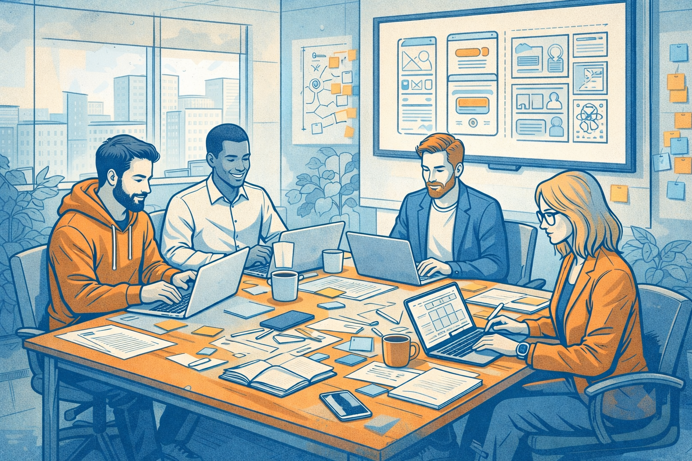
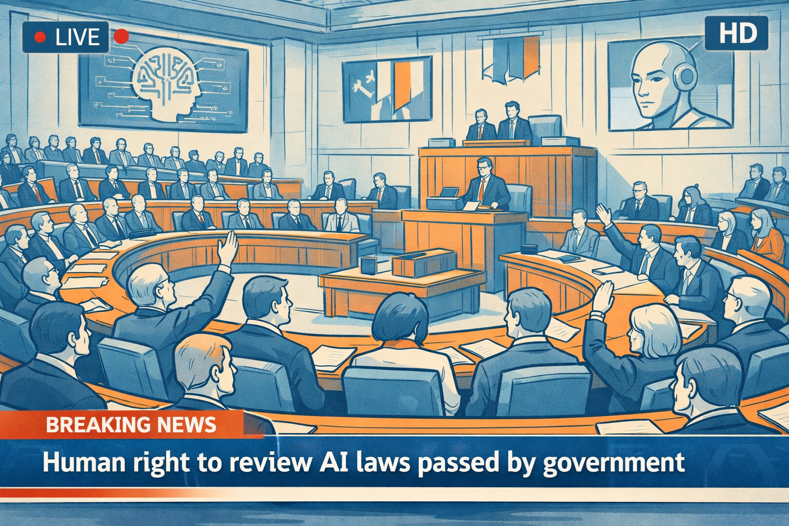

The back part of 2025 feels like change is happening on multiple fronts at the
same time. As a result, we’re heading into a 2026 that will make the world feel
very different by the end of it. The predictions I outline below will show why
I think that.

## 5-10c for an AI task done reliably

By my estimation, a model becomes fairly capable once it has hit an
[MMLU](https://github.com/hendrycks/test) or [GPQA
Diamond](https://github.com/idavidrein/gpqa) benchmark of about 0.7 / 70%.
State of the Art models are well in excess of this now (>0.9) and mid-tier and
distilled models are routinely in the 70-80% band.

While prices [have dropped a
lot](https://intuitionlabs.ai/articles/llm-api-pricing-comparison-2025) for
this type of capability and are [now well inside the $1-$0.10
range](https://www.vellum.ai/llm-leaderboard) - at scale this adds up for
organisations very quickly. Price remains a barrier to adoption.

Somewhere around mid-late 2026 we will see the first pricing that will be
around $0.01 / M tokens. The combination of distillation, incremental model
improvements, price competitiveness and inference efficiency will move us into
this price range.

### So what?

A 5-step agentic workflow that is 90% accurate at each step will fail overall 2
in 5 times. 

The unlock isn’t just cheap tokens, it’s cheap correctness. 

The impact of being in this pricing territory is that individual requests
become so cheap that you may as well run them multiple times and then combine
the results to provide better verification of the results. Benchmarks drive the
capability and workflow engineering will drive the reliability.

Useful tasks, with much higher reliability, will be achievable for 5-10 US
cents per task.

At this price point, the breadth of use cases an organisation can use AI for
goes up by an order of magnitude and will help drive adoption across
non-technical teams that demand correctness in decisioning.

 

## Valuation gravity favours margin efficiency

Modern teams won’t look anything like the unicorns of 2017 - 2022 where cheap
capital chased any business that could command ever growing MAUs, regardless of
revenue. They also won’t be your solo hustle-fluencer of 2024/5 using AI to
automate the creation of slop and garner enough attention to generate ad
revenue.

The next round of unicorns will be [tiny, 5-10 person
businesses](https://www.latent.space/p/tiny?publication_id=1084089&post_id=168403275)
that were born AI native and have been building businesses over the last two
years making tangible, useful products that people want to spend money on. All
the while leveraging modest investments or bootstrapping themselves, with
positive cashflows.

*Highly leveraged teams will become the norm. ajfisher - nano banana* 

This wave of start up and scale ups will be [extremely leveraged by automation
and AI](https://www.deeplearning.ai/the-batch/issue-242/) that was built from
the first moments to be efficient and they actually run their businesses
looking at things like margin, free cash and customer churn rates. Watch where
money flows in 2026 and it’s going to be investments in micro-teams on very
favourable term sheets.

### So what?

Expect tiny-team, micro-team or one-pizza-team language to creep into every
org. Leaders will be (or should be) looking at these high velocity, high
leverage teams and asking what they need to do to restructure their orgs to
behave like this.

The conditions are also lending themselves to starting a business. Small
amounts of investment will go a long way so if you can assemble a team of 3 and
deliver on a problem people have, you’re likely to be cash positive very
quickly due to low burn rates.

There’s a darker side to this efficiency. Small startups tend to hire from an
“in-group” known to the founders (eg 3 friends from university). This could
have significant impacts on social mobility as these businesses create massive
wealth for 10 people and no jobs for anyone else.

## HR gets dragged kicking and screaming into the late 2020s

In most cases, the role of HR is to ensure compliance and regulations are
followed as it relates to the workforce. In a few exceptions, HR leaders work
inside the executive and senior teams to help guide the return on human capital
investment.

Post-COVID, most HR teams are barely understanding the ramifications of
techno-social change occurring and have been asleep at the wheel taking a
business as usual approach.

2026 will be the point at which Boards and CEOs indicate enough is enough and
that HR need to start taking the reins on the biggest organisational
restructure of skills since PCs hit offices. 

### So what?

HR will be recalibrated and will likely become smaller.

Capability, workforce planning and skills intelligence will be removed from HR
and embedded into Strategy or Ops teams.

To survive, people leaders will need to get up to speed extremely quickly on
how roles are changing as a result of AI and be thinking about a skills matrix
that maps human and machine capabilities together.

*HR will be in the hot seak in 2026. ajfisher - nano banana*

HR leaders beware - your “seat at the table” just became the hot seat. In 2026,
the Board won’t be asking about engagement scores, they will ask you about
Human-Agent capability ratios (eg. output per FTE adjusted for agent use) or
reskilling velocity metrics.

## The value of AI continues to accrue to consumers

The race to the bottom on capability versus price continues with each of the
big three consumer AI businesses ([OpenAI](https://openai.com/news/),
[Anthropic](https://www.anthropic.com/news),
[Google](https://blog.google/technology/ai/)) leapfrogging each other to either
cut prices or deliver more for the same price and with ever more generous free
plans.

Arguably, Anthropic is already beginning to tack away towards enterprise and
leave Google and OpenAI to duke it out for regular consumers.

In 2025, Google finally shook off its malaise, hitting back at OpenAI in
particular and delivering a string of consumer-focussed products through the
back half that start to resemble something like a cohesive product strategy.
OpenAI, trading blows, have clearly advanced their product timetable as they
can now only count on being the “leader” in a category for weeks instead of
quarters. 

The question of 2026 is whether the market is big enough for this many
incumbents and who can “own” the customer well enough to retain them? 

Google has inherent natural distribution advantages here via Workspace,
Android, Chrome and Search but consumers have shown no loyalty and are prepared
to happily jump ship between Gemini, Claude and ChatGPT on a moment’s notice.

In 2026 the market probably looks like Anthropic for enterprise, OpenAI
increasingly for premium consumers (like Apple) and Google having mass
distribution (like Android).

### So what?

As consumers, competition is great - especially when it’s this fierce for your
cash. The risk here is that consumer AI goes the way of airline travel. In this
scenario it gets so cheap there’s no margin in it for anyone, and the
experience becomes awful unless you can afford to pay for the AI equivalent of
Emirates First Class - which will get more expensive.

AI tooling has higher switching costs (context, history, habits) compared to an
airline but keeping tabs on all of the tools on offer and trying them out will
keep you aware of where the best value for money exists for your usage.

## A 1-minute, structurally coherent generated video is made

This is a stretch - don’t expect this to be mainstream in your chatbot in 2026.
However, video diffusion models have hit diminishing returns in 2025. While the
quality & resolution improves, there are fundamental limits on how many frames
you can generate before you lose video coherence.

In 2025, long format generated video was an exercise in character and setting
consistency improvements then cutting 8-10 second clips together into a story.

Object permanence has been the Achilles heel of AI video. In 2025, if a
character walks behind a tree, they emerge wearing a different shirt. 2026
starts to solve this.

*Technical demos likely to arrive in 2026. ajfisher - nano banana*

[Various labs](https://www.worldlabs.ai/) are
[pushing](https://deepmind.google/blog/genie-3-a-new-frontier-for-world-models/)
on [world models](https://arxiv.org/abs/1803.10122) as a key unlock to generate
coherent longer video and we may see the first 1-minute clips being generated
from a single prompt. This is likely to be at relatively low resolution and
very much a technical demo rather than be consumer ready - but it will
demonstrate the benefit of an architecture change.

### So what?

Steerable, longer-length video generation unlocks a lot of new use cases for AI
generated news, influencer bots as well as just general video innovation as
creators play around with the medium. Organisations are always looking for ways
to create more content, more cheaply - world models have a real opportunity to
break us out of the current video generation plateau.

Expect pushback from everyone in media regarding lost jobs and likeness usage
rights - in effect the same arguments we’ve heard all year will continue into
2026 but get very loud as soon as a technical demo of this drops because it
will upend traditional video production methods.

## Cursor, Replit and Lovable will be acquired, crushed or sold for parts

CFOs and CTOs are getting licensing fatigue as developer spend goes through the
roof on AI tooling with non-obvious return. Developers are getting frustrated
that they have to adopt an entirely new set of tools just to access a coding
agent. 

There are very few moats that weren’t simply first mover advantage. 2025 is
already showing signs of this already with many bundled options available. 

Gemini CLI, Codex and Claude Code have all shown that having a “one stop”
license and making tools available on the command line is a strong play from a
developer flexibility standpoint.

In 2026 Microsoft may just roll Github Copilot into an E5 license and everyone
will breathe a sigh of relief - not least procurement and security having spent
2024 and 2025 constantly assessing whatever flavour of the month tools the Dev
team want to use.

Some of these businesses may survive via an acquisition (perhaps by Microsoft
and merged into Github), some become invisible infrastructure behind other
products and some may not survive at all.

### So what?

The dev space has been the most contested part of the enterprise over 2024 and
2025 and is now showing signs of maturity and likely consolidation. This way
points to how other parts of the enterprise will go over 2026 and 2027 as
specialist tools spring up and forge a “new AI way to do things”.  Eventually
the incumbents do the work, get the licensing right, and enterprise sticks with
what they know and like (bundled licensing on multi-year deals!!). This is why
IBM and Oracle still make billions a year in traditional enterprise sales.

These incumbents are not like Nokia and Kodak and are able to adapt much more
rapidly to commercial and product pressure.

## M365 Copilot integrated into the ways teams actually work

Copilot has been the unloved, spotty, step-child of Microsoft’s enterprise
product suite all year - appearing in all the family photos but no one really
wants to pay them much attention.

2026 will see this change. Enterprises are committed to having M365 Copilot as
part of their stack and they are screaming out for tighter integration in the
places where teams actually work, not in fancy “just add AI to your formulas in
Excel”, or “make me a presentation” type use cases.

We’re already seeing individual copilot capabilities come to Teams meetings to
allow you to ask questions of the transcript or provide a summary if you’ve
jumped in late and need to catch up. This will go further and be embedded in
every Teams chat, where Copilot becomes an @able member of the team and can
contribute.

We should see shareable copilot sessions so you can ask questions collectively
on a topic and we should start to see the ability to combine agents in a chat,
allowing you to mix multiple enterprise agents together to help you solve your
problem.

### So what?

Microsoft still owns enterprise and their Teams play has been slow and
incremental month by month, finally becoming a solid platform for business use
(albeit still without threaded chat). Pressure is building on Microsoft to
usher in the next iteration of connected, hybrid, Human-AI based work methods.

*Copilot in MS Teams channels will become commonplace in 2026. ajfisher - nano banana*

Expect to see new product announcements in 2026 and don’t be surprised when
someone @’s an agent in a teams chat to provide a summary of the discussion so
far and provide some thought starters about what to do next.

Teams chats will become the source documents - no need to write up more
documentation. This will quietly kill many of your internal documentation
rituals. Your Copilot agent will provide actions, summarisation and specific
retrieval just by asking a question in Teams.

## Disposable software reigns supreme

Artefacts, canvases, vibe-coded apps - it goes by many names and in 2025 these
started getting really good. Ask Gemini or Claude to make you a quick micro-app
for a specific purpose and it will be 80% good enough on the first pass. Add
some data or some business rules and it will be even better.

Next year this will permeate the long tail of business apps that are needed by
either small groups or for a short period of time. This will be the year of
marketing managers spinning up an internal app needed to manage some data or a
process for the week of a campaign. It will also be the year where the
logistics & supply chain teams take matters into their own hands and knock up a
series of small applications to solve the problems they have been asking IT for
support on for 10 years and getting only a “it’s on the long term roadmap” as a
reply.

*Expect functional teams to build their own software. ajfisher - chatGPT*

In the first half of the 2020s Low and No Code applications started the process
of business users taking back ownership of the technology needed to do their
jobs because they know what is needed but didn’t have the technical skills to
build it themselves. This trend has been super charged by AI. IT will resist,
but this [will be nothing like the Shadow IT of the last
decade](https://www.netskope.com/resources/cloud-and-threat-reports/cloud-and-threat-report-shadow-ai-and-agentic-ai-2025)
due to SaaS. If you can’t even see it turn up on a credit card statement, how
are you even going to know it exists? Especially if it’s torn down by the time
IT become aware that it happened.

### So what?

The last decade of transformation of organisations was characterised by digital
and technology product teams listening to, but then telling the business what
they needed.

In 2026, that dynamic changes as those same teams get cut out of the loop and
the business teams do it themselves. Smart people will do smart things and not
every project needs a $150/hr developer working on it to solve the problem -
indeed it makes it cost prohibitive to do so (which is why it languishes on the
todo list).

Expect teams to begin owning their own destiny with respect to micro-tooling
and expertise in building agents and disposable apps will develop inside
practitioner teams without IT gatekeepers.

Be prepared for your IT governance teams to have an initial meltdown, then CIOs
will shift their teams towards sandboxing, guardrails, integration mandates (eg
SSO) and IT providing a secure playground for business teams to bring their own
toys. Governance shifts from “Approving Apps” to “Monitoring Data
Exfiltration”.

## Legislation passes to protect against white-collar jobs collapse

2025 has generated a lot of heat around this topic but the fire is yet to
catch. In 2026 we will see the first digitally advanced and legislatively
nimble country (my tip is on Estonia,
[Singapore](https://www.pdpc.gov.sg/help-and-resources/2020/01/model-ai-governance-framework)
or one of the Nordics) pass legislation that enshrines symbolic protections for
workers rights. This will be driven by a groundswell of concern from
well-educated, white-collar workers who become increasingly concerned they are
about to lose their jobs.

Expect increasing community concern about this topic in 2026 - especially from
older workers compared to younger, AI-native graduates. Younger workers may
feel safer now but they are entering a much more volatile labour market.

*Workers rejoice as law makers take a forward policy stance. ajfisher - chatGPT*

[Beyond legislation](https://oecd.ai/en/ai-principles), I’m expecting to see
multiple governments discuss this and set up review committees to provide
impact reports and better understand economic mitigation options. Specific
tells will be legislation focussing on rights for Human Review - in particular
around algorithmic / AI decision making - and that AI being used to replace
worker roles will require special oversight and protections regarding
organisational redeployment.

Governments know how to handle striking miners; they are totally unprepared for
unionised accountants and software engineers. 

### So what?

The AI boom is the least well liked boom in history, with many workers deeply
distrustful of what will happen, whilst at the same time actively using the
technology and becoming familiar with it.

The friction isn’t just vertical (worker to boss), it’s horizontal. Older
workers will clash with a younger, more diverse and AI-native cohort who can do
the same work in less time. Coalitions of incumbency may be what drives the
politics here.

Reading between the lines, what workers are most worried about is rising cost
of living pressures and capitalistic mechanics that minimise worker protections
at every opportunity. Older workers are especially attuned to this as they face
many more challenges in redeployment or redundancy.

Expect to see worker concern for jobs loss increase every quarter and bosses
and politicians increasingly pressured about what they will do about it.

## Consumer robotics - China shock edition.

If 2024 and 2025 has taught us anything, particularly in Australia, it’s not to
underestimate the supreme manufacturing powerhouse that China has become. The
trickle of EVs has turned into a flood. In markets like Australia where there
is no native automotive manufacturing industry so no need for industrial
protectionism the scale of the ramp up has been astonishing.

Much of this scale is underwritten by state subsidies and the quality level is
mediocre in many respects. But this is opening up a market where EVs are
rapidly dropping in price as more models force more competition.

Humanoid-robotics in many markets is about to go through the same China shock.
Heavily subsidised, with a large domestic market to shake the wheat from the
chaff, China is looking set to dominate the affordable robotics market and 2026
will be the point this takes off. [Unitree](https://www.unitree.com/) and
Xiaomi are already showing the possibilities here and Xiaomi knows how to build
consumer products.

While companies like Boston Dynamics, Tesla, Honda and Figure build extremely
capable robots that will meet all regulatory and legal obligations, China
manufacturers like Unitree will do an end run around them and build things good
enough to capture market share then come “up to spec” as and when things go
wrong. Liability, insurance and certification outside of China will be the
biggest unknowns here.

### So what?

In 2026 a [Unitree G1](https://www.unitree.com/g1) is likely to be available
for about USD $10K with general availability. This isn’t in the “new TV”
category of electronics but it’s definitely not “buy a new car” territory. For
tech-forward, high-disposable-income households this is in the realm of being a
considered fun purchase to try it out.

Companies like Xiaomi know how to price consumer products. Expect to see
ultra-competitive pricing, perhaps sub $10K, with a monthly subscription to add
new intelligence and capabilities over time. I wouldn’t be surprised to see
subscription pricing in the low hundreds per month.

These robots will interact with you, carry objects around the house or patrol a
property within constrained environments and tasks. Software updates will
improve them over time. Enable party mode for a dance partner, or something
that can perform backflips in your living room.

*Slow and gimicky, but robots will be available to buy. ajfisher - nano banana*

This won’t be for everyone, but there will be enough buyers to be the
“debugging” workforce while the costs plummet as China manufacturing hits the
“scale” button.

## RAM doubles in price, with a silver lining

All electronics are about to get a [whole lot more
expensive](https://www.idc.com/resource-center/blog/global-memory-shortage-crisis-market-analysis-and-the-potential-impact-on-the-smartphone-and-pc-markets-in-2026/)
due to the hoovering up of RAM by data centres. In 2026 this is only going to
get worse because manufacturers can’t ramp up production that much more in
short timelines.

Expect that [prices of RAM could double
again](https://pcpartpicker.com/trends/price/memory/) over the course of 2026
which will annoy gamers, data centre builders, or anyone looking to buy a new
phone or laptop.

### So what?

The last few years we have been gorging ourselves on cheap memory and it’s made
our applications bloated. A browser or a text editor needs multiple gigabytes
of RAM because for years it’s been cheap, plentiful and every year devices jam
in more of it.

The opportunity then is that now RAM will be a premium, devices will get
sweated for a bit longer and engineers will need to spend some time working on
efficiency to get more out of that very expensive set of RAM that they are
using. Engineers are generally good at optimisation but the incentives haven’t
been there to focus their attention for the most part. In 2026 that will change
and we’ll start seeing performance becoming a critical benchmark again.

## Conclusion

As we close out the year and head into 2026, what connects these predictions
together are the ideas of changing dynamics around trust, power and control.

Consumers are exercising their own powers of choice to extract value from AI.
At the same time the economic ramifications of sustained inflation and cost of
living pressures are manifesting in public mistrust of organisations and
politicians to look after their interests.

Businesses are looking to realise opportunities whilst at the same time trying
to navigate a highly chaotic environment where workers are simultaneously wary
and embracing of these emerging technologies. Teams are being forced to
recalibrate and the dynamics of power will swing back toward functional teams
as they are able to push their agendas and capabilities without being shackled
to the digital transformation agendas of the last decade.

In 2026, capability will be normalised and incentives will become the main
story.
