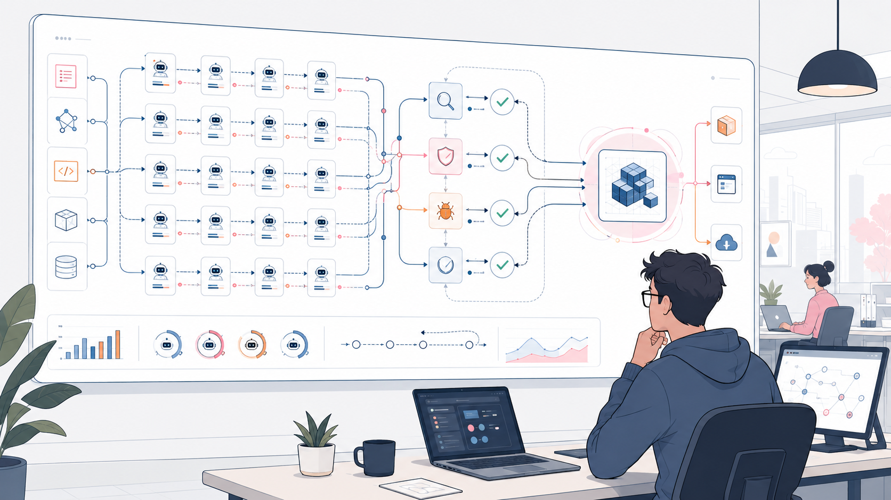
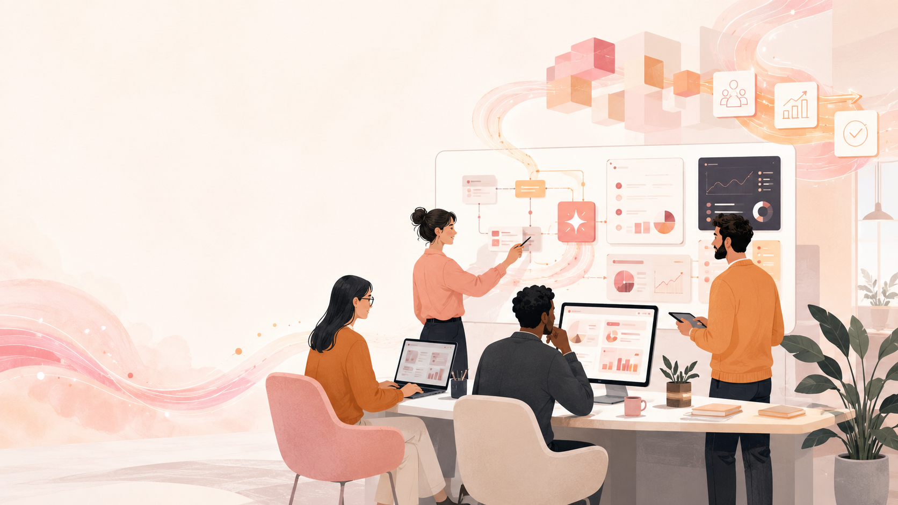

Off the back of the Mythos hiatus, Fable’s withdrawal and constrained return,
and the delayed launch of GPT-5.6, an obvious question arises. What if this is
about as good as AI gets for the majority of us?

Maybe this isn’t forever. But what if publicly accessible models improve only
slowly through the second half of 2026 and beyond? Does AI continue to produce
meaningful gains, or do we exhaust what the current generation can do?

[Steve Yegge](https://steve-yegge.medium.com/) explored one version of this
possibility in his [“Flat Curve Society”
essay](https://steve-yegge.medium.com/the-flat-curve-society-36c8b01eb33b) and
[Mark Pesce touched on this topic as well
recently](https://thewatershed.markpesce.com/turing-police/). I’m more
convinced by this argument than I would have been a few months ago,
particularly given the growing appetite among governments and model companies
for greater control over access and capability.

But I’ve arrived at the same question from a different direction - the ability
of organisations to absorb and realise the benefits of the AI that is already
available.

If we leave aside the uncertainty of model improvement for a moment, we can ask
a new question.

What if accessible models are already capable enough for most commercial work,
and the race has shifted from building better AI to deploying today's AI more
effectively than everyone else?

## The demand horizon is already here for routine work

Yegge outlines three horizons as it relates to AI:

- The capability horizon - whether a model is capable enough to do a given
  task.
- The demand horizon - the types of tasks a user asks a model to do.
- The discernment horizon - how able is the user to understand the results of a
  model doing the task they’ve asked it to do.

For most of AI history (and especially the early period of LLMs), the
capability horizon was the dominant constraint. Over the last year that has
changed. Once models got capable enough, the way work was framed, decomposed,
equipped and verified began to matter just as much as the base model capability
itself.

We’re now at the point where most <b>frontier models can reliably complete many of
the routine work tasks we ask of them</b>. For those tasks, a more capable and
expensive model delivers diminishing returns. [^1]

At the same time there exists the discernment horizon (or the threshold of
misplaced confidence in understanding) where the capability of the AI system
easily surpasses the user’s demand - however the user’s ability to understand
the resulting response or artefact is limited. Vibecoded failures by
non-software engineers are an early example.

Better models and external verification systems can push the discernment
horizon outward. But where neither a competent human nor a reliable system can
validate the result, the organisation still cannot safely depend on it.

Right now, different domains within organisations and industries have different
horizons, especially as it relates to demand.

- Software engineering is approaching the demand horizon - I routinely brief
  coding agents that can work autonomously for a full day with high degrees of
  success.
- Many routine office tasks are already there - you can see this with workers
  maxing their usage by asking the strongest models to do tasks when the
  weakest would be sufficient (eg using 4.8 Opus to summarise an email thread
  which Haiku 4.5 could do)
- Mathematics and science remain uneven. Formal reasoning and
  verifier-supported mathematics are crossing the capability horizon quickly,
  while open-ended discovery and poorly specified scientific work remain much
  more difficult to achieve results.
- Healthcare and life sciences are now on the cusp of being inside the
  capability horizon but often the issue is deployment and access to the other
  tools and data needed to make a meaningful difference not the model itself.

These horizons are not fixed. Once an AI system can do a task reliably, users
rarely stop there. They ask it to work for longer, take on larger units of work
and operate with less supervision. The demand horizon moves outward, and the
work shifts from waiting for a smarter model to building a better system around
the one already available. Engineering teams building agent harnesses are now
the textbook example of this behaviour.

## The bottleneck has shifted

Software development has become the poster child for process re-engineering. As
soon as AI tools became good enough to write reliable code (mid 2025) and could
do so at scale (late 2025) the bottleneck moved to things like review,
validation and how to automate routine changes.

[Software factories](https://simonwillison.net/2026/Feb/7/software-factory/)
are the clearest example of this shift. A coding model on its own is not an
autonomous engineering team. Put it inside a harness that decomposes work,
provides tools and context, coordinates tasks in parallel, verifies outputs,
feeds failures back into another loop and escalates judgement calls, and its
effective AI system capability changes. The base model may remain static while
the system around it improves.

*Highly leveraged software teams will be the norm. Image: ChatGPT*

The [recent Bun rewrite](https://bun.com/blog/bun-in-rust) is a useful example.
The outcome did not come from a single heroic prompt, but from a system of
parallel agents, tests, review agents and repeated feedback loops. The model
was one component of a wider production system.

As a result of these system changes, the question morphs from “Can AI do this
task?” to “Can AI do this task *inside our organisation*?”. In many legacy
enterprise businesses or large teams the answer to the second question comes
with pursed lips, a sharp intake of breath and a weary, <b>“Not without a lot of
stakeholder and change management”</b>.

The constraints on adoption and scale increasingly sit within the organisation.
These include:

- enterprise data access, definition and provenance
- system access when that access is defined around human roles (and levels)
- organisational knowledge that is often locked up in tenured employees’ heads
- workflows that may be partly explicit or soft and implicit
- trust and accountability of systems and processes
- governance, policies, decision rights and delegation of authority
- the total economics of model use, integration, supervision and failure
- operational dependency on providers outside the organisation’s control

Smarter AI tools may assist with some of those points above, but only at the
margins. Those areas are the messy activities of how work, decisions and
capital flows through an organisation in service of its objectives. Different
types of organisation are better or worse at codifying these things but few
organisations are perfect, and certainly not across their entire business.

*Orchestrating and estimating work is still an art. Image: ChatGPT*

Most organisations cannot yet estimate the full cost of an AI workflow: model
usage, integration, supervision, exception handling, failures and the
opportunity cost of human attention. Without this, it is difficult to
distinguish a cute technical demonstration from an economically useful
production system.

This creates a distinction between base model capability and effective AI
system capability (or system capability for short). System capability combines
the model with its harness, tools, memory, context, verification and workflow.
<b>Organisations do not merely absorb capability; they extend it through
engineering.</b>

At organisational scale, usefulness increasingly depends less on base model
capability than on whether the wider system can understand organisational
context and act within it.

This is a very different form of deployed AI from what most organisations have
now.

### Breadth is now more valuable than depth

Let’s say that GPT-6, Saga 7 or Gemini 4 Super Flash Pro Awesome scores 20%
better on all benchmarks but costs 20-30% more than current models. Cooler
heads in the Finance team are going to do some rigorous analysis on usage vs
capability vs spend (some teams are already starting this in mid-2026 as a
result of H1 bill shock) and they’ll find that 90% of the organisation’s tasks
could be completed by the cheapest frontier models of the last generation and
they’ll focus on cost optimisation [^2].

If, however you said that the next model generation were instead 20% better at
understanding:

- PowerPoint & Excel (or equivalents)
- ERP systems and CRM platforms
- organisational structure including practical structure as well as management
  structure
- internal documentation from numerous sources
- holistic project information and product / project portfolio strategy
- proprietary data sources that may be poorly defined

Many organisations would pay for that. Today.

*Businesses want AI to support portfolio decisions now. Image ChatGPT*

Most orgs already deploying AI to their workforces are realising they have a
bottleneck that base model capability alone can’t solve and are trying to work
out how to make their systems, processes, org culture and data more accessible
to AI tools.

Businesses can engineer this awareness and utility into their own environments
now, or wait for future models to provide more of it natively. Waiting may
reduce the implementation effort later, but concedes time, learning and
operating experience to competitors.

AI tools that are better at integration, context, domain knowledge, that make
it easier to apply ML, advanced analytics and decision support, or can work
across data sets easily, would create significantly more value to organisations
at this point than simply smarter models.

## Foundation model companies can’t do this alone

Model companies can provide the primitives for system capability such as
models, agent runtimes, memory and evaluation tooling. But the harness that
matters is usually specific to the organisation, its domain and its tolerance
for risk. Model providers can’t restructure the organisation, connect every
internal system, redesign workflows, document tribal knowledge or decide where
accountability sits. This is where organisations unlock most of the remaining
value.

Yes, AI can *assist* these tasks and make the process of achieving them easier.
But even MS Copilot (the most incapable of enterprise deployed AI tools) can
assist on this front today.

OpenAI and Anthropic have both spun out consulting groups to help organisations
use AI to do the messy stuff that a model can’t do. This is a play straight out
of Salesforce, AWS and Adobe’s book where increased adoption is driven by
organisational transformation support.

*AI consulting is a fast growing part of AI labs' business. Image: ChatGPT*

Model companies are recognising that while they are involved in organisational
transformation, they are at risk of being a passenger and are certainly not in
the driver’s seat of this change. So they need to be the tool or platform of
choice instead.

## The deployment gap

If all of this is true, then it suggests that organisations that can achieve
rapid, whole of org process change to realise AI within their business stand to
have a competitive advantage. We can see this play out in the charts below.

Start with a fixed class of work and assume no change to the organisation
around it. As base model capability improves, the economic value potential
rises quickly. Once the task can be completed reliably, the economic value
potential curve begins to flatten. A stronger model may still produce gains
elsewhere, but it adds progressively less value to that particular task. [^3]

*Economic value potential from base model capability for a fixed
class of work. Once a model can reliably meet that demand, further gains in
base model capability produce diminishing economic returns for that task.*

Base model capability is only the start. Once a model becomes available, it
creates an initial level of economic value potential. Organisations can expand
that potential by building effective AI systems around it: harnesses,
evaluations, system access, context, automation and validation. Even when the
base model improves slowly, the economic value potential of the wider system
can continue to grow.

Realised organisational value follows a different path. It rises only as those
systems are deployed into teams, workflows, decisions and operating models. The
difference between the available economic value potential and the value the
organisation has realised is the deployment gap.

*Economic value potential and realised organisational value across
deployment maturity. System engineering raises the available potential;
deployment and operating-model change convert it into realised value.*

The current debate about whether AI is improving productivity illustrates the
problem. Few organisations have progressed far enough through systems
engineering, deployment and operating-model change to realise much of the
economic value potential already available to them.

These activities reinforce each other. Organisations build systems to realise
initial value, learn from deploying them, then use those lessons to improve the
systems and expand the available potential further. Mature organisations run
both loops continuously.

The deployment gap is the difference between the economic value potential of an
organisation’s AI systems and the organisational value it has realised.

Closing that gap faster than competitors creates one source of advantage.
Organisations that can also derive greater system capability from a
comparatively limited base model gain a second. [^4]

### Three organisational futures

The deployment gap already exists, and we’re now in a period where closing it
becomes imperative for every organisation. Early movers are those that close
the deployment gap fastest while continuing to extend their system capability.

Not all organisations are equally equipped to close this gap and have different
opportunities and risks associated with them.

#### AI-native organisations

These orgs have been born in the AI era and have been designed assuming AI is
critical to their operations. At their core, the businesses are designed around
the concept of AI as computable labour and they adopt an AI-first operating
model across every aspect of their business.

These organisations are regularly pushing their demand beyond the current
limits of the capability horizon, knowing that what is not possible today may
be operationalisable in a few months from now. As such, they continually
operate close to the limit of what their AI systems can reliably do.

Their core discipline is about continuously building new harnesses around new
and existing models, pushing their demand horizon outward and redesigning the
business rapidly to absorb the result. This keeps their system capability
advancing, while realised organisational value remains close behind.

Humans still exist in these organisations, but humans are in the organisation
to provide guidance, judgement and accountability and they are significantly
augmented by AI-enabled tools and agents to create exceptional operational
leverage. These will be the first organisations to report revenue per employee
in the hundreds of millions. [^5]

*AI-native teams will be small, nimble and highly leveraged. Image: ChatGPT*

A model plateau may narrow the advantage gained from early access to frontier
models, but it does not remove the advantage created through better harnesses,
feedback loops and work systems. AI-native organisations may continue widening
their lead even if they are stuck with static base models.

Their principal vulnerability is dependence on external frontier providers,
whose access, pricing, safeguards or regulatory status could change abruptly.

This was evident in the [Great Fable Switch Off of
2026](https://www.anthropic.com/news/fable-mythos-access) where businesses
dependent on it quickly realised they were [swimming naked and the tide went
out](https://www.goodreads.com/quotes/8025608-only-when-the-tide-goes-out-do-you-discover-who-s).

#### Small and medium enterprises

In my view, these orgs have the most opportunity to be quiet winners. [^6]

These organisations usually have deep knowledge in a domain and command
expertise within it. Proprietary data or access to a particular customer base
is their superpower if it’s adequately utilised.

AI allows them to more readily leverage those assets by augmenting deep
expertise with adjacent skills, allowing them to take on additional projects,
drive transformation and scale without the proportional hiring typically needed
to do this. AI can help scale operations, improve customer experience and build
capabilities previously out of reach, such as enterprise-scale analytics and
advanced decision support.

*SMEs commanding proprietary data or customers have much to gain. Image: ChatGPT*

Most will not build these systems from scratch. Their advantage will come from
combining increasingly capable horizontal and industry-specific tools with a
small number of people who understand how to reshape the business around them.

The primary risk for small and medium enterprises remains what it always has
been - access to capital and a willingness to deploy it. This extends to
salaries for talented staff who can embed into the organisation and drive
change. Historically, these organisations are fiscally conservative regarding
investment and free cash is paramount. [^7]

For SMEs, a K-shaped path is likely the future. There will be those who embrace
the technology to unlock innovation and transformation and become highly
competitive, whilst those that lag become targets for PE roll-ups (particularly
AI-native ones) who themselves leverage mature operational AI to streamline
organisations and achieve scale through acquisition.

#### Legacy enterprise

These organisations represent the biggest, slowest moving businesses in our
economy and already have the largest deployment gaps even against existing base
model capabilities. When AI tools hit the mainstream, they were largely banned
or restricted by IT. Where they have been rolled out, it’s only after
significant governance oversight and access has been granted to the least
capable tools due to convenience (eg Copilot).

As with the digital transformation that came before it [^8], the opportunity
that exists for these organisations is huge given the markets they command.
Like always in big enterprise, unlocking <b>the ability of the organisation to
effect change without becoming hamstrung by process is the key tension</b> needing
to be addressed by leaders.

Across enterprise we’re already seeing unsustainable behaviour such as
AI-theatre (deploying budget AI to all staff with minimal training) and endless
pilots (various teams trying out use cases because executives want bragging
rights on what they are doing to their golf-buddies). Worse is when this leads
to ill-considered workforce reductions, “Because AI” such as [Ford who have had
to rehire workers when AI isn’t good
enough](https://www.theguardian.com/technology/2026/jun/30/ai-backfired-so-ford-had-to-rehire-humans-greybeard-engineers).

*Enterprises needed to get past the basics quickly. Image: ChatGPT*

The key for enterprise is to build on the areas already identified during
digital transformation. This means simplifying operating models, reducing and
streamlining organisational complexity and modernising systems (in particular -
making them more accessible). From an AI transformation standpoint this means
embedding highly capable AI enablement teams throughout the business and
providing those teams with authority to deliver change aligned to pragmatic
organisational standards and guardrails.

Large enterprises, more than any other, need to rethink and fundamentally
redesign work systems rather than just automate tasks. Automation is important,
but automation of organisational structures and flows of work that don’t map
forward will simply create high speed chaos.

Redesigning processes around new capabilities to capture value isn’t new. The
electrification of industry holds lessons here.

Early electrification often meant replacing a steam engine with an electric
motor while preserving the factory layout designed around steam. This delivered
some benefits, but <b>the larger gains came when distributed motors allowed
factories to reorganise machinery around production</b> rather than power
transmission. Enterprise AI faces the same trap. Substituting AI into existing
roles will create some value, but redesigning the work system is where the
economics change.

*Electricity enabled orgs to redesign their processes. Image: ChatGPT*

The organisational analogue is a [forward-deployed engineering
model](https://en.wikipedia.org/wiki/Forward_Deployed_Engineer) used across the
whole business, not confined to a single technology team.

These teams are embedded deeply into functional units to close local deployment
gaps and convert system capability into realised organisational value. They do
more than integrate models. They build the local harnesses, evaluations, system
access and workflows that make AI reliable inside each domain by combining base
model capability with domain context.

### The Kodak moment

These archetypes represent different responses to a technology that is broadly
available to all three. The risk for incumbents is not that they lack access to
AI but that they fail to activate it.

We’ve seen this picture before. [Kodak invented digital
photography](https://www.weforum.org/stories/2016/06/leading-innovation-through-the-chicanes/)
but failed to realise and commercialise it due to fear of cannibalisation of
film. [Nokia invented the smartphone and
cameraphone](https://knowledge.insead.edu/strategy/strategic-decisions-caused-nokias-failure)
but didn’t dedicate resources to develop it further.

Both case studies highlight how technology is rarely the problem, the design of
an organisation matters far more in its ability to realise the benefit of that
technology.

Organisations that underperform with regard to closing the AI deployment gap
will find that they are accumulating AI deployment debt. Over time, this means
being further behind the baseline expected of their industry, partners or
customers and it becomes harder to do business and creates an exposure to
sudden change such as Apple releasing the iPhone (Nokia) or retailers forced to
close their stores during COVID without a Digital Commerce channel to support
them.

Closing this deployment gap requires patience, a commitment to transformation
and the allocation of resources to see it through.

## The next decade belongs to deployment

The AI race doesn’t end with access to the best models. We’re either there or
fast approaching that point.

Much of the next wave of economic value will not depend on another leap in
model intelligence. It will come from organisations doing the hard, messy,
grinding work of redesigning themselves around the intelligence already
available.

Digital showed us what to expect next - that our organisations need to change
to embrace new technology and re-engineer to leverage it in new ways.
Organisations that slow-roll this phase of AI will accumulate considerable
deployment debt that may later prove disruptive or existential.

The organisations that win will not simply rely on the base model capability
available to them. They will build systems that extend it, create new demand
for it and continuously convert expanding system capability into realised
organisational value. They will do this faster than their competitors.

### Acknowledgements

An early draft of this essay was reviewed by Hamish Songsmith, Mark Pesce and
John Allsopp. Their feedback to refine this concept was invaluable. Claude and
ChatGPT helped the editing process. I am responsible for any errors or
misguided explanations.

[^1]: Why employ a PhD mathematician to add up some numbers, when you can use a
$1 calculator to get the same result instead.

[^2]: This is especially the case when you consider engineering skills and
harnesses around lighter weight models to make them more reliable and
repeatable for general use.

[^3]: Note that this is assessing a model against a given task. At the moment,
we still see the [jagged
frontier](https://www.oneusefulthing.org/p/the-shape-of-ai-jaggedness-bottlenecks)
in action so newer models create improvements in *other domains* that may be
the incentive to adopt a newer model into the organisation. Regardless, the
marginal economic value potential available from a stronger model for the
original task has largely been exhausted.

[^4]: This is one reason organisations investing in proprietary systems around
models may outperform peers using the same underlying models.

[^5]: Some AI-native businesses may still grow large workforces. The difference
is that headcount will be less tightly coupled to output and revenue than it is
in current organisations.

[^6]: This would be a welcome relief after being squeezed over the last decade
by economic headwinds that have made running an SME extremely hard (but that is
a whole other post).

[^7]: Managing cashflow in the age of AI can feel like shovelling money into an
incinerator, but managed correctly it can be used to unlock new capabilities
for the org and allow it to grow.

[^8]: Many enterprises spent a good two decades doing the minimal amount
possible until COVID-19 upended their lacklustre digital strategies and showed
how little they had achieved in true digital transformation of their
businesses.

