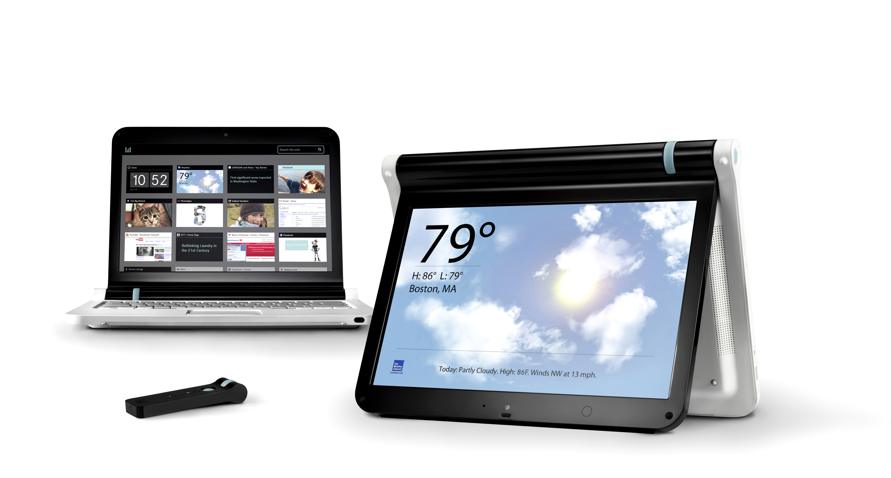

2010 is set to be a bumper year for Consumer Electronics. With people spending less outside the home they are focusing more inside and as just about everyone now has some monstrous TV it's the little things that count.

2009 was arguably the year of the Netbook. After Asus launched with their eeePC in 2008 a land-rush occurred last year with virtually every Notebook manufacturer providing an offering. HP's Mini and Acer's Aspire One ranges both did very well as did Asus with their eeePC.

At the end of 2009 however it became virtually impossible to get a Netbook that is truly still a Netbook. Acer, Dell, Asus and HP all fell back into their same tired old routine - bigger, faster, more capacity! And the Netbook experience suffered.

I've made this point before but the power of the Netbook is in the Network - not in how big a hard drive it has. Why do I need a 160GB hard drive when I have Terabytes of NAS and Gigabytes of cloud storage? I don't need 5 USB ports and I certainly don't need Windows.

Having said all of this the Netbook category has gone ballistic - having doubled from 16 to 33 Million units sold in 2009 - sales are worth about $USD11Bn globally ([Display Search research for 2009](http://www.displaysearch.com/cps/rde/xchg/displaysearch/hs.xsl/071309_mini_note_netbook_shipments_to_double_y_y_to_more_than_30m_units_in_2009.asp))

<a href="http://www.flickr.com/photos/litl/4077444353/">litl
web book prototype design (image (c) litl)</a>

My money is on the next generation - so called Web Books, Slates or Tablets. These devices are being actively invested in by a number of investors and represent a merging of several types of computing behaviour.

Architecturally, most are small form factor (10 inch or less), are either a tablet or have a folding range far outside the normal Notebook range (can be flipped over on itself entirely - so is just a screen), they are generally touch screen capable with many being multi-touch and the big one - most are not running windows (generally running flavours of Linux).

Behaviourally, the Web Book is designed to be a piece of Consumer Electronics. It's not a desktop replacement, it's not an office machine. It's a device that is a general purpose computer but built to use in the home as such it plays on the following:

* It's relatively small and definitely light.
* The processor is powerful but not an energy guzzler (Intel Atom's do brilliantly here as do ARMs)
* The display is gorgeous and has high viewing angles so multiple people can see it
* It uses wifi and may not even have Ethernet connectivity
* Solid State disks are a must but are low capacity (you don't need more than 16GB in a machine that is connected to a network) thus saving on energy
* battery life is a must - the longer the better thus every component is energy efficient
* Ideally the screen is touch capable and ideally multi-touch (thus eliminating the need for a keyboard)

The device is permanently connected to the network and thus the Internet. It's there to connect with people, view photos, play your tunes, watch movies and read web pages. <b>It's not there to write documents, do full scale design or programming</b> (though people will use it to do this in a limited, fast fashion).

I've been excited about Internet tables, Slates, Web Books - call them as you will since Nokia released the N710 and with [Apple](http://gizmodo.com/5434566/the-exhaustive-guide-to-apple-tablet-rumors), [HTC (Google)](http://www.smarthouse.com.au/Home_Office/Notebooks_And_Tablets/C5J4K9R8), [Litl](http://litl.com/) and others all about to play in this space in a big way over the next few months, there will be a lot of people asking for a Web Book or Internet Slate in their Christmas Stocking next year.

Expect to see masses of innovation in this space as companies that have not been too caught up in the Netbook scene enter the fray for the first time and start showing off some new ideas. Litl does this with their awesome Easel Frame style web book and both HTC and Apple will do some great stuff on the user experience end of things too.

2010 will definitely be the year that the Internet goes increasingly mobile both inside and outside the house but the experience of it literally becomes more tactile and less bound to the keyboard.
