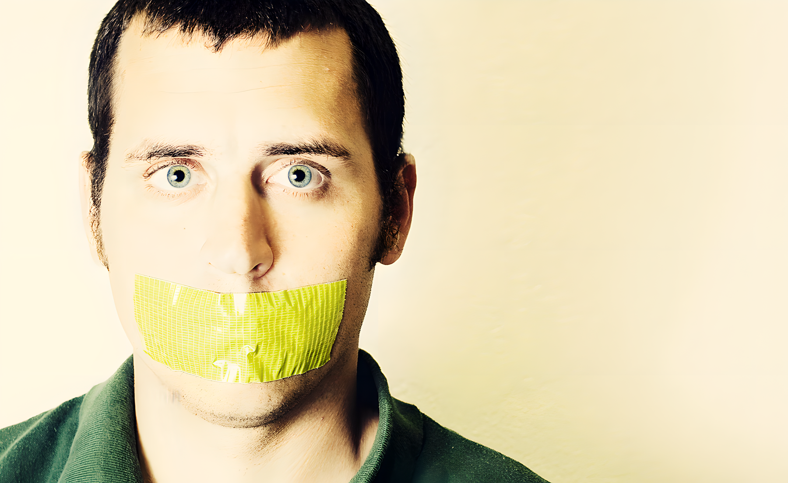

Having watched the trainwreck that is the Australian Internet Filter and Senator Conroy's single minded obsession to go down in history as the "man who removed free speech from Australia" I can't help but notice two things:

#### There has to be support somewhere

I canvassed people on twitter and email and I can't find anyone who knows of support for this scheme. Having said that, there's no way Conroy can go and do this by himself. Don't forget old Johnny Howard was touting this idea long before Stephen Conroy was.

#### Antagonists are arguing an emotional issue on technical merits

I've been as guilty of doing this as everyone else in the Open Internet / No Clean Feed camp and numerous industry stalwarts (Google, Yahoo & Microsoft included) have made [submissions to the government](http://www.dbcde.gov.au/online_safety_and_security/cybersafety_plan/transparency_measures/submissions) using exactly this tack ([SMH has a good summary](http://www.smh.com.au/technology/technology-news/conroys-internet-censorship-agenda-slammed-by-tech-giants-20100323-qt83.html?rand=1269318915365)). I've written to my MP, I've supported petitions and made the technical argument vociferously. Arguing that there are technical problems with implementation, that it will slow down connectivity etc is all technically correct but the pro-filter camp just say "Think of the children" and it's like some magical trump card that will negate any and all arguments.

### Where the argument is failing

The problem as I see it is that the people who are supporting this aren't going out into the media and saying anything because they will be shot down by those that know more about technology. They are waging their war not through the media but through the back channels of conversation and the corridors of Canberra. The Open Internet / No Clean feed lobby whilst technically superior can't make a case that is being listened to and additionally we are out of step with the majority of voters who don't understand our concerns.

Take this conversation as an example:

Filter Lobbyist: "We must protect the children from pornography and terrorism online"

Parent: "Absolutely, I don't want my child exposed to that sort of content."

Filter Lobbyist: "Well that's what this filter will stop. Your child and everyone's in Australia will be protected from the harmful parts of the Internet"

Parent: "I completely agree"

Open Internet Lobbyist: "Yes well that protection comes at a price. The government will choose what content is 'appropriate' and can censor anything it wants from the population with no accountability. The cost of implementing a filter and maintaining it could be better spent on education programmes or policing and technically every part of your Internet experience will be slower"

Parent: "Oh"

Filter Lobbyist: "Think of the children"

Parent: "Yes I agree, we must protect our children from this type of content"

I've seen this exact argument play out at least twice now with friends and family. The problem we have is it's too easy for the Filter Lobby to recruit the average population into the fold and I suspect this is where Conroy's getting his base from. The only way to overturn this scheme is to get the average person involved, and to do that the technical arguments need to support but not dominate the conversation.

The only way I see of getting out of this mess is to **SHOW** the average person what the extent of this scheme could do.

### A call to arms

I want everyone who works at an ISP, a major content provider, or is a techie to do the following:

On a day in April we choose to voluntarily censor the Australian Internet.

<a href="http://www.flickr.com/photos/vtotter/3426290124/">It's
better this way (image (cc) Kevin)</a>

Let me say that again: We CHOOSE to censor our Internet within our borders.

Doing this will show every Australian online what it will be like to live with this system in place.

It's sounds like a challenge but it's not - here's what we need to do:

* If you are a search system like Google, Yahoo or Bing, you need to put an interstitial page on any link to something of questionable content (A standard blacklist would work) the same way Google does if you are about to visit a site where it knows there is malware. It won't stop you but we can take the opportunity to educate by forcing an additional click.
* If you are an ISP or you manage IT services for a business you can do this with DNS, send people to an interstitial page which then has a link to the content they are after (you could do this simply to well known RC sites such as YouTube)
* If you are a content provider run a black list over your forum or blog and get it to switch off content that may be inappropriate under this scheme. Again let them through but only after they've seen the message.

This can be done, and importantly it can be done quickly. All it requires is will.

If you know anyone that works in technology in any of these sorts of capacities, send them this page then get them to get in touch. If we can get some momentum we can use technical skill to make an emotional argument. We need the average person to understand what this means for them and to do that we need to show them.

Volunteer to Censor the Australian Internet.

Additionally - [support the EFA's fund raising activities](http://www.efa.org.au/)
