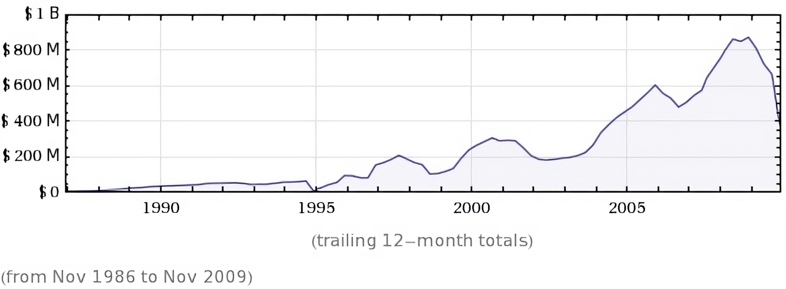

Adobe's public fracas with Apple over lack of flash on iThings and Google open sources VP8 - it's been a tough couple of weeks for Adobe with no signs of getting better. Cries of "My kingdom for a plan" may just about to be heard from the corner offices...

I've been through the cycle of love and hate with Flash. I have, at one time been employed to write games in flash, I appreciate it's usefulness in situations where HTML just doesn't cut it (3D animation for example) but I also loathe it with a passion otherwise reserved only for cucumbers - and have done for years.

Flash, unfortunately, has gone from being a tool that enhances the web to one which degrades it. It is responsible for more performance woes and crashes in the browser than any other technology whilst at the same time the standard of design with flash has become almost powerpoint-esque in it's mundanity (fade transitions and slides really don't light me up the way they did in 1998).

There was a time when Flash was just a tool for creating some interesting animations - then Macromedia made it a bit more programmer oriented, then a lot more programmer oriented but what Adobe didn't have the guts to do when they bought Macromedia was rip out all the designer oriented components and make it programmer focussed (that honour was left to the Open Source Flash Development team, with whom the last vestiges of Flash credibility now reside).

*[meh(image (cc) Rick Harris)](http://www.flickr.com/photos/rickharris/430890004)*

Adobe's lack of vision was the equivalent of a parent thinking it is okay to let toddlers play with machine guns - today's average designer is not capable of building anything non-trivial in flash that will not degrade or crash a browser.

## Apple and Google enter the fray

The highly public fracas between Apple and Adobe about Flash being allowed on Apple iDevices has been matched by a slightly less vocal, but extremely important movement to get an open video format into HTML 5. With Google's [recent move to open source VP8](http://newteevee.com/2010/04/12/google-to-open-source-vp8-for-html5-video/) this now looks like a reality and Flash's dominance in web video looks certain to end soon - especially if YouTube convert their videos across as is predicted.

Both Google and Apple both have self-interest in this move and both because of the shift to mobile computing. The second biggest search engine on the planet is YouTube and it is a media channel in it's own right - having their broadcast medium tied to a single proprietary format is potentially very bad news for Google (and has been because of the aforementioned issues around Flash-crashes).

Apple have always taken a line on their hardware that borders on the fascist, but with generally good reason - user experience is maintained to high levels. Introducing flash and the current crop of flash designers to any iDevice will have it crawling to a crash in minutes.

## Adobe hero... to zero

Today apparently Adobe are looking at giving Apple [a nice fat lawsuit](http://www.itworld.com/legal/104320/adobe-vs-apple-going-get-uglier) which I'm sure will actually make Steve Jobs laugh smugly as he drinks his coffee reading the news on his nicely performing iPad.

What went wrong for a company that was at the forefront of innovation through the 90s and with it's purchase of Macromedia was the owner of just about every credible piece of tooling for creating the Web?

My opinion is the acquisition of Macromedia went harder than anyone realised and Adobe are still choking the pieces down. Add to that the acquisition of Omniture  with some serious development needed to hold-off Google and this is a company that is trying to eat two elephants - at the same time; in one bite.

Adobe's current rate of innovation is laughable and they continue to support and invest in products they should have killed off 5+ years ago. Both revenue and profit have taken a dive with profit almost falling off a cliff since 2007.

*Historical gross profit of Adobe corporation - Wolfram|Alpha*

While I'm here it's worth pointing out that that profit is equal to about $45K per employee (compared to $70K per employee at Oracle or nearly $250K per employee at Google!)

## Adobe - where to now?

Whilst it's fun to give a major corporation a kicking, for what it's worth if I was working at Adobe here's what I'd be suggesting as a way to get out of the doldrums:

#### Kill Flash

The flash application as it stands now has got to go.

Video has moved on and enhancements to the After Effects product line to support one-click publishing (thus streamlining work flow) and supporting the Open formats would reinvigorate this product and be at the heart of an Internet Video transition that has barely even started.

Invest in developing an application that allows the easy animation of SVG which has languished as a standard because of lack of decent tooling. That developers are hand coding SVG and animating it via JavaScript and Canvas is ridiculous. There is great opportunity here and actually goes back to the heart of what flash was designed to do when it was Splash - vector animation.

#### Revive Flash

The only bastion of innovation in Flash these days is in 3D and Adobe are no where to be seen in this space. The native updates in Flash 10 to support 3D were okay but [PaperVision](http://www.papervision3d.org/) had already stolen the show. With 3D Augmented Reality using things like [FLAR](http://www.libspark.org/wiki/saqoosha/FLARToolKit/en) and the work already done by the PaperVision guys the reality of good 3D on the web may finally becoming a reality (I worked on [VRML](http://en.wikipedia.org/wiki/VRML) a long time ago which went nowhere).

#### Focus back in on the core products

Photoshop has always been Adobe's crown jewel. For a long time it was also one of the most innovative pieces of software being developed. The strategy behind the fragmentation of that product line into Elements and the web version probably went something like this:

Someone at Adobe piped up and said that because of piracy they should offer a cut down piece of software at a much more consumer friendly price so if a million people were pirating the full Photoshop they might get 100,000 sales from Elements licenses.

Adobe then went off and had to develop and support another piece of software that was then lower on magin and higher in support costs (lower skilled users).

Platform fragmentation kills your business - that's why Software as a Service exists.

[Photoshop.com](http://www.photoshop.com) is an attempt in this direction and may pay off but I'd kill Elements off with the vigour of an enraged samurai.

Photoshop isn't supposed to compete against Picasa, F-spot and any number of simple photo editing pieces of software. Through taking the eye off the ball it's allowed Open Source projects like the[ GIMP ](http://www.gimp.org/)to gain market share and start to be known for innovation.

The same diversions across the business are having effects elsewhere too, Illustrator having overlap with Fireworks for example has allowed products like [InkScape](http://www.inkscape.org/) to gain market share and again become known for innovation.

So kill off the misbegotten child that is Fireworks and at same time get rid of Dreamweaver too (is there a serious web developer that uses this any more anyway? It was great when we built in tables but is now officially worse than useless)

Cold Fusion should have been drowned at birth so let's finally put it out of it's misery.

The product suite is fragmented and chaotic - get rid of the things that aren't needed and focus back on the things that made Adobe great and not worry about the things you've inherited.

#### Leverage Omniture's experience

Omniture was one of the first SaaS companies in existence - it was also quite profitable. Learn from this and how to deliver software over the web but at the same time look at it in the cold light of day and work out in an increasingly Google driven world how it is going to compete (and as an Omniture user UI / UX is a big area needing revision).

#### Bring innovation front and centre

There was a time when Adobe was one of the most innovative businesses on the planet. Now is not that time. The business needs to celebrate innovation not with patents but with releases - do great things and get them out. It can really learn from Omniture in this regard.

#### Start listening to the market

Listen to your customers, understand what they want and need then take the best things and make them better.

Adobe doesn't listen any more - Apple, one of it's longest running partners gave it the warnings but no heed was paid. Adobe's head-in-sand attitude showed this week at the CS5 launch when they talked about packaging for iPhone / iPad which [Apple decreed last week could no longer be done](http://techcrunch.com/2010/04/08/adobe-flash-apple-sdk/).

No business can be so arrogant as to ignore warnings about it's market.

## Adobe, zero... to hero?

I don't know. We've seen a lot of businesses try and fail - Novell, Microsoft during Ballmer's reign, now Oracle to an extent. It takes an iron will to change a company's direction once it's set and has momentum.

Adobe used to be synonymous with creativity and innovation, now it is synonymous with being average.
