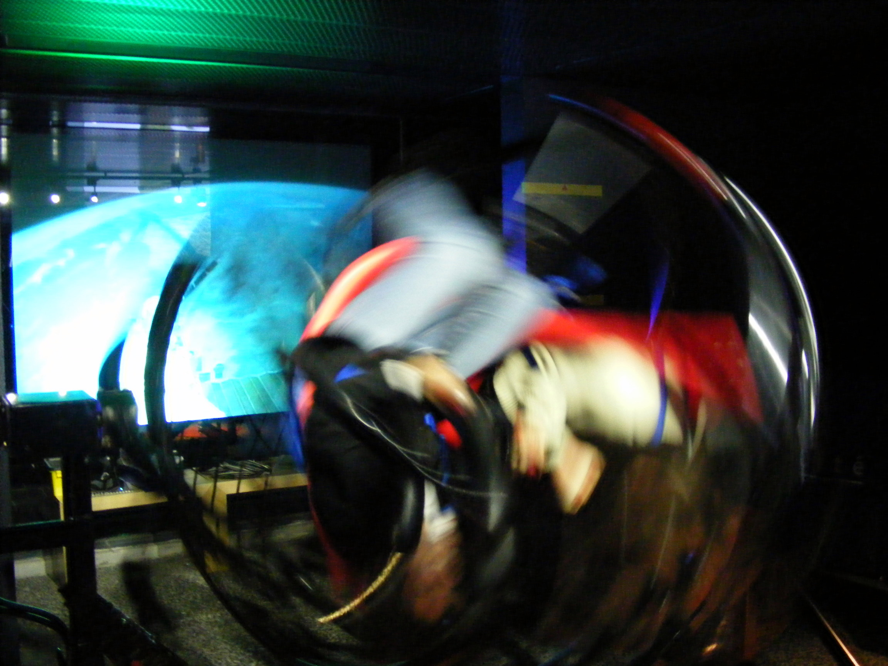

I've always loved the fact that in every smartphone there are a range of sensors attached to it. At the moment this is limited to GPS (position on the earth), orientation (how the device is tilting) and direction (how is it moving / accelerating) but we'll get others such as temperature, light etc at some point too. While we've had access to these for some time at the native app level, exposing access to these sensors has been slow to filter through to the web browser. We've had GPS for a while using the GeoLocation API which is great but it's a little too macro for playing with.

<a href="http://www.flickr.com/photos/slasher-fun/3039970101/">Gyroscope
et rotations - image (cc) by Mathieu Marquer</a>

With the iPhone 4 and Gingerbread Android devices we're starting to see this data become available. Mobile Chrome is lagging but Mobile Safari, Firefox for Android and Opera Mobile in developer mode are all providing access to the gyroscope and accelerometer data even though [the spec is still in draft mode](http://dev.w3.org/geo/api/spec-source-orientation.html). (Note: Having just got a Honeycomb tablet today, it appears mobile chrome for Android now supports these features so we should see it available in handsets from Ice Cream Sandwich)

If you want to see what sort of data you can get access to take a [look at the demo here](http://ajfisher.me/code/deviceapi-normaliser/examples/data.html) if you have one of the browsers above.

_Why would you even want this - a web browser is for browsing the web isn't it?_

It is, but increasingly it's a tool for interaction as well. I started exploring this space not so much for the applications that you could create within the browser (eg games) but more out of interest in how you could use the web browser to facillitate interaction with the physical world.

I work with a lot of clients who use apps to create engagement and I know there's a lot of download / install drop off. Even <b>as a hardened mobile user, accustomed to installing many apps a day, I get frustrated if I have to install something just to interact with a billboard</b> or in store display (especially if it isn't multi-platform).

If I'm standing in your store or in front of a piece of your media why are you asking me to download something?

With that in mind, I feel mobile web can come to the rescue. Why not use the web browser as a means of controlling a web app remotely. Could the web browser become a game controller in its own right, for you to be able to interact with media and with other people?

Have a look at the presentation I gave on this at [Web Directions South, What do you know Melbourne in August](http://whatdoyouknow.webdirections.org/) this year. There's slideshare and youtube available.

<iframe src="//www.slideshare.net/slideshow/embed_code/key/s9rdOygKqy7n9k" title="Device API - now with added fun" width="595" height="485" frameborder="0" marginwidth="0" marginheight="0" scrolling="no" style="border:1px solid #CCC; border-width:1px; margin-bottom:5px; max-width: 100%;" allowfullscreen> </iframe>

<a href="https://www.slideshare.net/andrewjfisher/device-api-now-with-added-fun" target="_blank">"Device API - now with added fun" - slide deck (CC) ajfisher</a>

The YouTube screencast in particular shows how quickly people could jump on and start playing and interacting with a system that was literally only up for 90 seconds.

<iframe title="Device API - now with added fun screen cast" width="560" height="315" src="https://www.youtube.com/embed/h86K3wBycLA" frameborder="0" allowfullscreen></iframe>

YouTube screen capture of live presentation - WebDirections

Watching the smiles as people played this from where I was standing on the stage was gold. Tank tag demo starts at 4:30.

## How does it work?

Tank Tag is actually pretty simple. Using the device API events, DeviceMotion and DeviceOrientation, I'm pulling the sensor data from the phone and streaming it to a server over [web sockets](http://en.wikipedia.org/wiki/WebSocket). The web server manages all the data and then provides it back to another browser (again using web sockets) that simply provides the view into the game using canvas (and actually handles all the game play). I'm using [Django Socket IO](https://github.com/stephenmcd/django-socketio) for the server but any [Socket IO](http://socket.io/) based server would work and you could do this just as readily using node.js for example.

At the moment this is a proof of concept and a bit rough around the edges and the big caveat is that because the sensors generate so much data (literally as fast as the phone can produce it) that you have to limit the web socket stream. For my demo I ran this using a portable wifi hotspot and at an event / media location you could do the same thing. Trying it out over 3G was very laggy though some optimisation may help there but 3G isn't really designed for realtime data streaming hundreds of times per second.

## Applications

As described above, and in my presentation there's plenty of applications within the browser itself. The [Is this an Earthquake site](http://isthisanearthquake.com/) is a cute application of the technology but is limited to one user. I've seen a few labyrinth and bouncing ball demos as well but they are all limited to the individual's context.

The big areas I see as opportunities for this technology are media interaction (individual or multiplayer) and physical interaction.

#### Media Interaction

As can be seen by the tank tag demo, using just a web stack it was possible to gain a large amount of multi-user interaction very quickly through a simple interface with an intuitive control method using the device as a controller. The opportunity for transforming media spaces (eg museums / installations) is huge - all that's needed is a small server (A mac Mini would be sufficient) a wifi access point and a display or projector a combination that would cost less than a thousand dollars + display.

Advertising media spaces could utilise this technology too, say on train platforms where you have a lot of people standing around for up to 10-15 minutes not doing anything (and largely having their phones out already). <b>What better way to drive brand engagement that providing a bit of fun or distraction?</b>

#### Physical Interaction

This was actually my first thought in this space as for WDYK Melbourne I was planning on having a mobile phone controlled puppet on stage people could interact with. The idea was a bit cumbersome to work with in the 5 minute format but the technology works. An early stage example of this can be seen in the photos below where I'm using the web browser orientation values across each of the three axes to [control the RGB channels on an LED](http://maker.ajfisher.me/2011/09/rgb-led-controlled-by-mobile-phone-browser/) thus creating an interactive light sculpture that merely requires a web browser and some motion to interact with.

Besides being a Django / Python guy, this was the main reason I chose Django Socket IO as the server - being in Python gave me access to USB devices so I could control the light (or servos) using the incoming data. I couldn't do this easily (if at all) with Node.

## Where to from here?

I'd love to see what people can do with this. I've [released a library](https://github.com/ajfisher/deviceapi-normaliser) that is in early stages of cleaning up some of the differences between implementations of the DeviceOrientation and DeviceMotion events and the data they produce. Feel free to use, play with, test and fork that.

If you're interested in Tank Tag and the arduino interaction stuff then that's[ available as a repo on github](https://github.com/ajfisher/django-arduino-socketio). It's a little rough at the moment but will be cleaned up over the next week as I stabilise it a bit more.

