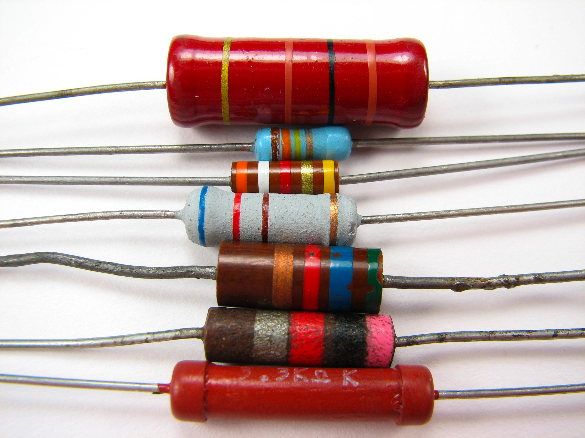
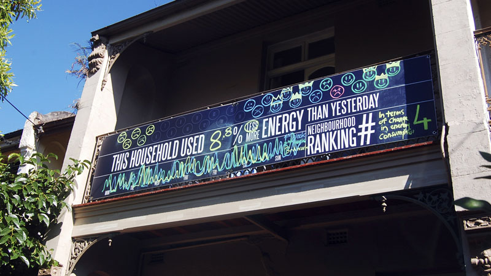

The [Internet of Things,](http://en.wikipedia.org/wiki/Internet_of_Things) a term being bandied to the point of almost meaninglessness now it's hit the mainstream of the [NYT](http://www.nytimes.com/2011/12/18/sunday-review/the-internet-gets-physical.html?_r=1&pagewanted=all) and the [BBC.](http://www.bbc.co.uk/news/business-13632206) Yet, while the mainstay of the media struggles to describe how and why smart sensor arrays are going to mean you spend less time in traffic, ultimately pay more for your electricity but make sure your fruit is always fresh, there is a quiet revolution taking place.

<a href="http://www.flickr.com/photos/oskay/437342078">"Resistors" -
image (cc) Windell Oskay</a>

The action taking place is the creation of what I call the Sensor Commons. Why is this a revolution? Because as a population we are deciding that governments and civic planners no longer have the ability to provide meaningful information at a local level.

Two posts summarise this activity and its implications beautifully for me.

The first, by [Ed Bordern](http://twitter.com/#!/edborden) from [Pachube](http://pachube.com), is on the creation of a [community driven Air Quality Sensor Network](http://blog.pachube.com/2011/12/you-can-help-build-open-air-quality.html). His passionate call to arms highlights that we have no realtime system for measuring air quality. Further, what data does exist and has been released by governments is transient due to the sampling method (ie that the sensor is moved from location to location over time). Summarising a workshop on the topic, he discusses how a community oriented sensor network can be created, funded and deployed.

The implications of this quiet revolution are discussed by [Jauvan Moradi](http://twitter.com/#!/javaun) in his post on [how open sensor networks will affect journalism](http://javaunmoradi.com/blog/2011/12/16/what-do-open-sensor-networks-mean-for-journalism/). Jauvan discusses how citizen data will re-establish the localised roots of journalism by reporting on issues that matter locally and with accurate, real time data to help drive the story. Obviously Jauvan has an interest in media so he's taking that slant yet this is but one of the many implications of the Sensor Commons.

We don't know what we're going to get when we arrive at a point where there is hyperlocalised data available on any conceivable measure - sound levels, temperature, rain levels, water quality, air quality, the number of cars passing a location in real time. The needs are going to be driven purely by local communities - by bottom-up interest groups that have access to cheap technologies to enable the sensor creation as well as a local need or concern that drives action.

I gave a talk at [Web Directions](http://www.webdirections.org) in October this year on the [Web of Things](http://www.slideshare.net/andrewjfisher/how-the-web-is-going-physical). The last third touched on the notion of community created and led data - citing the nascent [Don't Flush Me project in New York](http://dontflush.me/) and the spontaneous self-organisation of radiation data in the wake of the Fukushima Disaster.

<a href="http://www.flickr.com/photos/slowkodachrome/11817407183/">image cc Julian Stallabrass</a>

Through observation of many of these projects, as they mature one of the issues I have is that many of these endeavours require deeply technical knowledge in order to be effective. For the true Sensor Commons, as I see it, we need to have deep engagement with the population as a whole, regardless of technical ability or knowledge.

## What is the Sensor Commons?

Before I get into the fundamental requirements of a Sensor Commons project it's worth defining what I mean by the term. For me the Sensor Commons is a future state whereby we have data available to us, in real time, from a multitude of sensors that are relatively similar in design and method of data acquisition and that data is freely available whether as a data set or by API to use in whatever fashion they like.

My definition is not just about "lots of data from lots of sensors" - there is a subtlety to it implied by the "relatively similar in design and method of data acquisition" statement.

In order to be useful, we need to ensure we can compare data relatively faithfully across multiple sensors. This doesn't need to be perfect, nor do they all need to be calibrated together, we simply need to ensure that they are "more or less" recording the same thing with similar levels of precision and consistency. Ultimately <b>in a lot of instances we care more about trended data rather than individual points</b> so this isn't a big problem so long as an individual sensor is relatively consistent and there isn't ridiculous variation between sensors if they were put in the same conditions.

In my definition of the Sensor Commons, geography doesn't matter. You can be as hyper localised as measuring the sewage level of a borough - as in the case of Don't Flush Me - or measuring radiation on a global scale. The scale upon which you operate is dictated by the type of thing you're measuring. For example measuring water quality in two unlinked water courses makes almost no sense, in two different oceans it makes even less with regards to comparability.

## The 5 requirements of the Sensor Commons.

We're at a very early stage of the Sensor Commons and attempting to define it may be foolish, however by observing many different types of projects around the world I believe there are five critical requirements for getting a Sensor Commons project off the ground and making it a viable endeavour. A Sensor Commons project must:

* Gain trust
* Become dispersible
* Be highly visible
* Be entirely open
* Be upgradeable

Each of these will be dealt with in the sections below. A project that has these characteristics will generate a momentum that will exist beyond a core group of technical evangelists and will find a home within the mainstream community.

### Gaining trust

Many sensor commons projects shine the light on our human behaviour. Ostensibly the goals are noble - to try and understand our environs such that we can make them better and change our behaviour - yet we must stay on the side of data and fact and not move towards blame; others can carry that torch. For example the project that seeks to close down the local smoke stack due to its impact on air quality will have a hard time fostering trust due to their agenda. We all want to have clean air but my kids go to school with the kids whose parents work in said smoke stack - how will I look at them when they lose their jobs?

In the section on dispersal I'll talk about using existing community assets and infrastructure and trust plays a part in this. If you are piggy-backing the local library's WiFi so you can get a network connection down in your stream bed <b>it is imperative you don't abuse their network by sending or requesting too much data</b> - or harvest anything you shouldn't do.

Trust is provided by having stated project objectives, clear policies around what data you're going to capture, where it will go and how it will be used and available. Someone responsible for dealing with these issues and being the "go to person" for any issues or questions that arise will provide credibility as well as probably opening up some opportunities for partnership as well.

Note how trust requires no technology, merely an understanding of it. This is a perfect role to engage non-technical team members in, especially those who can articulate why the project is important to the community.

As an example the Don't Flush Me team have done an excellent job of this, they have built trust with the authorities who are granting them access to the sewerage system - there's no blame being cast, they are simply trying another way to help a community known problem. Similarly they are building trust with the community by creating a valuable resource for people who care about their local environment.

### Become dispersible

One of the biggest issues facing Sensor Commons projects is that of dispersion. Projects that seem like such a good idea fall at the hurdle of widespread adoption. Understanding how you can disperse your sensors properly means that like a dandelion seed on the wind you'll find plenty of places to put down and ensure success.

<a href="http://www.flickr.com/photos/apoptotic/2597478489/">Image
(cc) sciencesque</a>

There are many factors that contribute to this which are discussed below:

#### Price

This is pretty obvious but can go overlooked. What is the total cost of the sensor? Don't forget that as well as the material cost of components you need to factor in someones time to build the sensor (especially if it's short run and will be hand built by the project team). You also need to factor in ongoing cost - for example if you have a remote sensor that uses the 3G network you'll need a data plan that is paid for month by month. Similarly if it breaks down can it be fixed (if so for how much) or is it a straight replacement?

Price is a big factor in dispersal. Taking Dont Flush Me as an example, the cost of the sensor and the data plan make the project unwieldy without donations. While I'm sure this will work in the end, this isn't the path towards quick dispersal. Contrast this with say the radiation data gathered by individuals globally - while the sensors themselves were relatively expensive, the network cost was negligible and thus led to higher uptake.

#### Tapping into local assets

If you can gain trust with the community then you get the opportunity to try and use community assets to help with dispersal. If you can use things like WiFi on your project why not talk people locally and see if they would be willing to "host" one of your sensors on their network so long as you don't do anything silly. I used to belong to a kitesurfing group in the UK and we wanted to get a networked wind meter at our local beach so we could see if it was windy enough to go kitesurfing. As we all drank in the local pub on the beach anyway, the owner allowed us to mount a weather station on his roof and use his Internet connection so we could publish the data so we could all see it.

Do you have a local library that is on a main road? Might make a good location for an air quality sensor that uses their WiFi to stream the data back up. Libraries, schools, local council buildings are all community infrastructure - it's worth a conversation to see if you can use it for your project.

<a href="http://www.flickr.com/photos/opalsson/13535412304/">"The
Geisel Library" - image (cc) O Palsson</a>

In Melbourne you can walk along some of the suburban creeks that run into our bay and never be out of range of a WiFi connection for its entire length. Surely some of the people who live along that river would have an interest in the quality of the water and would share their WiFi with you? If you're a local organisation you probably know some of them or know someone that knows some of them already.

Utilising local assets can dramatically drop the cost of a project, meaning more units, greater dispersal and better community engagement too.

#### Units should be self contained

The sensors themselves should be as simple and self contained as feasibly possible. Utilising batteries or solar power makes sense and if you can use WiFi then it's even better. WiFi modules for things like Arduino use are becoming pretty cheap now so won't blow your budget too much. It's still cheaper to run cable if you can however this is another barrier to dispersal. It's one thing to ask someone if you can put the sensor in the creek next to their house and send the data through their WiFi, it's another entirely to ask them to route a cable across their yard, in a window and across a room to plug it into their router.

Don't underestimate the cable factor - I've had my wonderful and generally relaxed wife draw a line at visible cables taped to the decking so I could get data from the back yard into the house.

#### What level of technical knowledge is required to deploy?

To gain higher levels of dispersal, drop the technical knowledge required to deploy. There's a reason why Linksys and Netgear own the home router market - because anyone with some very basic instructions could deploy a box and get their home Internet up and running reliably. If you have a difficult package to deploy it means your technical members of your project will need to do it. This may not be a problem if you're doing small scale projects but if you have say hundreds of nodes this becomes an issue.

#### An API makes your data dispersible too

Once you have your data wrap it in an API so it becomes dispersible too. This doesn't need to be a grand piece of software engineering, either let me have all of it and document what you've got or else provide me a method of querying your data over a period (from X to Y) for the entire node array or individual nodes in the array. Make it lightweight and expressive, such as JSON and you'll provide a data set that can be readily used, integrated into other systems or mashed up with other data sources easily.

#### Adopt permissive licensing

Permissive licensing for your hardware, software and data allows it to be used and improved upon by others. You probably haven't considered all of the uses people will come up with for your project so let others help you.

### Be highly visible

There are two aspects of visibility that should be considered; first the visibility of the device itself and second, the visibility of the data created.

With respect to the sensor itself if it is in a public place then you should endeavour to make it visible and also provide information about what it is there for. Occasionally you're going to get vandals trash your stuff - there's not much you can do about it. However if you take the opportunity to explain what it is and what the project is about then <b>it becomes harder for someone to vandalise a community project than something put there "by the man".</b>

Once you have the data then look for ways not just to make it public but also ways to make it visible. The [Neighbourhood Scoreboards project](http://neighbourhoodscoreboards.com/) by [Martin Tomisch](http://twitter.com/#!/martintom) and team from the [Sydney University Design Lab](http://sydney.edu.au/architecture/research/research_deslab.shtml) showed how visibility of data at a community level could affect behaviour.

Imagine engaging with a local council that has a display on the side of their building showing what the overall air quality score was in real time for the borough? These sorts of Civic Displays could become quite common place as different projects feed data into them. There's probably an opportunity for civic art to incorporate data from these types of projects and display it in interesting ways to the local population.

<a href="http://neighbourhoodscoreboards.com/">Neighbourhood
scoreboards project</a>

By creating visibility of the data we can raise awareness or affect behaviour which is often the goal for many of these projects.

Data should be visible online as well - not simply by making the data sets available but also highlighting some meaning as well. What I found most interesting about the self-assembly of the radiation data on pachube in the wake of the Fukushima incident was that it wasn't "real" until it was on a [google map](http://japan.failedrobot.com/). Prior to that point there were dozens of data streams but it was too hard to interpret the data. Making your data visible in this instance means making it approachable for people to gain understanding from it.

### Be entirely open

Openness in this day and age is almost expected but it's worth pointing out that the projects that open source all of their code, schematics and data will do better than those that don't.

The other part of openness however is about the wider project context. This type of openness is about the transparency of the project objectives and the findings, documenting any assumptions about your data such as it's likely error rate and whether you're doing any manipulation of the raw data to derive a metric.

Government data sets and sensor networks are steadfastly closed but there is a lot of weight paid to them because they have an implied lack of error and high precision. Ostensibly this is because they are supposed to be "well engineered", rigorously tested and highly calibrated devices - why else would one sensor cost $50,000?

With radiation data on pachube as an example, there was much made in April about how reliable it was given that it wasn't calibrated, the sensors were probably sitting on peoples' windows and that they were only consumer grade. <b>Precision was never the intent for those deploying the sensors however so the argument was moot</b> - ultimately the point was to assess trends. If my sensor has an accuracy level of ∓ 20%  then it's always going to be out - probably by a similar amount. However if it goes up consistently over time, even though it's out by 20% the trend is still going up - and I wouldn't have known about that unless I was using a more deployable sensor because the government one is probably 200km away.

Having a culture of openness and transparency makes up for the error and lack of precision in the data. By "showing your workings" it opens up your data and method for critique and from there allows room for improvement. It also provides a method by which you can agree or disagree with the assumptions if you want to use the data and make an informed decision underpinning the data set.

### Be upgradeable

The final requirement is to be upgradeable. One of the benefits of [Moore's Law](http://en.wikipedia.org/wiki/Moore's_law) is that not only do we get more computing power for the same price over time but that we get the same computing power for less dollars over time. Consider a humble arduino - something that is more powerful for about $40 than a multi-thousand dollar 286 PC back in the late 80s.

Being able to upgrade your sensor network allows you to take advantage of all the developments happening in this space. Adequately modularising your components so they can be switched out (eg switching to WiFi from cabled Ethernet) as well as abstracting your code (not doing heavy processing on your sensor, offloading it to the acquirer then processing it) make upgrading easy over time.

This means your project gets better over time rather than stagnating.

## The Sensor Commons Future

Smart Cities are all well and good and [IBM](http://www.ibm.com/smarterplanet/au/en/), [Cisco](http://www.cisco.com/) and others are more than welcome to their ideas and products to make our urban infrastructure more clever - we need it more than ever now. For me this vision is narrow in that the top-down view made from a very tall tower provides an architecture that doesn't seem to solve problems at a local level. Humans, by our nature are highly localised beings - whilst we may have to travel long distances to work we only travel a few kilometres from where we live and work once we're there. As such we develop profound connections to our local environments - this is why we see "friends of" groups spring up for local parks, creeks or other reserves and why communities lobby so heavily for protection of these spaces. This type of technology enables us to interact with our environments differently.

If you think this is all naive data-driven techno-utopia think again.

Governments are starting to look at ways they can push their data into platforms like Pachube to make it accessible. Germany is in the process of doing this with its radiation data.

Individuals and project groups are already using tools like Pachube, [Thingspeak](https://www.thingspeak.com/) and [Open Sense](http://open.sen.se/) to aggregate data from their local environment (eg:[ C02 levels](https://pachube.com/feeds?tag=co2)).

It's becoming almost trivially easy to create the sensors and the web tools are there to hold the data and start the process of understanding it.

The access we are getting to cheap, reliable, malleable technologies such as Arduino and Xbee coupled with ubiquitous networks whether WiFi or Cellular is creating an opportunity for us to be able to understand our local environments better. <b>Going are the days where we needed to petition councillors to do some water testing</b> in our creeks and waterways or measure the quality of the air that we are breathing.

The deployment of these community oriented technologies will create the Sensor Commons; providing us with data that becomes available and accessible to anyone with an interest. Policy creation and stewardship will pass back to the local communities - as it should be - who will have the data to back up their decisions and create strong actions as a result.

If you have a project that is creating a Sensor Commons I'd love to hear about it.
