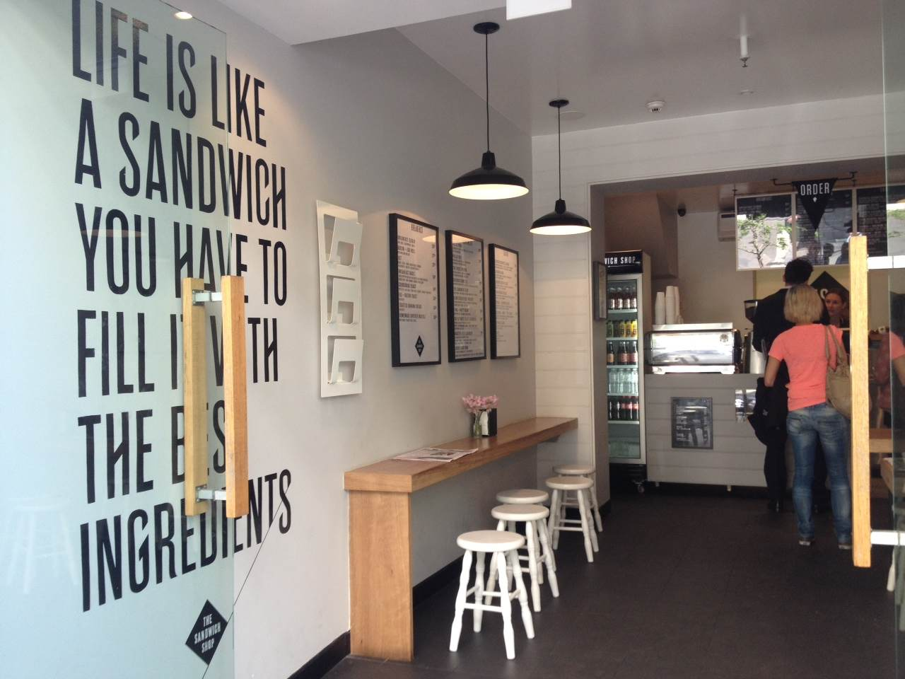
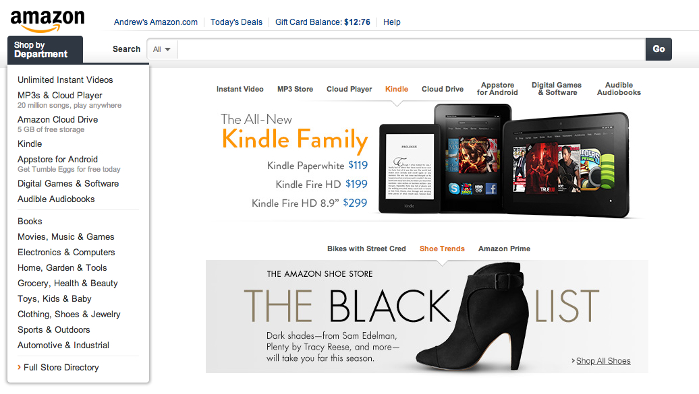
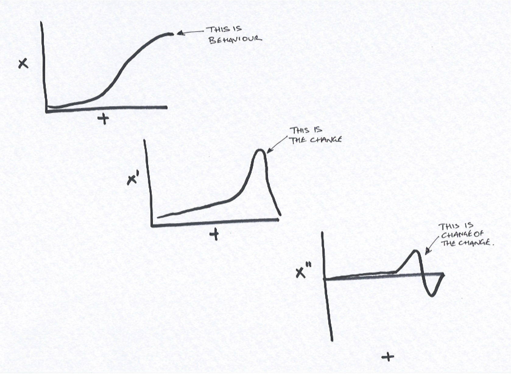

I had an opportunity to speak at Web Directions South again this year though was a bit daunted by the prospect of being asked to speak in the Design track for the very first time in my career. However, this was a great opportunity to distill a lot of the thinking I've been doing around responsive experiences for the last two years, thinking that dates back all the way to the work I did with [Paul Thurlow](http://twitter.com/jptcovers) at [peoplesound.com](http://wayback.archive.org/web/*/http://www.peoplesound.com) over a decade ago as well as more recent work at [JBA](http://jbadigital.com) as a result of my data work.

I've included the slide deck here as well as the document which lead to this presentation.

<iframe title="Datatium - radiation free responsive experiences" src="//www.slideshare.net/slideshow/embed_code/key/B1grIeiHuBesRn" width="595" height="485" frameborder="0" marginwidth="0" marginheight="0" scrolling="no" style="border:1px solid #CCC; border-width:1px; margin-bottom:5px; max-width: 100%;" allowfullscreen> </iframe>

<a href="https://www.slideshare.net/andrewjfisher/datatium-radiation-free-responsive-experiences">"Datatium - radiation free, responsive experiences" - (CC) ajfisher</a>

This is just a small piece of a wider body of work I've been amassing on this topic for the last year and my first attempt to codify the mechanisms of responsive experience. I will be looking to extend this over the next several months with some additional ideas I have on this and probably build a site to support it.

## Transcript

Today I'm going to talk about how we use Datatium to make responsive user experiences for the next 45 minutes.

I must admit I was a bit daunted at first at the thought of speaking in the design track at web directions because I'm not a designer, I'm a programmer with a fascination about human behaviour. So I thought, I'm not going to be able to speak about design, but I can speak about where I think the web is lacking, some things I think can help from a technology point of view and talk about what I want it to become.

The web as it stands has got remarkably prettier over the last few years, and we're seeing some interesting effects as the web is joining together nearly two billion people and that's all great. But the web is still not truly responsive to me as a person, it responds to my device and reflows nicely but not to my behaviour. We're not evolving to respond to our users the same way we're responding to technology choices.

[Amazon](http://www.amazon.com), for all it's early innovation on this front in personalisation is becoming less adept not more so. Every day that goes buy transforms Amazon into the digital equivalent of the local $2 store but one that just happens to move some things that might be relevant to the front of it when it sees me coming down the street.

That's not the type of web I signed up for when I started as a developer far too many years ago and this is why I'm getting grumpy - I was sold a personal jetpack and what I've been given is a Honda Civic.

In my future I want all my data made securely available to any service I give access to and I want those services to shape themselves around me all the time. I want applications that change their nature based on how I behave not just as a result of what device I'm on but how I use the service. I want all the features of the web - search, social, location, information, service layered around me all the time with relevant pieces popping into existence when I'm likely to need them, seamlessly integrated into my day.

I want the alarm in my phone able to access my diary, the weather, the traffic and the public transport system and decide whether to wake me 10 minutes earlier because it's going to take me that much longer to get to work.

I want github to recommend that I check out three other projects after I commit some code because it looks like I might be doing something similar and I might be better placed contributing there rather than making a fourth project.

I want the moon on a stick, I want a pony, and I want it now. Is that too much to ask?

Responsive Design is an important aspect of the next evolution of the web. People are starting to become unbound not only from desktops towards mobile devices but our notion of what is a web browser is beginning to change due to the fragmentation of the web across so many devices and services. The web is the only thing that can possibly keep these things glued together but responsive experiences are what allows the adaptivity between them.

And data is the fuel of truly responsive experiences and allows them to function and this is the notion of what I call Datatium.

My aim here today isn't to turn you into data scientists, though if I do make you decide to become one then that's awesome. Rather I want to start injecting some data science thinking into your approach to design and hopefully make you interested enough to pick up some of the tools and techniques I'm going to talk about today and start using them.

The third decade of the web is going to be led by those that understand data both from the insight it can give in shaping the user experience and by those who can get to grips with the mountains of data we're generating and design totally new data products from it. The next age of the web will become increasingly elastic and fluid that will react to the way we want to experience it.

And today I'm going to show you how using a little bit of datatium can really start to shift the types of experiences we can create.

So to do this we're going to concentrate on three key areas:

  * We'll start with looking at direct feedback experiences.
  * We'll then look at how we can use behaviour to shape a response.
  * And finally we'll look at the effect of context on experience.

So let's get started.

## Conditionally responsive experiences

Conditional experiences are the simplest type of responsive experience. They take explicit pieces of information and shape the experience based on what you tell them.

I call these conditionally responsive experiences because they are pretty much like big programming “if” statements: IF I do this thing or provide this information THEN the application does something in response..

This stuff is pretty simple as it's entirely driven by explicitly given data points and a lot of these things we can ask for and we can usually trust the data once we have it. For example if someone picks “tall” from a gender selection list we can start doing something with that information because we're going to be fairly happy that the information is correct and we ignore people that are lying and treat them as though they were telling the truth.

I can get a long way by designing this type of experience because it all comes back to what the user has told me they want.

Conditionally responsive experiences should be the baseline for most web experiences by now, but sadly they aren't or are often ignored - how many of you get annoyed when you set some kind of preference about how you want to interact with a service and then it's blatantly ignored?

So let's look at how we get the data to do this, the types of experiences we can create with it and then how we weave it into the design process.

### Getting data

What sort of data do we want to get when we're designing conditionally responsive experiences. Well the main thing here is to make it as clean as possible and also to use what you ask for.

Start by just keeping it simple. Ask questions and ask for corrections from the users. The obvious things are items like demographic and preference information and wherever possible provide a pick list.

Sometimes you can't do this however so you need to take a guess and roll with it or suggest an alternative to the user.

A really good example of this is [Google's](http://google.com/?q=sheos) “Confused User” mode where it says “Showing results for shoes” because you can't spell "shoes" Andrew.

Also consider best guessing and providing the results to the user showing what assumptions you've put in place - for example [Wolfram Alpha](http://wolframalpha.com) when you type Ruby gives it a go and then asks for further clarification.

So don't underestimate asking and validating with your users in order to get clean data that you can use.

### Types of conditionally responsive experiences

So we've worked out how to get the data so what can we do with it now we've got it. One thing to point out here is that if you've gone to effort of getting it, make a bit of effort to show the user how you're making their experience better as a result. If you've got it, flaunt it.

#### Efficient experiences

So the first and most obvious use of all this data is to simply make things more frictionless throughout the experience.

These don't need to be massive mods, they can be little tweaks to help make the person's process a little more frictionless. Like one of my pet hates is when I buy something online and I have an account because I've shopped there before and yet things like the contact form doesn't populate my details with name and email address. Why do I need to be asked again? You already know who I am, I've already provided that info...

Another way you can do this is by leading questions that might ask for something which helps a later decision. If we put the postcode field first in our address field set then we can pre-populate state and country with information derived from it. Now as an engineer I KNOW you need to do a real look up on postcodes to determine state because we have some wacky exceptions but a user is a little forgiving.

You don't have to be perfect in every instance. If you can get 99% with about 10 lines of javascript why wouldn't you?

Don't underestimate the value of tiny removals of friction, especially in things like checkout processes. The way I think about this is like a slide right. Remember when you were a kid and they made a slide out of some sort of metal that you just didn't seem to slide on so you had to wiggle your way down. Pretty soon you got bored and went and set fire to things or did something more interesting.

The Sandwich Shop, Surry Hills, Sydney - image (cc) ajfisher

One of my favourite examples of this frictionless interaction is actually from a sandwich shop over in Surry Hills. When you place your order you have to give your name. If you pay with a card though they use your name off the card and just confirm it with you “You're Andrew right?”. Beautiful! We can do this so much more often than we do.

#### Leading incremental experiences

We can also use conditional response to lead a user through a process to supply more data or gain experience.

This works by constantly shifting the goal slightly so you always have another destination but in doing so you build up your skill with the service.

[Linkedin](http://linkedin.com) leads people through the process of getting their profile built up and it doesn't feel like an interrogation. They need to get a full profile on everyone so they lead the user and stretch them with goals to supply more incrementally which helps the user as well because they aren't overwhelmed in the initial sign up process.

How many of you have played a game like Zelda Ocarina of Time, or Twighlight princess or some other Nintendo, SquareEnix or EA RPG of some sort? Okay most of you.

Notice how when you start playing one of these games you start off with a really limited palette of actions. You move around, maybe jump and maybe fire.

So you have this purposefully limited set of actions while you develop familiarity and then more and more complex actions are given to you over time. Eventually you end up with these control systems where you're clicking buttons like mad and it feels quite natural but if you tried to put that in front of someone in their first 30 seconds of a game it would be almost impossible to play with.

This is a responsive experience in action - the game helps you along the way but until you master the ability to do something you don't move on to higher degrees of complexity.

So we can use the data that surrounds our user to open up the experience around them as they are capable. As complexity arises in modern web applications, this keeps them engaged, doesn't overwhelm them and gives you more data to work with to create even more responsive experiences down the line.

We could do this much more than we do now.

### Design process

How do you approach this in the design process?

One of the ways I incorporate this is by calling it out explicitly during the wireframing and prototyping phases.  I draw little stick men asking what do I know about the user to this point and what should I be asking them now which will help me give them something more later?

I constantly look at forms and attempt to pare things back to only that which is required. You know when you go through that process of marking fields as required or optional? get rid of the optional ones! If they are optional create another process to fill them in later as part of “profile completion” tasks.

Every time you put a field down question what you are going to use it and what does the user get out of it by supplying the information.

Look at whether there's a better arrangement of requests for data that allow you to make the experience have less friction. Keep asking this over and over and work with your dev team to see if they have any additional sources they can pull in to help this as well - for example address validators or importers.

We've looked at the most straightforward type of responsive experience, the one that lends itself towards obvious user personalisation. We've looked at how we get data from the users and how that creates certain types of experiences and we've looked at how we can weave this into the design process. Now we'll take a look at the next type of responsive experience, where we don't just consider what a user says but we'll look at what they do as well.

## Behaviourally responsive experiences

Behaviourally responsive experiences are a little harder to create because we will look at what a user does as well as what they say - actions speak a lot louder than words.

A thing that we also need to be aware of is that behaviourally responsive experiences can start get a bit murky as well because the user isn't always aware of what is causing the application's behaviour so we need to consider transparency.

So we're going to talk about what data is useful for these types of experiences, the types of experiences we can create with them and how we factor this into the design process as well.

### Getting the right data

So how do we get the data we need to make responsive experiences from people's behaviour? This data is largely implicit in nature.

Now, implicit data is generally the stuff we derive from other sources - like familiarity with our system is a function of clicks to finish a task or time spent on a particular page or interaction with particular content.

It's less reliable and we can't say things definitively though we can start to infer things from this behaviour.

I just want to mention Web Analytics for a moment here. Even though I work with this every single day, I don't consider it real behavioural data. It's marketing spend justification data. So it's not that useful for us when designing experiences.

No, what we're interested in is in getting data that is actionable - that helps us form opinions about how design should unfold or about giving us direction for iteration. So that helps us; but we're also interested in data that shapes the experience for the user. It's about them too remember?

So we look at why is a user doing or not doing what you've set out to build for them? Are they getting stuck? How do we even know if they are getting stuck?

We can ask questions about a user's intent. What are they after? Are they exhibiting any sorts of behaviour where we can start predicting what they are ultimately wanting to do? Are they using our system in a particular way that allows us to tune the experience for that.

Often to make this type of data work you need to start working with a developer or a data scientist in order to start making sense of it, but it's worth considering these questions up front as it allows you to craft experiences around the answers.

### Types of experiences we can create

So once we have some behavioural data what can we do with it? Using behavioural data doesn't need to be ridiculously clever to be extremely effective.

#### Recommendations

Recommendations of what other things to look at is an obvious first step but one that's ignored many times. In my experience, a machine with a reasonable model will beat a human on recommendations just about every time.

Amazon are the obvious example here and have got consumers used to the idea of affinity matching - this model is also dead simple to implement too but it can work on other types of content too like this recommended stories panel from the New York Times site.

So recommendations is a great way to help the user and increase discoverability and you use the data from thousands or millions of users to create the correct associations. When you've got a product catalogue that literally has hundreds of thousands or millions of items in it then you need to be able to do this.

#### Repetitive behaviour:

What can you do in order to get people to the things they really want to be able to see as fast as they can. One of the things I've been toying around with is to consider the thing someone does most frequently and consider having a slot for it in your main nav or homepage.

For example if I have a pay as you go mobile phone and I recharge it online, chances are most of my visits to the website are probably going to follow a pretty well defined path. Home page, account login, select recharge, put in the recharge details, complete, exit.

Why not make this a link that surfaces when I start exhibiting this behaviour. Sure it makes it a little harder to design for but if we just make the slot available for responsive experience customisation and define constraints around it then it makes it much more useful for the user.

Taking Amazon back as an example the thing I do more than anything on the Amazon site is check my Gift Card balance because I read so many ebooks on my kindle. Creating a responsive experience for me would be taking that piece of data and then exposing it on the site AND exposing it through the API that is available to the kindle. That's the sort of stuff that starts empowering users and making them feel as though the application is reacting to their behaviour.

So behaviourally responsive experiences start becoming a lot more elastic in terms of design.

### Design process

Now the problem with behaviour is it's inherently chaotic. It's messy and it's now reliant on users who could be doing all sorts of different things and behavioural data can be contradictory as well. Argh - how can you design for it without it looking like 20 random things have just been vomited up onto your home page.

Start small and build upwards. Consider using behavioural rules like we do media queries to show behaviours once a threshold is reached.

Some thresholds will be low - for example product recommendation based on the product you're looking at. Others will take time to develop say surfacing content that is based on previous interactions with the service over long periods.

Design for slots / modules as high up as your primary page structure where you can dynamically allocate them as the user's experience evolves. And make sure you do this early on as this helps constrain the chaos a little bit can stop data vomit later on.

#### Allowing for failure

Now, we need to consider designing in methods to allow people to correct a mistake. If you embrace the chaos of behaviourally responsive design you ARE going to make mistakes in what you put to the user but they are good opportunities to learn.

So in your design process you need to do two things.

The first is to make it transparent to the user about WHY they are being provided with the information you're providing them. Sometimes this can be hard to articulate easily so you might need to work at it.

[Amazon](http://amazon.com) recommendations work quite well here because it tells you what you purchased or looked at in order to get the recommendation.

The second is allowing the user to correct things. Facebook ads are a good example of this as they let you fix a problem and in fact they look at it as an opportunity to collect some additional data about WHY it was no good for you which helps them with their targeting ongoing.

#### Passing data back that's useful

Correcting failure starts the process of closing the loop on behaviour, however, we can extend this and provide the data back to the user in some other form to start using for themselves to give them feedback on their own behaviour.

The saying goes that if you're not buying the product then you are the product and I think many users realise this now. But that doesn't mean you have to just brutally harvest them for their data and sell it off to the highest bidder through targeted advertising.

A nice obvious example of that is say [Last FM](http://www.last.fm/user/andrewjfisher/charts) which shows succinctly what I've been listening to over different time periods, by tracks, albums and artists.

Linkedin gives you stats about how your profile has performed over the last week or month to show how effective your profile is in search and visits. In fact they built an entire data product around this for “vanity users” who want to see all the details of how many people are looking at them.

So behaviourally responsive experiences take a bit more work but they completely change the nature of the experience from one of linear progressions down a decision tree to something that is a bit more fluid. It sits on the edge of chaos from a design and system perspective a lot of the time but if you embrace it you will end up with a bunch of unexpected consequences as a result which you can turn to even greater experiences for your users.

Now we understand how conditionally and behaviourally responsive experiences work we're going to talk about how we really start to change the nature of experience and look at contextually responsive experiences.

## Contextually responsive experiences

These experiences are ones that constantly evolve, they are highly chaotic and require you to think more about intent than about anything else. They are shaped by external factors to the user as well as to the explicit and implicit data they have generated for you.

To give you an example of how seamless this looks when you see it in action here's a clip from the Avengers movie.

Notice here how the HUD changes from a general display on what's going on to full threat tactical display in a heartbeat. Stark doesn't activate it at all and it becomes perfectly tuned to the tactical situation around him, responding contextually to the threats nearby.

Now clearly this HUD doesn't exist in anything other than a fictional sense but this completely sums up how I want the web to behave every day - and I'll settle for this without the flying suit of armour and pulse cannons in my hand.

A contextually responsive experience is really easy in theory but super difficult in practice. How many of you are using media queries to create responsive pages for mobile, tablet and desktop web experiences?

Great - just about all of you. So you're already familiar with the basics of contextually responsive experiences.

Now I'm sure many of you have come across this problem where you have a nice desktop site and you use media queries to reformat it to work on mobile but it doesn't feel right or worse it feels terrible? It ends up as a big long scrolly page, the navigational system doesn't work very well and you end up with something that whilst it's reflowed nicely doesn't really elicit the feel or the usability you were striving for. Has this happened to anyone?

Right so the issue here is that whilst the mechanics have worked properly using a different device has created a totally different context from one interaction type to another. This is the hardest type of  responsive experience to create because we haven't been trained to consider it, we don't have a lot of tools to make it work and it's really difficult to get the data for it. But this is where the web transforms into something else - something that's entirely and seamlessly linked into our every day.

So we'll look at how we get some data to work with, what we can do with it once we get it and then look at how we factor it into the design process.

### Getting the data

Getting the data to use for contextual responsiveness can be a bit hit and miss. The key here is to experiment, to use all sorts of data sources and blend them together. The obvious starting point is devices but that just lets you know capabilities you've got to play with.

Next we can consider time, different people use devices differently over the day and week. Using your tablet at 9pm is a different behaviour at 9am.

We can also consider location - is the person moving or stationary? You can infer location but you can also ask a user for their location if you think it will make it a better experience. Does the person's location overlap with known places like a train station, a train line or say you were a retailer one of your stores (or close to it).

These are just a few points that can create a whole bunch of different contexts that the user may be in.

If I visit a site on my phone at about 8am every morning through the week and I'm moving chances are I'm on my commute. This is very different to me using a tablet in landscape mode at 9pm where I'm connected via a high speed wifi link from a static location.

Context starts creating a significant number combinations of variables and this can quickly spiral out of control but start by just considering device, location, time and speed and you'll get a surprising number of contexts from them to consider in your design.

### Types of user experiences

We've got all these different contexts so what can I do with this information?

#### Externally adaptive experiences

Traditional responsive design starts here looking at capabilities first and foremost. I can start shaping the type of experience based on the device. By looking at connection speeds I can start shaping what they see. A mobile phone on a WiFI connection is a fundamentally different to one on a 3G network especially when you change cells and the network has to do a hand off.

As such we can change assets based upon this. As well as our media queries, we can send different quality images to users on poorer connections. Indeed we can even consider removing heavy images altogether and making them request based.

Reacting to these types of external events can really make the difference between a great experience and a terrible one.

Make the external factors that go into the experience something you can start to control.

#### Task oriented contextualisation

Now, a lot of companies when they “go mobile” have this belief they need to be able to offer everything on their site on the mobile site as well. This is rubbish. The user might tell you they want something but actually when it comes down to it, they'll do something else entirely. The reason for this is because of task oriented context.

I've been told anecdotally that when ANZ came to build their GoMoney application for mobile devices it was based around the insight that the majority of users logged in to the existing web application on their phone, looked at their account balance and exited again. As such in their mobile app they put it front and centre and then tacked on making a payment as well as that was the number two task.

> Context is what drives need and requirements.

When I'm out and about and I'm really mobile, I don't need the full capabilities of the entire ANZ online banking platform. I just want to see whether I've been paid and whether I have enough money to buy that new Vita game or not.

Don't underestimate task oriented context as it's a massive factor in behaviour. As we all have smartphones and tablets available to us one of the big shifts you see is in starting to use micro moments to be more effective. Smashing out a quick tweet, taking a photo and uploading it somewhere, paying a bill, reading an email. These are all massively task oriented behaviours that are bound to the context of our locations and our devices.

This works for desktop sites as well. For example I love the way when you're doing something in google docs all other Google services melt away. You can still access them when you need to, but the application becomes your primary context.

So understand what the user is trying to do and get them into that mode as easily as possible and maximise their ability to work within it given the constraints of the external factors that drive the context.

#### Adaptive contexts

The last type of experience we can create is what I call adaptive contextualisation.

Adaptive context is where all those context variables are being considered all of the time and they are constantly changing our experience on the fly. The only real example of this right now is the work google is attempting to do with Google Now. It doesn't really work just yet and is almost useless in Australia but it's a sign of the things to come.

This is showing how the future of much of the web will be fragmented and will slide across our various devices in different ways based on the data that's coming from all around me. Google knows I'm likely to be going home about 5pm so it can start showing related information to me. This could pop up in a widget in chrome, come into my Android home screen or be beamed to my pebble watch (well maybe in the future it will be).

This is where the web starts bumping up against the physical world. Where physical and web data starts seamlessly flowing back and forth and influences the way I interact with both.

Imagine walking into a store and little highlights are shown where product is that you might like based on your previous purchases that ALSO includes availability of stuff that's in your size. This is where adaptive context starts to go once we get things architected the right way.

### Design process

So how do we work this type of experience into design? This is really where system thinking really starts to take hold in order to make this work completely.

#### Embracing chaos

The first thing to do is to truly and totally embrace chaos. Contextually responsive experiences are complex systems. This is why they are so powerful as they are deeply adaptive. You can end up with some quirks so try to find out where the quirks happen and give the user the ability to take a decision that fixes it such as those I described before with behaviour.

#### Intent

To help with this we use intent. Intent gives you a framework without having to be prescriptive. To design with intent you should design and build prototypes rather than design in photoshop.

#### Rules

Once you have intent, you can then emit some rules for behaviour. These are your non-negotiables but the key here is to be sufficiently relaxed that you ONLY define the non-negotiables. This allows you to define really adaptive systems and maintain some standards but not have to define every single little thing which kills you in complex systems. Think of this as like an uber-style guide, where you're defining an approach to design rather than the specifics.

## Conclusion

As I said at the start my aim has not been to turn you into data scientists but give you some thinking about how this notion of datatium can help you evolve much more complex and responsive experiences by looking at conditions, behaviour and context to do so.

I want you all to go away from here and start creating highly responsive experiences in everything you do. I feel as though the web is about to hit another tipping point, where it is so ingrained into everything we are doing that it's about to morph again into these amazingly adaptive and responsive experiences that surround us every day, constantly shifting and changing.

Hopefully the examples I've talked through will give you some ideas of where to start but I want to leave you with a couple of things if you take nothing else from this talk.

### Golden rules for creating responsive experiences using data

Firstly here are my golden rules for using datatium to create responsive experiences:

  * You don't know everything, be open to ideas and open to what the data tells you
  * Data is worth more than opinion discussion shifts when there's data to hand.
  * Be bold - design is about exploring a domain space. No real explorer we know about now got there by sitting on their couch. Make a judgement and go with it a lot of the time you'll be wrong - who cares at least you'll learn something.

The other thing I want to leave you with is something I mentioned at the start. Data and data thinking is one of the most critically required skills of the coming decade of the web and society generally. Don't be afraid of data because you don't need a PhD in stats to do interesting things with it.

Back in the 70s a magazine was launched to help you make a punk band. In it there was a page:

Here's a chord, here's another, here's a third - go start a band.

Behavioural differentials - image (cc) ajfisher

Well data science is like punk. It's all about exploring the possibilities of what data can do for user experience and break pre-existing rules. So here's my equivalents:

  * Here's a question - What's the behaviour look like over a period?
  * Here's another - How does this change from one period to the next?
  * Here's a third - How does that change itself change over the period?

Now go make some responsive experiences!
