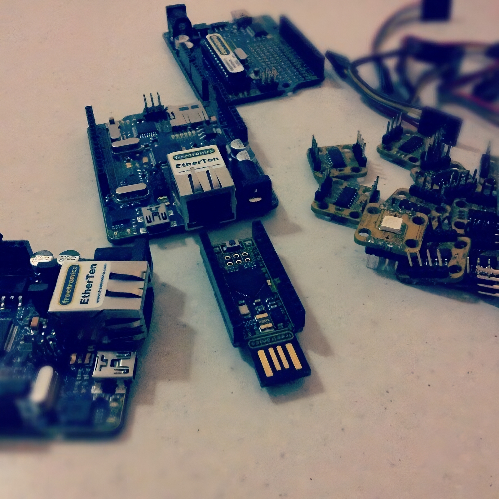
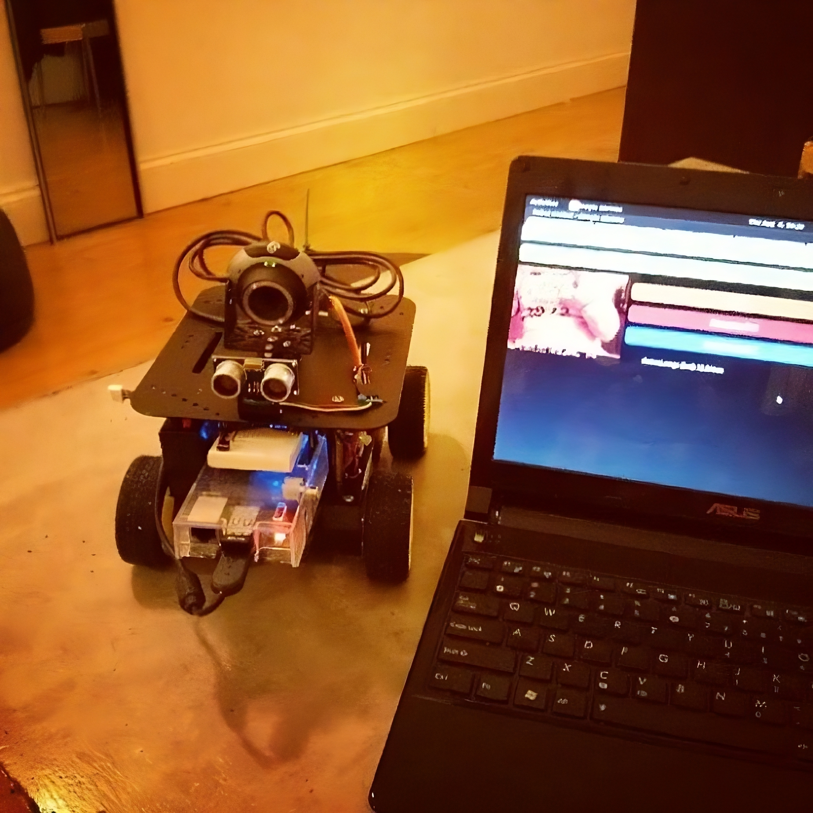

_The bent and broken pieces of the drone were lying scattered on a table in the office. There wasn't much worth looking at; most of the components shattered beyond repair. The PizzaCopter team looked at the mangled mess at the table. No one really wanted to be the first to talk about the crash._

_"Well," said the lead developer, "it looks like there was a bug with the range sensor. The flight controller didn't contain a type check on the data and so when it corrupted it interpreted it as NaN and didn't know what to do. At that point it just sped up and became a high speed projectile with a pizza and smashed into the ground."_

This is a riff on something [Glenn Siegman](https://twitter.com/gsiegman/) was joking about (quite astutely) on Twitter the other day  and something that has stuck with me since the launch of [technical.io](http://technical.io) earlier this week.

<blockquote class="twitter-tweet" lang="en"><p lang="en" dir="ltr">What if the Mars Curiosity was programmed with JavaScript, huh?</p>&mdash; Glenn Siegman (@gsiegman) <a href="https://twitter.com/gsiegman/status/368103661500891136">August 15, 2013</a></blockquote>

<blockquote class="twitter-tweet" lang="en"><p lang="en" dir="ltr">I&#39;ll tell you what would&#39;ve happened. It would&#39;ve crashed into Venus spitting out NaN errors.</p>&mdash; Glenn Siegman (@gsiegman) <a href="https://twitter.com/gsiegman/status/368104836228976640">August 15, 2013</a></blockquote>
<script async src="//platform.twitter.com/widgets.js" charset="utf-8"></script>

I don't think things would have been quite that bad, and we've certainly seen rocket scientists crash very expensive spacecraft in the past ([the ill fated Beagle 2 mission for example](http://en.wikipedia.org/wiki/Beagle_2)), however, I've been asked a lot about what I think of the project, not least because it coincided with a talk I did this week called [Building Droids with Javascript](http://www.slideshare.net/andrewjfisher/building-droids-with-javassript) and because I've been working and playing at the intersection of the web and hardware for quite a number of years now.

The launch of technical.io was met with the usual Hacker News crazy. One group of devs exclaiming, "OMG this is the most awesome thing ever invented", another, "Dude, be a man and learn C - that's what the real hardware devs do" and a final group that can only be summed up with, "Lol, you're a JavaScript developer, man could you get any lamer? You probably use PHP as well". <b>In all, the usual responses to an HN post discussing programming</b> and a perfect example of why I try to experience as much as the Web as possible without comments - though in this instance I read every single one - just in case there was some insight (in case you were interested - there wasn't).

I've spent a while trying to articulate my thinking on this as it's a complex topic that touches on hardware, design, engineering, community and education. I don't profess to have all the answers but I hope writing about these topics will create discussion about the role of projects like this in the community.

First up, let me give you some context as this may explain my "mixed" opinion on this bit of tech and about using hardware with JavaScript in general.

## Growing up a nerd

As a kid I was much more into electronics than I was programming - interested in why a computer worked rather than how to run code on it. I didn't have access to much hardware but dismantled every toy, VCR, blender or TV I could lay my hands on to understand how they worked. As I got older and computers got more powerful I got lured to the software side due to the ability to make things happen faster - particularly as a result of the Amiga demo-scene of the early 90s.

Eventually, my very first "tech job" was a summer job before writing software drivers for the very first resistive touch screens (Windows 3 and Amigas). These were used for multimedia installations in places like museums and were all custom built. I found it interesting and a lot of the software the screens interacted with was hypermedia. I realised then that I was actually very interested in how people interact with things rather than the things themselves. That went on to manifest itself in my degree choices (Psychology & CS) and then into working with the web very early on and that's been my career ever since. As a web developer I have always been much more interested in how and why someone interacts with something than the technology that underpins that interaction.

Even though my day job is and has been web development for a considerable number of years I've always dabbled with hardware, particularly embedded systems and this increased significantly since 2007.

The reason for this can be solidly accounted for by the robustness of Linux on the desktop and the availability of the [Arduino](http://arduino.cc). You'll note that neither of these things have anything to do even remotely with javascript.



<p class="caption">image (cc) ajfisher</p>

Having access to free development environments to tinker at a low level (initially with USB development kits) with Linux and then subsequently with the excellent hardware package that is Arduino brought me back to hardware in a big way. Since then I've been developing "things" for art, research, personal interest, fixing things for people, scratching itches and generally trying to join hardware with the web. I've spoken around the world on the topic and even helped provide feedback on new products being designed.

Over this time I've used many different AVR based chips and boards, played with PICs, designed my own boards, blown many things up and have achieved a passable knowledge of how to build and use modern electronics - especially when you want to have a physical "thing" that is interactive and connected to the web.

With that context in place, lets move on to JavaScript and Hardware.

## JavaScript all the things

JavaScript is a powerful language. It has a bad rap as being a toy because of it's early days when it was. Over time JavaScript has been getting better, more powerful, more complete and more "serious". My entire career has been defined by the capabilities (or not) of JavaScript dating back to its first release as LiveScript. I don't consider it a toy but I do consider it poorly implemented in parts (but getting better).

In my opinion the greatest strengths of JavaScript are its immediacy and its accessibility. It has plenty of weakness (insanely weak typing, implicit casting for comparison, terrible problems with numbers, fluid syntax, I could go on...). Regardless, these weaknesses are entirely overcome by those two points above.

Having taught quite a few people to code, <b>the benefit of being able to open a text editor or a browser console and type code that can be immediately and reliably executed is incredible</b>. The power this brings to the learner is unmatched. When trying to learn new things it's important to get positive reinforcement very quickly and JavaScript has this ability in spades.

Executing console.log("hello world") or window.alert(2+5-20) brings immediate feedback, makes you feel as though you're getting somewhere and that you are interacting directly with the computer as a programmer. For those of you old enough to own a Spectrum, C64 or Vic20 - BASIC (itself heavily derided) had the same benefit.


<p class="caption"><a href="http://www.flickr.com/photos/taizocurry/4129346259/sizes/l/in/photostream/">Image (CC) Taizo E.C.</a></p>

Many of those in their 30s got their first intro to programming by doing this:

```
10 print "Andrew rulez"
20 goto 10
>run
```

Immediacy of feedback is a powerful learning step and one that simply cannot be replicated by languages like C. Download and install your build tools, create make files, do your compilation and linking steps. Oops, syntax error! Now go back and do this all again once you fix it. Even as a seasoned embedded developer I **HATE** going through this process a bajillion times a day.

As for accessibility, JavaScript is accessible through the sheer amount of it out there. As a web language there's lots of it documented, web developers love to blog about it and there are libraries, snippets and howtos by the million.

I fully accept there is a lot of bad javascript out there - Stack Overflow is absolutely full of the stuff. It's probably second only to bad PHP in terms of volume (I made that up - there's no data to support that statement). Having said that, I bet if we looked at your first couple of years of programming C, Pascal or whatever you learnt back in the day we'd find some coding practices that we shall say are, ahem, less than excellent?

There's a lot of discussion about the bad parts of JavaScript blowing people's legs off because they don't understand them (eg everything being mutable so you can do things like redefine "function"). This is often said in a way that only makes me think of worried parents saying "no darling you can't go on the slide because you might fall off and break your arm". As both a parent of a child who's done exactly that by being stupid and as a programmer that has done equally stupid things in C (off by one errors on a memory pointer anyone?) this is both condescending as an argument and misses the point about the benefits of failure in the learning process.

JavaScript's accessibility and immediacy create a good opportunity to teach programming. If we are concerned, as a Computer Science community (and by that I mean all programmers, academic and professional), that JavaScript developers don't code the "best" way then <b>it is incumbent on all of us to educate rather than belittle</b>.

What must be remembered is that students entering and graduating Computer Science degrees are at an all time low and have been declining for years. And yet the number of informally educated developers in the web community is astonishing, many of them doing excellent work every day.

The ability to self-learn with nothing more than a web browser and an enquiring mind should be seen as the greatest gift the programming community has been given. From my perspective as a senior technologist it's certainly helped when it comes to availability of great developers to work with that our traditional educational systems have failed to provide.

Given this combination of accessibility and immediacy we find ourselves with an increasingly powerful language that is being extended further and further into "traditional" use cases of "real" languages like C++ (and dare I say Java??) and for reasons that can only be considered protectionist this is met with resistance.

At this point I will direct the reader to ["The innovator's dilemma" by Clayton Christiansen](http://www.amazon.com/The-Innovators-Dilemma-Revolutionary-Business/dp/0062060244). The gist of which is this:

* A new tech comes along (JavaScript) and it's cheap (free) but it doesn't do everything a more mature tech (C++) can do.
* The incumbents write it off for lack of comparability, usually saying "no one would use that - it doesn't do x, y, z".
* Over time, users of the new technology get involved with its direction and the features they need to make it better get added - usually at a considerably reduced price and they get the benefit of learning from all the implementations that came before.
* Eventually the upstarts take large swathes of the market, seemingly overnight, and the incumbents are left with husks of their former positions - often unable to explain how they got to that point and were unable to see the threat.

From cameras to cars to mobile phones to 3D printers this happens time after time so we shouldn't be surprised that JavaScript is doing this to established areas of technology (eg server side application development, embedded systems etc).

Now we understand why JavaScript is popular let us consider the use of it on hardware.

## Droids in JavaScript

The last 12 months have seen a significant shift in the amount of projects being done attempting to use JavaScript with hardware. Initially this has focused on using JavaScript to control hardware.

For example the [library that was developed to control the ARDrone](https://github.com/felixge/node-ar-drone) by wrapping its network protocol and exposing a JavaScript client. This created a slew of [NodeCopter](http://nodecopter.com/) events, where developers would build things with the drones using JavaScript. All sorts of applications have been created - everything from making drones respond to external APIs (dancing on a twitter @ message), to refined control UIs through to full image recognition and manipulation.


<p class="caption"><a href="http://www.flickr.com/photos/nez/8575918404">Image (cc) nez</a></p>

After that came the excellent [Serial library for node](https://github.com/voodootikigod/node-serialport) (removing my final objection to using JS with hardware). This meant that applications could control devices that are plugged in via USB. All of a sudden everything from controllable lights (eg [Blink1](http://www.kickstarter.com/projects/thingm/blink1-the-usb-rgb-led)) through to small scale robots started popping up.

Coupled with [Firmata](http://firmata.org/) - a protocol for controlling embedded systems over serial - it then became possible to[ start manipulating hardware very directly from within JavaScript ](https://github.com/jgautier/firmata)over serial connections. Whilst focused on Arduino, any board that implements firmata is a viable target.

This eventually led to the[ Nodebots / Johnny-Five project](https://github.com/rwaldron/johnny-five) (disclosure: I'm a big fan, have committed code to the project and helped run a nodebots day) that provides JavaScript objects for common hardware (servos, motors, sensors etc) for Arduino.



<p class="caption">Image (CC) ajfisher</p>

So within just over 12 months the community has gone from almost no hardware capability at all to being able to control things that fly, crawl and walk, make things light up and sense the environment. Yes much of this stands on the shoulders of other protocols, libraries and hardware but that's not the point (all software if built on the shoulders of lower foundations all the way down). The point is that when something is technically possible people will start doing things with it.

I've been playing around with web controlled "things" for years. For most of that time, particularly in Melbourne, it has felt very much like I was the only person doing it. There have been others dabbling from time to time but they were mostly coming at it from the engineering side (eg make a thing simply shift data over the network etc). Internationally this was reflected as well - <b>those working truly from a web perspective on hardware design for the last several years could be numbered in the small hundreds</b> at best.

I used [Web Sockets to talk to hardware devices](https://github.com/ajfisher/django-arduino-socketio) very early on and was consistently dismissed (even ridiculed) because HTTP & WS are heavy protocols and there are technically better ways to do it (there are eg [MQTT](http://mqtt.org/)). Now this is nowhere near an extreme position for these types of comms. Why? Because immediacy gives you the ability to prototype rapidly. A web sockets server in JS can be implemented in 15 lines of code plus "npm install express socketio firmata"). Accessibility means that you can find a LOT of developers who can do exactly that code above and actually know how it's going to work even without hardware knowledge. Try and do the same thing with tech like MQTT or [Protocol Buffers](http://en.wikipedia.org/wiki/Protocol_Buffers) and your pool of talent drops spectacularly.

So as this hardware has become more accessible, more developers are attempting to work with it. This is a **GOOD THING** because through exploration of a design space we get more coverage with the more practitioners. This is why the web has taken over just about every facet of our lives, because we have designers and developers tinkering on new ways of doing things or new ways of conveying information all the time. This effect should not be underestimated and we are only at the start of it.

One of my more contentious views is that your average web developer or designer in 2013 would have been a cabinet-maker, smith or instrument maker in 1913. I won't get into all the details of this but suffice to say that most developers and designers who work with the web have an intrinsic desire to "make" things. Most of them even refer to web work as a "craft" as much as a profession.

Once you couple the skills of a few hundred thousand web developers and designers with the ability to design, build and fabricate actual physical things that talk to the web you start ending up with interesting things. [Robots controllable from mobile phones](https://github.com/ajfisher/ajnodebot), [house lights you can interact with](http://lifx.co/), art where data from a buoy in the middle of the ocean is [tele-present in the middle of a gallery in Poland](http://www.youtube.com/watch?v=0p3je4WGcM0).


<p class="caption">Web addressable LED matrix - Image (CC) ajfisher</p>

Making hardware available to web developers is a desirable goal. Much of the web is given over to entertainment and solving first world problems. Being able to affect the real world provides an opportunity to fix actual problems and enable better quality of life for many. Web developers and designers intrinsically understand the "hard place" between systems and humans - making them uniquely placed to have a tangible impact in the real world.

## Abstraction creates magic

So far I've painted a picture of how desirable it is for web developers to be working with hardware so you would assume that I'm entirely for this idea. Here comes the grey side of my argument and the areas I believe we need to be wary of.

In working with developers coming across to hardware from software the single biggest knowledge gap is to do with the actual electronics. Many have never touched an electronic circuit of any kind (especially those that are younger).

Whilst electronics is a completely learnable skill, it is a barrier to entry that needs to be overcome before being able to design something non-trivial. Time after time I see posts from people saying, "I don't understand why it won't work" and 99% of the time it's due to a fundamental knowledge failure of how a circuit or a component works. Nearly every one of my own problems falls into this category as well.

Electronics components often either work or not and are much less tolerant of failure than code - not least because you can destroy a component, not realise it and then spend days debugging before you understand you have killed it.


<p class="caption"><a href="http://www.flickr.com/photos/brickman_photos/5597955361/sizes/l/in/photostream/">Image (CC) brickman</a></p>

It is this facet of electronics that the embedded systems camp are coming from when they say "do it in C". Not necessarily because the language is better but because you are working at "the metal" and as a result you will get a much more visceral understanding of the electronics. I totally appreciate this position and my fundamental electronics understanding comes from a combination of this as well as building analog circuits.

So now we get to technical.io and my concerns about this project and others like it.

Fundamentally I think there's too much magic here and not in a good way.

Abstraction is useful when it removes the need to do tasks that are low value or highly repetitive (eg finding the location of a character in a string or providing the routing for a URL to a page in a web app).

For the record, what I'm about to say next is based purely on my observations of [technical.io's public code](https://github.com/technicalmachine), poring over images of their boards and reading spec sheets for the chips they are using and reading all of their blog posts and commit logs. I have not talked to any of the team (though I'd love to - I expect they are insanely busy). IE: I'm making some educated guesses, doing some speculation and reading between the lines.

Technical.io attempts to build a board that runs JavaScript "natively". This isn't quite true. What happens is you require the tessel library and that provides you an abstraction of the board. Functions of the hardware are then exposed out via an API (eg led(1).blink() etc) that allows you to control pins etc.

This is pretty much what firmata already does, though firmata doesn't provide an API to the underlying hardware it simply provides the mechanism to interact with it (analog reads and writes for sensors and PWM, digital on / off states for IO pins etc). Firmata has its problems (it's very geared towards Arduino, there's issues with the project, it's slow moving, it's bound to a serial baud rate for starters) however it has a good protocol and it's in very wide use. There's also bindings for JavaScript, C, perl, Python and others which makes it very portable.

My bigger concern with this is that it would appear the libraries (and the plug in modules that provide additional functionality) ultimately wrap C libraries (which is pretty common in the node community anyway) however because this is a custom designed board with seemingly little access to  lower levels, the ability of non-core developers to add functionality will be significantly reduced. Thus <b>we land ourselves in the "app" world where the capability of our design is based on the ability of the hardware developers to expose APIs</b> for it (this will sound familiar to anyone that has dealt with Android or iOS?).

I also have some concerns that there's some kludging going on with both the hardware and the software. This always happens to an extent, but when you're dealing with inexperienced hardware developers who will be using this there may be some problems. Consider the "Servo" library which you would use to control servo motors. Servos look simple but they are relatively complex devices. Unlike a standard motor which can just go forward or backwards, servos use pulsed signals (PWM) to tell the servo where to position the servo head. For example a signal of pulses that go high for 1.5ms usually means align the head to the centre - longer and shorter pulses moves the head in ranges away from that centre point clockwise or anticlockwise.

The tessel board is using a chip designed to PWM LEDs (to make them brighter or dimmer or control RGB LEDs) in order to do servo control duty. This is a neat hack as it means you can control a range of different things with the one board but the biggest problem comes when a novice developer comes along, plugs in a high current servo, loads it up with something heavy and blows the board. Admittedly this can happen with an arduino (and I've done it) but it is a bit harder because you have to read more and you'll come in contact with good materials on using servos - most likely before you blow it up.

Next we have the obfuscation of the OS. To run JavaScript we need an OS to run it on. Given the ARM M3-Cortex chip at the heart of this board, this probably means it's running a micro flavour of Linux. That's great just by itself even without JavaScript but it would appear all of that power is going to be hidden away behind an interface layer. Whilst I'm sure someone will make some mods to make Linux available in some way, most users won't bother with that. Contrast this with the Raspberry Pi or BeagleBone which provide full access to Linux as well as anything you want to run on it.


<p class="caption"><a href="http://www.flickr.com/photos/stfnix/9176951660/sizes/l/in/photostream/">Image
(CC) stfnix</a></p>

In my opinion the BeagleBone provides the best mix of this - plug it in, connect over USB or network and you have Cloud9 IDE where you can write and execute JavaScript directly on the board. If you _want_ you can SSH onto the device and work at a Linux command line - you can work in perl, python, java or C quite happily. There's no requirement to do so but you get the power when you do. This provides immense longevity for the device and stops it sitting in a draw discarded 6 or 12 months down the line.

## Making hardware for JavaScript devs

Far from being dismissive of the tessel / technical.io project I think it's a great sign of where we are at in the JavaScripting of hardware. As stated earlier I fundamentally believe there is a massive opportunity to solve a lot of problems with physical devices by getting web designers and developers working with them.

However rather than build something simply to "run JavaScript" I believe a better approach is allowing JavaScript to be a first class citizen and provide a learning path that encourages the understanding of electronics.

Arduino is an excellent example of this approach from a C perspective. The reason for this is Massimo, David and the rest of the team are all educators - as such they fundamentally understand that you need to provide opportunities to experiment and grow your capability with every step and not lock someone into a dead end. With an arduino it is extremely easy to do simple things. You can copy and paste code from the examples and it will work. Due to the framework it's easy to see that the LED is blinking because you're turning pin 13 on and off every 1000 milliseconds - you don't even need to be a programmer to understand that as a concept. This is why arduino has been successful with students who are not naturally inclined to try programming.


<p class="caption"><a href="http://www.flickr.com/photos/oskay/2226419292/sizes/l/in/photostream/">Image
(CC) oskay</a></p>

However once you get beyond this level of understanding it's perfectly fine and possible (and encouraged) to start writing "real" C code that manipulates registers and memory. Thus the pathway from novice to embedded system programmer is entirely visible.

To construct this path with JavaScript we need to do two things.

The first is to provide only enough abstraction so that the focus goes onto the electronics. Someone that re-implements the simplicity of the arduino learn package and examples libraries in JavaScript with say a BeagleBone would do a lot to achieve this goal.

The second thing we need to do is provide a pathway for low level interaction. Ultimately this probably means working in C / C++ however an intermediate step may be able to do manipulation of hardware registers directly from JavaScript as well as be able to handle things like Interrupt Service Routines in a reliable way (so you know they will execute quickly and with priority). In embedded systems you can't get away from these requirements so we need to provide a means for developers to learn and understand them as part of the journey not hide it away as being "too hard" and therefore irrelevant.

## The "Internet of Things" needs web designers and developers

At the moment, hardware devices that are being connected to the Internet are mostly being built by embedded systems engineers. Whilst these devices may be technically excellent, they often lack an understanding of good web design practice - particularly from the point of view of good user interface design, API creation and consumption as well as openness and extensibility.

This may be perfectly acceptable for M2M type applications (at a stretch from my perspective) however for anything remotely consumer oriented, web designers and developers understand the human part of the Internet of Things. As designers and developers, getting a good grounding in electronics and hardware gives us an advantage when it comes to building these types of applications and there is a huge future in it due to the cheapness of computation and ubiquity of networks.

If you're a web developer and you're looking at playing with hardware, don't shy away from the electronics. There are no magic bits of hardware that will give you full control of the physical world in a box - though there are plenty of attempts at this. Develop your knowledge the same way you do with the web - by reading, tinkering, playing with code and breaking stuff. Go join a hackerspace, get some learning materials, visit electronics shops, pull things apart and learn how they work.

And seriously, if you design a PizzaCopter for actual use, please don't build it in JavaScript.

_Update: There were some concerns expressed that my original fictional intro was a bit FUDdy. On re-reading I tend to agree with that sentiment - it was an artefact of my original version of this post due to me explaining my concerns to another JS dev using a similar story. I've kept the core element but removed the death and destruction._
