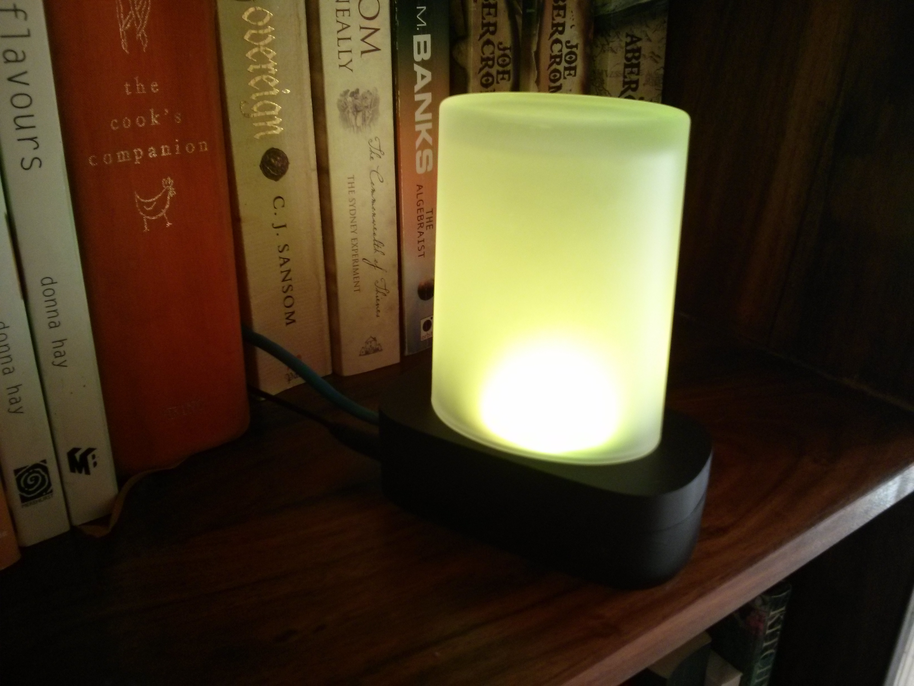

Information radiators are an interesting, though under-explored area of IoT - probably
because they are difficult to make money from in anything other than very custom
builds. I've built a few of these over the years - all of which were for
custom data sets (often my own amusement).

An information radiator is often a light (but could be any actuator)
that "radiates" information outwards by means of encoding information into the
light that is emitted. This may be through color, pulse duration, modulation
or some combination thereof. An information radiator is usually disconnected from the
source of that data which is often abstract in nature.

> In this post, I'll show you how to build an "information radiator" with a bit
of Python and some LEDs, which you can then use to make your own for your
own personal needs.

Full post at Packt: Building an Information Radiator
[Part 1](https://www.packtpub.com/books/content/building-information-radiator-part-1)
[Part 2](https://www.packtpub.com/books/content/building-information-radiator-part-2)

Temperature forecast radiator - ajfisher

Information radiators are fun to make, especially with kids or for workshops
as there are plenty of data sources you can use; weather, incoming tweets,
how full your email is or how often something has happened on your network. If
you can get a data source you can make it into a radiator.

