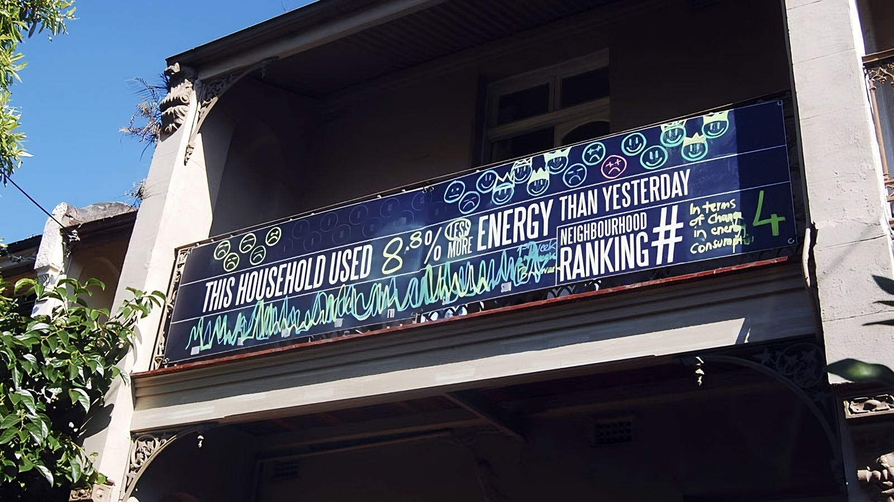

Right now, I seem to be the guy that is forever speaking about user contexts
and in particular, talking about the nature of how people behave in different
environments and their resulting use of technology within those environments.
My talk at [Web Directions 2012](https://conffab.com/video/datatium-radiation-free-responsive-experiences/)
focussed on this with respect to use of web tech, but this has also been a
primary part of the research that I set up Rocket Melbourne to look into.

What has mostly inspired this essay is that it seems like every week a new
piece of ambient technology is being launched on kickstarter - often to almost
Apple-like levels of hype (OMG this is totally going to change the tweet
notification market forever). I'm not going to talk about any one of these
products specifically because I wish them all the best and more people doing
hardware is a great thing.

Rather, I want to document some of my own findings, some insight from
observing (and purchasing) a lot of ambient technology products, and hopefully
highlight areas where people should be working in this space.

### What is ambient tech?

As you read this, you probably have many pieces of digital ambient display or
technology around you. If you're on a PC, chances are there's a clock in one
of the corners of your screen. If you're on a mobile device when you go back
to your home screen you may have widgets (if you're on Android) or badges
(if you use iOS) showing how many emails or tweets you have unread. You may
be reading this while standing on a train station platform where there will be
signage indicating how long until the next train arrives.

Departure boards are great ambient tech - when they work

Or, if you live in a house like mine you'll have many gadgets, all sporting
lights that are blinking on and off various colours to indicate a stack of
different things that are going on around you; from numbers of people hitting
my blog, to chirping when I get @ed on twitter to hot / cold indicators showing
me my inbox level.

And that's before we get to expert user systems such as the dashboard on your
car, which provides an inordinate amount of information to the driver at a
glance, and is being augmented further via smart heads up display (HUD)
technology projected onto the windscreen.

Ambient technology can encompass all these things and a lot more besides.
In essence, it's a method of presenting information to consumers that is
"around you". It's not typically "sit down at a computer and get it" type
information - typically it's embedded into our environment, hence the ambient
part of it.

In many cases there is some form of socially-created encoding involved,
such as the signs for the availability of a bathroom on an aeroplane that
switch from red to green showing busy or vacant. With many pieces of ambient
technology you have to be told what it's doing or else build upon your
knowledge of similar icons in order to bootstrap that knowledge. The bathroom
light builds on our cultural knowledge of stop / go colours as well as
socialisation that teaches us about the states of bathrooms.

Good ambient technology is also actionable - <b>it provides you with information
allowing you to make a decision based on the data encoded within it</b> - should
you choose to act on it. To continue the bathroom light example; you can decide
whether it's worth getting up out of your chair based on the bathroom state, or
consider going to one end of the cabin rather than the other. This provides
efficiency in movement, allowing aisles to be kept clear, and crew to move
around easily.

It's worth noting also that ambient display information is "nice to have" and
not critical. It is different from, say, a warning sign or an alarm, which
requires attention and action to be taken. With the bathroom example, if you
ignore the light, you can still head to the bathroom, you'll just need to wait
when you get there.

The bathroom status light is a simple example but one that is familiar and
creates an actionable outcome from very simply encoded data. Thankfully, this
will be the last time I talk about bathrooms on aeroplanes in this essay.

#### Ambient display

Ambient display is a very specific form of ambient technology. This is usually
referring to showing information in a visual mode - whether through the use of
light or more traditional display methods (screens, matrix boards etc). It's
fairly common, as we can produce displays very easily, however all the senses
can be engaged in ambient technology with the right design.

### What's all this got to do with context?

Context is really important to how people use and interact with technology and
services. Anyone that spends a lot of time jumping between different computing
devices will know all about context and context failures.

Try to reply to a message of some sort on your phone while you walk down a
crowded street (DO NOT try this if you're driving).

<a href="https://unsplash.com/photos/8UzhdypkVzg">A man in suit passing on the road</a> -
Pawel Janiak (Unsplash)

Observe the information you pay attention to when you're navigating somewhere
in a public space you don't know. What signs do you look at? When do you look
at a map? Can you hold a conversation and navigate at the same time?

How do you perform when you have to process difficult information late in the
afternoon versus in the morning?

All of these things are different aspects of context and it is something that
is constantly changing around us. There are many variables that shape our
context as well. I often talk about location, time, connection speed and device
capabilities for web tech, however context is driven by an almost infinite
number of variables. When we consider humans in an environment, we consider
cultural norms, symbolic education, proficiency with the service being used,
mental state, noise, distractions and all sorts of other things that affect our
behaviour.

Any time we talk about humans and technology or services, context should be one
of the immediate things we consider.

What I want to try and do with this essay is to consider the ways ambient
technology can be deployed and consider the contexts that work best for different
types of ambient information.

## A contextual model for ambient technology

The model I've built uses two, four-quadrant comparison charts comparing three
variables.

In the first part of the model, I consider the complexity of the information
being displayed against how mobile the display is within the environment.
Mobility of information is becoming more important to humans, primarily as a
result of always-connected smartphones which can allow themselves to operate as
a generic ambient display endpoint. This can be seen in the four-quadrant chart
below.

The second part of the model compares the variables of actionability against
the complexity of information instead. As we have seen from advances in Data
Science, taking large amounts of data and distilling it down is important, but
being able to trigger actions as a result of that information is even more
important and useful. This can be seen in the chart below.

Complexity of information is presented as the X-axis in both parts of the model
so will be discussed here. This represents how much information is encoded and
is being presented to the user. It is worth noting that the same piece of information can
be encoded in different ways and represent different levels of complexity.
Complexity comes down to how tolerant of precision we are in different
situations and the ambiguity inherent in the choice of information encoding.

For example take a counter of some event such as unread messages in an inbox.
A board with the number shown has very low complexity. If we encoded that same
data on a scale from blue being zero to red being one hundred on a linear range
between, then this becomes more complex to understand without reducing precision.
Instead, the encoded data must be reduced in complexity to “a lot” or “not many”
rather than 78 or 3.

The following sections explore the model in more detail and illustrate the
types of ambient technology that work well within each of the quadrants when
taking the mobility or actionability variables into account.

## Complexity of information versus mobility of display

In the first part of the model, along with complexity, we consider mobility of
the display as our other variable and is represented on the Y axis. The chart
is repeated again here so you don't need to scroll back up.

Mobility in this case, represents how fixed the technology is to a specific
location. A mobile phone is obviously a highly mobile piece of ambient
technology however the flight status board fixed to a wall at an airport is
stationary so has very low mobility.

There are some inherent assumptions that go along with mobility, namely that
the technology is able to be powered and probably has some type of connection
to data via a network or other means (e.g. displaying direct sensor data from
its local environment).

The four types of of mobile ambient technology, with examples are highlighted
in the following sections.

### Type A: Peripheral display (Complexity:L / Mobility:L)

Peripheral display is probably the most common type of ambient technology
currently deployed. This is the most common starting point for anyone new to
Internet of Things related ambient technology. In this category are mostly
lights that illuminate based on some arbitrary action (eg pulsing based on
tweets with a certain hashtag).

This type of display can run the risk of being a distraction because it
often encodes information that may be peripherally available anyway. The
very common email notification light is an example of this - most people have
the status of their email in their pocket courtesy of their smartphone. As a
result, the information is too simple to be useful and redundant due to other
means of conveying it (thus leading to it becoming low value to the user).

Where this type of ambient technology works best is when the encoded information
is not in the information space of the environment already (that is, it is not
redundant) as shown in the following examples.

#### ISS Notify 

[This lamp lights up](https://www.kickstarter.com/projects/natronics/iss-notify)
every time the International Space Station passes over the
location where the lamp is employed. The idea was originally simply as a
visualisation that the ISS was passing overhead and to highlight that there are
humans permanently in space. NASA endorsed the project and the kickstarter was
well backed and supported. The value of this visualisation comes from the data
not being readily present in our environment especially as the ISS passes
overhead often through the day where it cannot be seen.

The ISS Notify device (image Kickstarter) - (c) Nathan Bergey

#### Smart lighting

Becoming common in car parks, smart lighting is helping to solve the problems
of "where can I park my car". This system relies on a pressure sensor in the
floor (or ultrasonic range sensor to see if a car is below it) and a simple
bright LED above each car park which displays red if a car is parked in the
spot or green if it is available. Additional information can be encoded such as
blue for disabled car parks etc. Arguably, the value of this information is
relatively low, however given its increasing popularity in car parks around
the world there must be at least a perception of increased traffic flow within
the car park compared to the costs of fixture (which are now extremely low).

### Type B: Pocket Widgets (Complexity:L / Mobility:H)

Low complexity, high mobility ambient devices are, at this time, heavily
skewed towards indicators that are present in our mobile devices in passive mode.
This distinction is that the mobile phone (or tablet) is in a restful
state - i.e. without the operator taking complex actions to get at information.
This is the information provided in the lock state of the device or in its
standard “home screen” mode.

Smartphones are clearly capable of much higher function, however, for the vast
majority of the time, their use is in a low function passive mode, only one
step up from true standby. Regardless of their passive modality, the devices
are still permanently connected to the network and arguably it was the smartphone
which truly realised the way "always on, always connected" would pervade our
day to day rather than permanently connected Internet at home or work.

Due to high levels of mobility whilst (mostly) maintaining network connectivity,
a passive mode smartphone can provide a large array of ambient information
that is very easy to understand with simply a glance at the device or via
auditory means as well via connected headphones (or speaker).

This type of technology works best where there is a need to have information
of very low complexity available at any point in an environment that a
consumer may find themselves. This is why smartphone widgets and notifications
are currently driving this area of ambient tech.

However, <b>this class of device can also encompass other, highly mobile but low
complexity means of displaying information such as bespoke, hand held sensor
devices</b>. An example would be a radiation dosimeter which shows the amount of
radiation a person has been exposed to and is highly contextual to the
individual using it and the location that they find themselves in but only
shows a very simple piece of information.

#### Weather widget (Android)

A simple glance at the screen provides current weather as well as a forecast
for five days ahead. Utilising well known cultural symbols, the weather widget
is a fixture on the home screens of most Android user's devices. Utilising the
sensors in the phone to understand location (GPS or coarse grained location
data) allows this data to be constantly updating no matter where the user is
in the world (so long as they have a working network connection to update from).

### Type C: Smart fixtures (Complexity:H / Mobility:L)

When you combine high complexity of information with low mobility you move into
the realms of Smart Fixtures. These are devices that are fixed in their
environment - digital signage is an obvious example - but are afforded great
capability as a result. Being built into the environment generally results in
better power supply (eg mains power) and connectivity (eg wired rather than
wireless network). Reliable power, network and a largely fixed environment
affords greater options for display and processor speeds as well.

Many of these devices tend to run on a more traditional PC-based architecture
rather than embedded systems as we see in other categories. In many cases, due
to the commodity nature of this hardware, the devices are drastically over
specified too. The side effect of this is that they are more capable of being
enhanced in place with additional capability over time and can also do on-site
data processing - something that is extremely difficult in memory constrained
embedded systems.

The best environments for these types of systems are those where there is a
large volume of information that needs to be displayed or where there is a
large amount of change in the data being displayed. Smart fixtures are also
valuable where the data to be displayed requires a degree of precision to
convey useful information.

#### Adaptive wayfinding

Increasingly common in airports as well as shopping centres and conference
locations, adaptive wayfinding provides a means for signage to adapt to
external information. The classic example is the departure and arrivals board
at an airport or large train station. With the increasing prevalence of digital
signage in public spaces this will get more sophisticated and may eventually be
able to adapt to the individual standing in front of it.

Flight arrivals board - 
<a href="https://unsplash.com/photos/9qQTUYm4ss4">Image jeshoots (Unsplash)</a>

Imagine for example, an RFID or NFC encoded boarding pass which updates the
displays in an airport as you walk near them in order to direct you to your
departure gate. No more mad dashing around unfamiliar spaces looking for that
transfer desk and subsequent flight you're almost late for.

#### Fixed visualisations

More and more buildings are starting to incorporate digital displays as part of
the material from which they are built. Whilst some are practical, such as the
ubiquitous stock price ticker you see in many financial locations, others can
be more artistic or abstract in nature.

As this class of smart fixtures start to straddle traditional architecture, the
information that is visualised and the way it is presented (explicitly or more
abstract) helps contribute towards the overall feel of the environment and its
subsequent use.

The team at the Rockwell Group lab are particularly adept at this as they are
constantly looking at ways to merge digital and architectural experiences.

<iframe src="https://player.vimeo.com/video/21064909?h=092a49c0f9&portrait=0" width="640" height="360" frameborder="0" allow="autoplay; fullscreen; picture-in-picture" allowfullscreen></iframe>

<a href="https://vimeo.com/21064909">Plug-In-Play</a> from <a href="https://vimeo.com/labatrockwell">labatrockwell</a> on <a href="https://vimeo.com">Vimeo</a>.

This example from a project they worked on called
[Plug in Play](https://www.labatrockwellgroup.com/plug-in-play) in San Jose uses
projection along with data fed in from a variety of social and internal sources
(eg tweets nearby or car traffic density) to help show all the data that is
being created within the community. This starts to draw a story about community
and citizenship and how people interact with the civic space it was designed for.

One of my favourite versions of this was a project done out of
[Sydney University](https://design.sydney.edu.au/neighbourhood-scoreboards/)
that was extremely low tech so is not quite a "smart fixture" but
shows the potential for smart fixtures in our environment in the future. The
Neighbourhood Scorecards project highlighted energy usage on a series of black
boards attached to the front of some homes in Sydney.

Neighbourhood Scorecard Project - Sydney Design Lab

The information was real though the means of updating was very manual. These
visualisations encode very complex information in an ambient manner where they
could be used to affect behaviour (those homes that had the displays decreased
their energy usage the most compared to controls who did not).

#### Little printer

This is probably one of the first Internet of Things devices that plays
directly into the Smart Fixtures category of ambient technology. Conceptually
this product makes a move beyond the "twitter light" style interactions
prevalent in Type A ambient technologies and forces a higher level of precision
of the content that is produced on the printer.

<iframe src="https://player.vimeo.com/video/32796535?h=59f4deecd1" width="640" height="360" frameborder="0" allow="autoplay; fullscreen; picture-in-picture" allowfullscreen></iframe>

<a href="https://vimeo.com/32796535">Hello Little Printer,</a>
from <a href="https://vimeo.com/bergstudio">Berg</a> on <a href="https://vimeo.com">Vimeo</a>.

The device itself is a [little thermal printer](https://nordprojects.co/projects/littleprinters/)
designed in a quirky body - not dissimilar to a receipt printer on a cash
register - that connects to the network and can print content supplied to it
via Berg's "Berg Cloud". Thus, the printer will deliver pieces of content such
as what are good things to cook, a summary of your calendar for the day or a
weather forecast (as well as a lot more by subscribing to channels) whenever
it is appropriate to do so.

Arguably the true success of this product will be how many people replace the
printer roll and continue to consume the information. The interesting aspect to
this is how the device is being used to bring pieces of ambient information
into the physical world and bridge the digital back into a very tangible,
physical experience - after all you're delivered a piece of paper with real
information on it. Moreover it transcends the mobility issues by allowing a
piece of content to be removed from the physical installation and taken with
you (such as your diary snapshot) whilst the physical device remains in situ.

### Type D: Expert display (Complexity:H / Mobility:H)

To have complex information available and have it highly mobile at the same
time as it being ambient in nature implies that it is probably Augmented
Reality or an extremely specialised mobile system (such as those used in
hospitals for patient monitoring).

What I find interesting with this space is that it highlights the failings of a
lot of AR that has been made to date and I think also highlights some of the
contextual flaws that things like Google Glass may develop if left unchecked.

From an AR perspective, this is really about heads up displays (HUDs) for
experts. What I mean by this is that the data is very complex and highly
environment specific. The types of applications where this type of ambient
technology will be most useful will be in military (and probably industrial)
contexts where additional complex information is overlaid with the real world
in order to support better decision making power.

It is easy to imagine the military applications of this once it is reliably
mobile, lightweight and network connected. This type of display has
historically only been present in the visors of pilots who are strapped into an
aircraft equipped with sensors and jacked into a field from their command and
control systems.

Arvika was exploring the use of data layered into their vision to help
mechanics when they are working on machinery (for example providing the
tolerances for components).

<iframe width="560" height="315" src="https://www.youtube.com/embed/02mSH2lh1lg?si=sxCil6tKK2HzS2LP" title="YouTube video player" frameborder="0" allow="accelerometer; autoplay; clipboard-write; encrypted-media; gyroscope; picture-in-picture; web-share" allowfullscreen></iframe>

I can envisage similar scenarios where field engineers are provided with
information by data science teams overlaid onto sites they are working on to
help them make better on-the-ground decisions.

Similarly, <b>imagine surgery conducted where the surgeon could have a patient's
vitals in their peripheral field of vision</b> rather than on a machine that is
cluttering the operating theatre. Taken further, a similar system could overlay
imaging information over a patient, giving the practitioner a first person view
of what is going on within the patient they are treating.

Unfortunately, this type of ambient technology is drastically less glamorous
than the Iron Man Mark VII HUD or Google Glass showing you what your friends
have just +1'ed. I think the killer use cases for this type of ambient display
will remain in industrial applications for the foreseeable future before
someone finds an appropriate consumer-oriented use case for it.

## Complexity of information versus actionability of data

In the second part of the model we consider the actionability of information on
the Y axis. Again, the chart is repeated so you don't need to scroll back up.

Actionability in this case is an indicator of how well the person interpreting
the information can take action upon it if they choose to. For example an SMS
notification on a mobile phone is a highly actionable piece of data (you can
instant reply or open a dialogue to reply more fully with a single tap) but a
tube of water visualising my current inbox level has low actionability as the
data it encodes is distant from the means I use to action it (I can't read and
reply to my email via a tube of water).

It's worth considering a definition of "actionability" for a moment because
it's a fuzzy concept. When I'm talking about actionability I'm
considering the ability of a human viewer of the system to take an action based on
the information conveyed, that is in direct response to the data presented.
There are two parts to this; the actionability as perceived by the user of the
system, and the actionability as perceived by the designer of the system.
Sometimes these can come into conflict; primarily because the designer hasn't
expressed the right context for their device - whether implicitly in their
design or explicitly by highlighting a use case.

In this case when I'm talking about actionability I am suggesting the “desired”
action that can be taken either by the device itself or easily within the
environmental locale of the device. An example may be a display on your wall
telling you how many emails you have unread. <b>By itself, this device has low
actionability - there's not much you can do with that piece of data. Presented
with a computer nearby or your smartphone to hand, however, and this device has
high actionability as it can be used to prompt you to check your email and do
something about it.</b> Moreover, this same device can transition between low and
high actionability by considering the designer's intent and the way the user
ultimately uses it.

Actionability makes no judgement on the complexity of the action that results
but it does assume some degree of action taken by the user.

### Type I: Distractions (Complexity:L / Actionability:L)

Much of the ambient technology I see falls into this quadrant and this is
primarily due to the designer not having adequately considered the
actionability of the information conferred on the observer. To move out of this
quadrant, a designer needs to ask one fundamental question "What does the user
DO with the information I am giving them?"

An acceptable answer may be "Nothing - it's just pretty" - at which case the
device moves out of this quadrant and becomes a Type III device. Often, as
expressed in the introduction to this part of the model, the desired action of
the designer and of the user are two different things and this causes Type II
devices to become Type I devices and become an unwanted distraction.

In my experiments in this area I've been responsible for building many Type I
devices, so rather than criticising anyone else's work, I'll discuss my own as
anti-patterns.

#### Twitter notification light

I built a lot of these sorts of things when I first started playing with
networked arduinos. They allow computation to occur in one location (eg a
server) but display can be had in another. Similar examples which I won't go
into include email notification lights or some other notification that an event
has occurred which is untethered from a computer.

Being untethered from a computer is important. In my research, this is what
tends to drive actionability down. In theory, having a light that displays when
you get mentioned in a tweet and illuminates without needing a computer sounds
useful. In practice it is not, it's a distraction at best and useless at worst.

This was probably more useful several years ago, but in the age of smartphones
that are typically less than a metre away from their owner at any point, they
are rendered useless.

Location matters too, if the light is in my living room but I am in my bedroom,
the device's utility has entirely disappeared as a result of it not being
visible to me (thus no longer ambient). This goes back to the issue of mobility
discussed in the earlier sections. The worst possible combination for ambient
display is low complexity, low actionability and low mobility. This type of
device will be an occasional distraction and often completely redundant.

### Type II: Ambient technologies (Complexity:L / Actionability:H)

Type II devices exhibit a powerful blend of having simple information
along with being highly actionable. As noted above,
the action to be taken may also be simple, however the user and designer are
aligned in what that action should be.

When discovered, these types of devices become integral to the environment and
to the users of them. Their success lies in that they are “missed” when they
are no longer available to the user. <b>This should be the holy grail for
designers of ambient devices</b> and user testing can rapidly determine whether a
user feels lost when they have to give up a particular device after having it
in their environment for a period of time to habituate to it.

Possibly one of the best examples of a Type II device is a clock - many people
feel as though something is missing when they no longer wear a wristwatch or
the clock on a wall is removed (or stops working). This is a fairly trivial
example, but it's that type of feeling of utility and reliance the designer
should be attempting to elicit when creating these types of devices.

#### Blink(1)

The [blink(1)](http://www.kickstarter.com/projects/thingm/blink1-the-usb-rgb-led)
is a USB device that plugs into any computer and is essentially a
scriptable USB powered RGB LED. In many ways, for a computer it is the same as
the Android notification LED mentioned above and will fill the same role.

<iframe width="600" height="325" src="https://www.youtube.com/embed/ZLvloI4RleI?si=B6V-xwMM2dNyNlKc" title="YouTube video player" frameborder="0" allow="accelerometer; autoplay; clipboard-write; encrypted-media; gyroscope; picture-in-picture; web-share" allowfullscreen></iframe>

blink(1) by thingM

Again, high actionability comes because there will be a limited range of
information conveyed but it will be highly actionable when it is because it was
configured by the user which removes ambiguity from the display. One of my
primary use cases is that I have large data processing pipelines that take some
time to execute which occur in just one terminal window I may be using.
Historically I just switch back every once in a while to see if it has
completed. If I was being really fancy I could script an email notification but
that's just cluttering my email with messages saying “Complete” a few times a
day.

In this context the Blink(1) works well because it can be triggered when the
job is complete and it will just change colour in my peripheral vision. If I'm
at my computer I no longer need to keep checking, if I'm across the room I can
see when it's done and go back if I need to.

This is low complexity, high actionability at work - I can immediately use the
information to do something with it.

#### Ambient umbrella

Unfortunately no longer available (and they never worked in Australia), the
[Ambient Devices Umbrella](https://www.myambient.com/productDetail/UmbrellaSupportPage/serialPrefix/090/)
was a great example of a Type II device. The umbrella
had a radio chip and LED embedded into it which could highlight whether it was
forecast to rain at your current location that day or not.

The use case was you left it somewhere you could see it (and keep it charged),
such as an umbrella stand near your door, and without looking at the forecast
you could glance at your umbrella to determine whether to take it with you that
day or not.

This high actionability is the key to true ambient devices in our environment -
they allow us to glance at the information they provide and take immediate
action upon them as a result. The coupling to a device that is specialised
lends additional actionability - looking at your umbrella as you leave the
house is a natural thing one might do anyway and having a visual cue to prompt
you to take it with you drives that actionability.

### Type III: Ambient Art (Complexity:H / Actionability:L)

Type III devices lend themselves towards interesting and beautiful pieces of
data driven ambient art. Their actionability is typically low as there's no way
to use the information provided to take action upon it directly. Instead, most
art provokes some kind of response that may be more introspective or societal
in action. For example a civic installation visualising crime locations and
volumes may inspire action by residents to take action - at the least
questioning what can be done to fix the problem.

#### Before us is the Salesman's House

This piece of generative art was commissioned as part of the Zero1 Biennele
(http://www.zero1biennial.org/) in San Jose, USA and installed in the eBay
campus there.

<iframe src="https://player.vimeo.com/video/50146828?h=376e564f1b" width="640" height="360" frameborder="0" allow="autoplay; fullscreen; picture-in-picture" allowfullscreen></iframe>

<a href="https://vimeo.com/50146828">Before us is the Salesman's House - Three Cycles</a>
from <a href="https://vimeo.com/user313340">blprnt</a> on <a href="https://vimeo.com">Vimeo</a>.

Exploring the notion that databases will be the lasting cultural
artefact of the 21st Century, the piece blends real time data from eBay with
text extracted from a novel, each day starting with “Death of the Salesman”.
Elements from within the selected text are looked up using the eBay data,
visualising information about them historically before ultimately selecting a
new book and extracting some text and starting the cycle again.

This type of ambient art is becoming more popular as a result of huge datasets
becoming available to be coupled with projection or other display media.

### Type IV: Command and control visualisations (Complexity:H / Actionability:H)

At the extreme end of ambient technology are Type IV technologies, squarely
aimed at Command and Control based applications. The best of these are
typically envisioned in cinema (such as the battle display in the 80s film War
Games), however they are becoming much more prevalent in business.

The key with Type IV displays is that they must be highly actionable otherwise
there is the risk of information overload which, in some command and control
scenarios, could even prove fatal as a critical piece of information goes
unobserved or misunderstood.

In business contexts, the increasing use of tools such as Tableau
(www.tableausoftware.com) and Splunk (www.splunk.com) to bring critical
information to the eyes of decision makers (primarily through tablet use rather
than tying a consumer to a desktop application) is streamlining decision making
processes and speed at which decisions can be taken.

To be truly Command and Control, technologies need to be highly specific and are
very contextual in nature. For example the C&C requirements of the traffic
management system for a major city are extremely different to that of the
commander of the rural bush fire services in Australia. A Network Operations
Centre display is another interesting example, it provides glanceability (all
systems are green) but it can also provide specificity to focus attention and
action (why is that specific server orange?).

This highly contextual relevance drives many of the decisions about what to
display and how to display it for maximal effectiveness.

## Creating ambient technology as a function of context

As illustrated above, different contexts are afforded through the combination
of mobility, actionability and complexity of information. Understanding the
forces applied by context in this way allows a designer to consider the
appropriate use of technology within this context rather than merely deploying
a piece of technology and hoping that it works (which happens a lot in the
ambient technology space).

A designer's role is to explore the spaces created at the intersection of
constraints (contexts in this case) and technology and <b>there are still many
spaces to investigate given the emergence of this type of information design
and art form.</b> The examples given are by no means definitive, however they could
be considered current canonical references for deploying ambient technology in
the right way for a given context.

Understanding how new technologies can enhance or disrupt the way in which
contexts drive the use of ambient technology means opportunities for new
products, displays or artworks that previously didn't exist.

### Avoiding the low actionability trap

The worst place to be in the model is at the intersection of low actionability
and low complexity where you have created a distraction (Type I devices). As
such, how do you design your way out of this problem?

Getting out means shifting one of the variables - either make the system highly
actionable or more complex.

To increase actionability there are three ways to go about this. The first is
to set the correct designer and user expectations around actionability. The
second is to create a means to take action with the data and the third is to
change the data represented to something more actionable.

You can also increase complexity in which case you want to consider how you
transition the display to be more artistic in nature and think about the
message you want people to take away (i.e. lean into the low actionability
nature of what you're doing).

Finally, <b>there are just some data points that are very difficult to action
effectively</b> - getting @'ed on twitter is a prime example. Few interfaces are
more actionable than a twitter client on a mobile phone - which is probably
more proximate than the piece of ambient display anyway. In this case, it may
be more pertinent to think about other types of information that are also low
complexity but require less action as a result of them, or actions that are
more immediately viable given your interface restrictions.

## Conclusion

As we rapidly proceed along the second function of Moore's Law (that a given
level of computation gets cheaper over time) we are witnessing the transition
to “computing as substrate”. Once achieved, this becomes the point where
computation becomes a material that can be used heavily in the design process,
as illustrated by
[Kuniavsky in “Smart Things”](https://www.amazon.com.au/Smart-Things-Mike-Kuniavsky/dp/0123748992).
Once computing as a substrate becomes commonplace, the amount of ambient
technology we are exposed to will accelerate rapidly bringing with it a
multitude of applications currently inconceivable.

This transitional period is a defining one, as many products and designs are
not “consumer ready”. Rather than being despondent about this, a designer
should look to the areas where most traction can be had, in ambient art, C&C
systems as well as sketching with emergent technologies and ideas to explore
the other spaces. In many cases failures will occur as a result of not
correctly understanding the contributing factors to the context and how the end
result is shaped by these. However the documentation of and learning from these
failures is critical in the creation of more ambient technology and using it to
enhance our spaces - whether in the form of information rich environments, art
or simple informational knick knacks.

#### Acknowledgements

This was a long essay that took quite a lot of revision and input from
others to make possible. In the end I sat on this for a very long time due to
the amount of editing involved. To that end I would like to thank those who
gave excellent and detailed feedback,
[Mike Kuniavsky](https://www.linkedin.com/in/mikek/),
[Jessica Smith](https://www.linkedin.com/in/seniorcyberunicorn/) and 
[John Allsopp](https://www.linkedin.com/in/johnfallsopp/).
If my writing is more clear it's because of their good work - any failings in
that regard though are all mine.

#### Notes on the model approach

I've tried to express this nermous ways but
this version survived the longest. Obviously, this approach is not
expressed as a three dimensional model with three orthogonal axes - this is
because I'm unsure they are truly orthogonal. I believe that mobility and
actionability are facets of some higher function but am yet to work out what
that is though they drive different behaviours on the end results.
Possibly as we start to see more, higher level ambient devices in the
wild, this will refine my thinking on the subject further.

#### Updates, corrections and modifications

This essay was originally written in the first part of 2013, but took a long time
to pull together and went through many revisions. Due to work, life and the
curse of editing such a big piece, this document wasn't published publicly
until September 2023, a decade after it was started. Rather than let the content
rot in a google drive folder, I decided to release it, but back date
it to the time it was "mostly" done.

More significant revisions were made in September 2023 to clarify various items,
update links to projects, and remove examples that have unfortunately disappeared
from the Internet.
