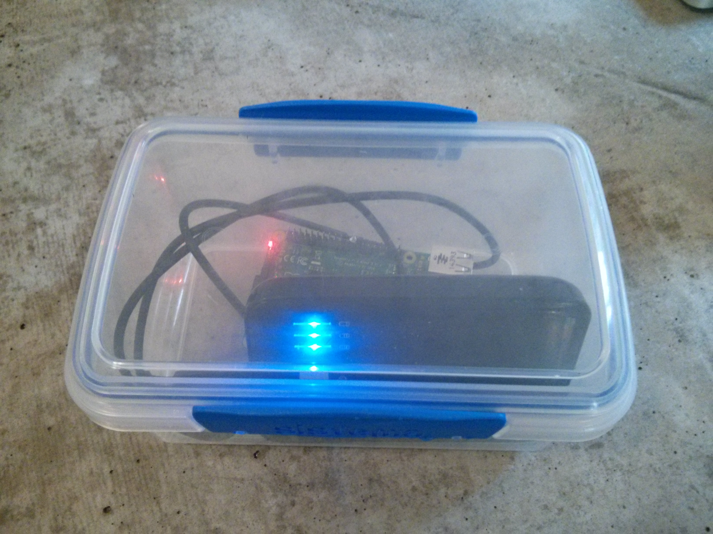

My son is pretty into minecraft - just like nearly all kids under the age of 14
at this point in time. He wanted a server that he could use to host a minecraft
world on that he and his mates could play on.

Being the security conscious person I am, having some device wide open to anyone
wasn't going to fly. Instead we flipped the interaction to create a mechanism
where they could play and be physically present with each other.

As a result of my robotics work there were plenty of Raspberry PIs and LiPo
batteries laying around so it was a fairly straight forward process to get it
all up and running.

> Minecraft is a lot of fun, especially when you play with friends. Minecraft 
> servers are great but they aren’t very portable and rely on a good Internet
> connection. What about if you could take your own portable server with you -
> say to the park - and it will fit inside a lunchbox?

The build process for this is published over at Packt
[Building a portable minecraft server for LAN parties in the park](https://www.packtpub.com/books/content/building-portable-minecraft-server-lan-parties-park)

There's also [some code](https://gist.github.com/ajfisher/f61c89733340cd5351a4)
if you just want to get stuck in.

*Minecraft server in a box - image (CC) ajfisher*

If you've got a child who has a group of friends who want to play together, this
is a nice safe way to do it where they get the benefit of collaboration along
with a device that can be more physically secured.
