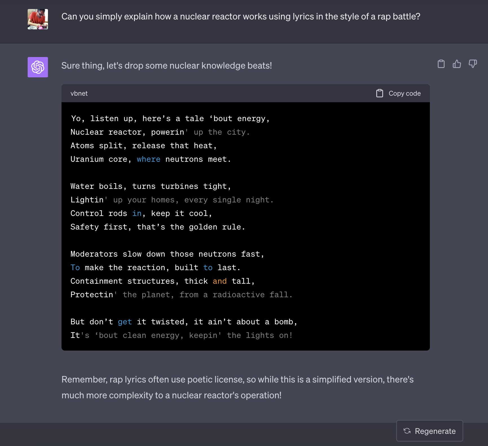

Recently, I was fortunate enough to get up to Sydney to attend the
[Web Directions AI conference](https://webdirections.com/ai) which provided a
good cross section to see where people are thinking and playing in this space now.

I studied AI at Uni in both Computer Science and Psych, but then abandoned
it because one of the (many) [AI Winters](https://en.wikipedia.org/wiki/AI_winter)
set in and I was going to be unemployable. That said, I've maintained a
dedicated interest in the domain, and I have tinkered or worked with many of
the technologies that have led us to where we are today.

The day itself was worthwhile – about half of the content I knew and was deeply
familiar with, but it was useful to see others explain it or how they are using
it which I find helps refine my thinking on a topic. The other half was either
new to me or was on an area I have familiarity on but is being used in a
completely new way – this stuff is great to shift the way I think about a given
topic and in particular my ideas about what use cases a particular tech is good for.

Many people have asked me about my thoughts since the session and I think these
probably represent a summarised view of the day and my thinking about the area
as of August 2023. No doubt this will change again in a few months given the
pace of change.

## The excitement and hype are high, but different

There have been some wild technology hype-cycles during the
[post-GFC](https://www.rba.gov.au/education/resources/explainers/the-global-financial-crisis.html)
period. Blockchain (and particularly Crypto, NFTs, Web3), Voice Assistants,
as well as AR/VR/XR and the various [Goggles](https://en.wikipedia.org/wiki/Quest_2)
have created an astonishing amount of noise but haven’t really delivered much
in the way of transformation.

A lot of this boils down to use cases. In the context of AI, many concrete use
cases have been around for years if not decades, but the AI simply didn’t work.
By contrast, with some of the recent hype-tech we’ve seen interesting bits of
technology that have had to go searching for problems to solve (and are often
trying to solve problems that don’t materially exist) and so they land flat.

Numerous speakers at the conference – particularly those who worked in research
pointed out that <b>for a very long time AI technology just didn’t work, but
suddenly, it’s become good enough to do meaningful work</b> and that’s why it’s
grabbing hold in many domains at once. A good example of this is voice and
handwriting detection. I worked on handwriting detection research in the mid-90s
using basic neural networks and it sucked – the training took forever, and the
detection rate was barely passable for someone with extremely clear printed
handwriting. It took another 20 years for that to become good enough to work
for enough people that we don’t even think about it as being cutting edge
technology anymore. Certainly, handwriting detection fails frequently as well
(especially for someone with writing as poor as mine) but for a very large
number of use cases, perfect is the enemy of the good – and good enough can
unlock vast amount of value.

The current set of AI technologies are following a similar path as mobile
tech did in the 2000s-2010s. Rather than building on and enhancing what came
before it incrementally, the enhancement provided is by an order of magnitude
or greater. For example, the shift to mobile meant that computing was no longer
"something you sit at a desk" to undertake. Instead, computing became permeated
into every aspect of our lives (for good and bad) and was as fundamental a
change as moving off mainframes to PCs.

<a href="https://unsplash.com/photos/hRVrvH9-dG0"
rel="noopener noreferrer" target="_blank">Mobile untethered computing from desks.
Photo by freestocks on Unsplash</a>

By following a similar trajectory, AI is driving excitement as a result (in a
similar fashion as the move to mobile or the advent of the web for those who
bore witness to those periods). Even current AI tooling is getting good enough
to do new things, better deliver old uses or create new opportunities and
people are right to be happy about that (especially considering it’s taken
nearly 70 years of research and applied development to get to this point).

## The interaction model is undefined

No one really has a good sense of what the AI interaction model looks like.
As humans our default interaction models are to use a tool directly (eg excel)
or to talk to a person (eg speak to a friendly data analyst). When we use tools,
in most cases a good tool (physical or virtual) gets out of the way and becomes
an extension of the wielder’s brain and hand to achieve the intended goal.
Likewise, if we are asking someone else to do some work, we say what we’d like,
have a conversation back and forth to clarify, then let them get on with using
the tools because they have expertise.

AI "tools" as they exist right now, sit somewhere between these two
interaction models. Think of something like [ChatGPT](https://chat.openai.com/) / 
[Bard](https://bard.google.com/) or [Stable Diffusion](https://stability.ai/blog/stable-diffusion-public-release)
/ [Midjourney](https://www.midjourney.com/) and you’ve got to talk (chat) to
your tool to make it work. It doesn’t feel quite right to use.

My sense is that in many cases this is why people initially try to get the
tools to do something silly (eg "explain how a nuclear reactor works as
lyrics in a rap battle") - because they haven’t got a strong mental model for
how this works. People clearly know they aren’t talking to a human so they
feel they need to give it instructions that they could never get a human
they know to follow.

ChatGPT explaining nuclear reactors, image (cc) ajfisher

The upside of this is that this means there are many opportunities for
developing what future mental models we’ll all use might look like. As a
result, this invites the opportunity for play, innovation, and research while
there’s no rules set in stone (or at least "best practices").

The point of caution here though is that users have got a good radar for 
this already because it is so new. Because of this, it means that just
slapping ChatGPT onto your existing product will feel weird and just "tacked on"
and customers won’t see the benefit especially if it’s in a human support role
where it can end up being dehumanising.

## How and where you build is up for grabs

Risk was a huge topic. Many of the speakers touched on this as well as a large
number of people I talked to. With only a couple of viable players in town
(who are global) and with extremely limited Open Source options (LLAMA 2 sort
of aside) there was a lot of consideration being given to what happens if someone
goes bankrupt or faces significant legal or regulatory action (eg some of the
copyright considerations currently being levelled at OpenAI).

If your business is "all in" on one provider to drive your product capability
then your business will be severely impacted. A lot of organisations, in their
rush to get something built, aren’t acknowledging the commercial risk they are
carrying as a result. The outtake here is that some clear-eyed members of the
business need to make their voices heard on this front so organisations are
taking a more robust approach.

Aligned to this is where these models are running is important as well.
There’s wide acknowledgement that whilst having access to ChatGPT or BingChat
or Bard or whatever is quite cool, there’s inherently a stack of latency
involved which again makes those interaction models clunky. They also use a
stack of bandwidth if you’re thinking about low powered or poorly connected
devices out in the world that may want to consume these services.

As a result everyone is looking to push AI to the edge. The next game in town
is really about being able to <b>push workable versions of those models down to
devices so they can run locally</b> (eg in browser) by optimising their contexts
and then remove 100% of the network latency which will make them way more
interactive and potentially offline capable.

Recent advances with [LLAMA 2](https://ai.meta.com/llama/) and the ability to
run it on many targets
([including on a raspberry Pi](https://www.tomshardware.com/how-to/create-ai-chatbot-server-on-raspberry-pi) -
though infuriatingly slowly) highlight the desire to optimise for pragmatic,
"good enough" models that can be run close to where the need is. Potentially by
sacrificing generalised models with wide capabilities for smaller, more focussed
ones we will see an upswing in the amount of AI at the edge in coming months.

## Everyone needs a co-pilot

As part of the conference, we got to see 2 minute pitches from 20 businesses
in Sydney that were building products with AI. At one level it was great to
see a thriving start-up ecosystem in place in an Australian city but it
highlighted that a lot of people were building on top of a couple of AI APIs
and calling that a product (see many of the points above about the dangers of this).

What was very evident from the pitches, as well as numerous examples given
by the speakers, is that there’s a huge amount of activity happening around co-pilots.

This seems like it’s being driven by the unlock of
[LLMs](https://en.wikipedia.org/wiki/Large_language_model) - which have got quite
good in a general sense and can be fine-tuned with domain specific information
to focus their attention (and minimise hallucination). This is really speaking
to commercial models that are considering "cost savings" as a motivator though
it’s less about cutting jobs and more about being able to scale the ones you
have by making them more effective or eliminating less valuable effort for a
given individual.

The key with a lot of these products is going to be their interaction model and
how quickly you can get them to do the work. If I have to spend 30 minutes
crafting a prompt to save myself 40 minutes of work, arguably I could probably
just do the work and keep my brain on-task.

Obviously we’ve seen [GitHub’s co-pilot](https://github.com/features/copilot)
in action for a while now and they seem
to have done a lot of good work thinking about how this tool sits alongside
the existing developer experience (if you use VS Code at least). How this
manifests in other domains and isn’t just an enhanced Clippy remains to be seen.

## There’s a lot more to come

We’re seeing things now that have been struggling to get out of labs for over
20 years and they are just now good enough to do so. In achieving these
successes – particularly regarding GPU training and model execution on
devices – this has generated a lot of learning that will now be applied to
other domains.

I don’t envisage this being a case of every problem will be solved by an LLM
or Stable Diffusion approach, but <b>the practical learning that has arisen from
these techniques can be taken and refine other tools</b> that we’ll be able to put
in our collective arsenal to solve an ever-widening set of problems.

One area I haven’t really touched on in this post is the issue of ethics and
equity as it relates to AI. This was a topic that kept being touched on, however
it is evident that the need for more conversations about these aspects is
crucial if we want this technology to be used in ways that eliminate or
minimise harm. The technology is racing ahead however, regardless of the
ethical or equity considerations which for me is alarming.

Overall, I’m glad I was able to get up to Sydney to attend the conference as
it was good to see a lot of thinking in one place and at a moment in time to
see where this all heads next.
