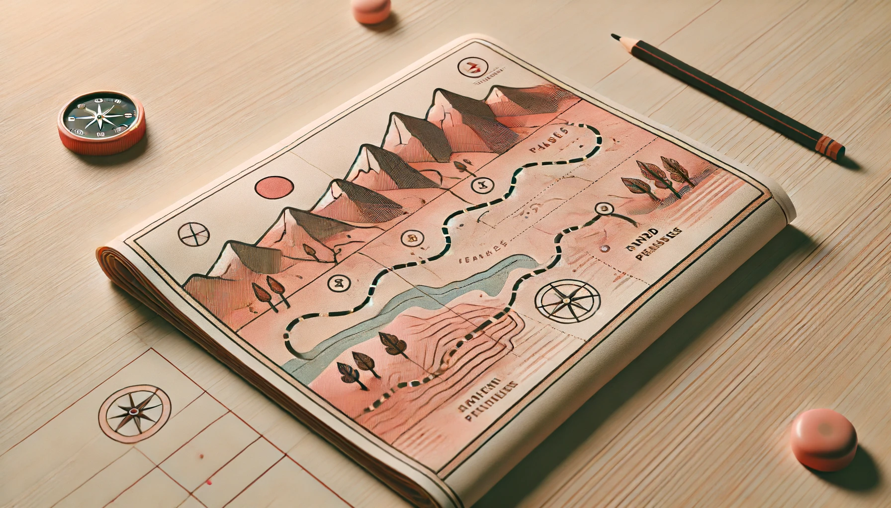
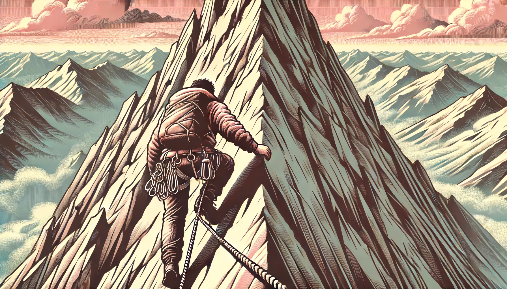
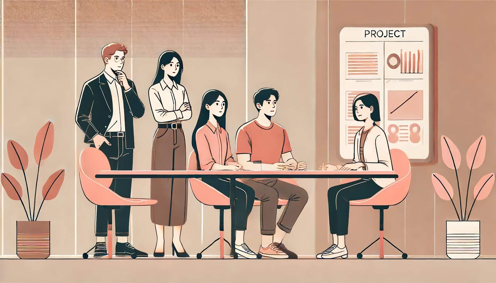
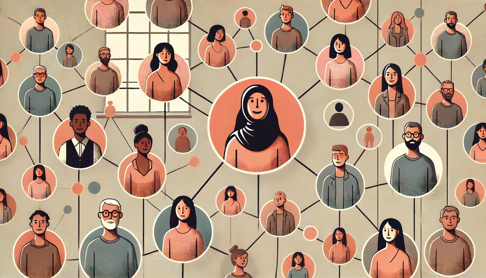
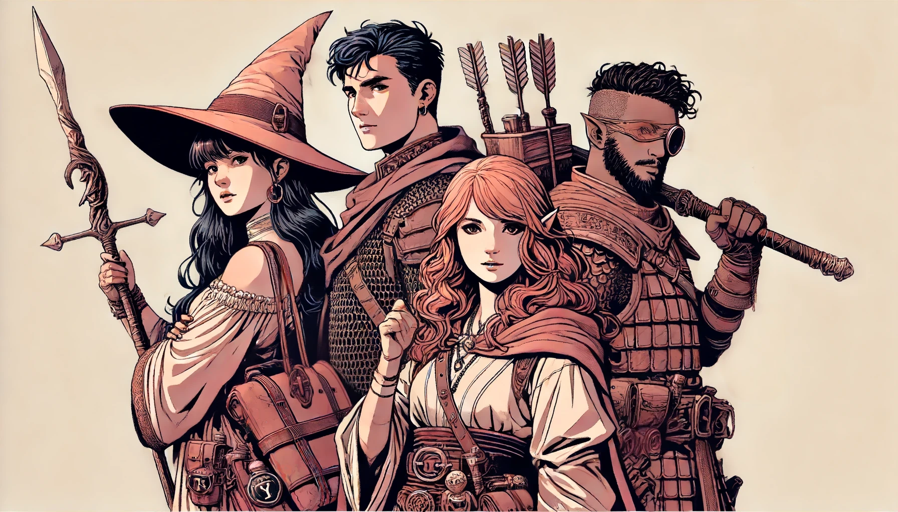
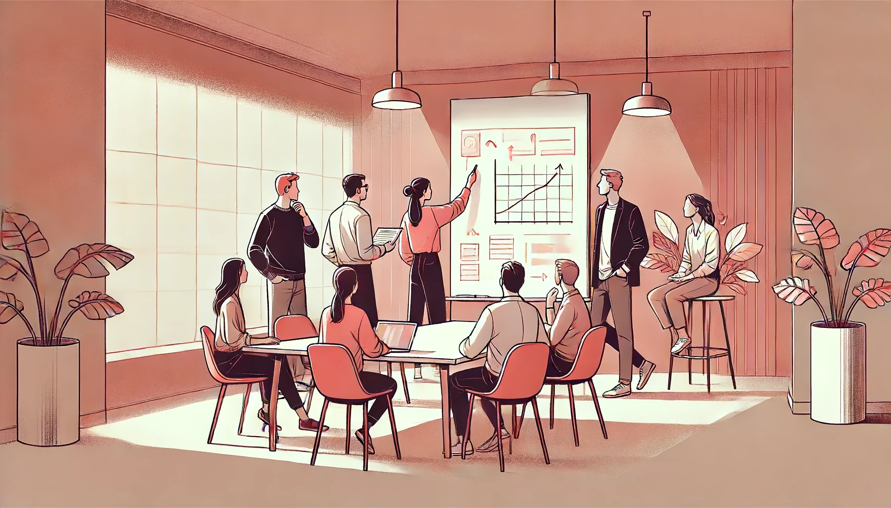

This week I had the privelege of [opening the leadership
track](https://www.webdirections.org/leaders24/speakers/andrew-fisher.php)
at [Web Directions Code](https://www.webdirections.org/leaders24/) with a talk
about how no one prepares you for stepping up from being a practice based leader
to a more general leader in the C-Suite.

This drew on my own experience of having been in senior engineering roles for
an extended period of time, but when moving to an enterprise "Chief" role,
reporting to the CEO, I found there were a lot of knowledge gaps.

The slides from the talk are embedded below, and the full transcript of the
talk with key slides is presented after that.

<iframe title="Follow Me Slides"
  src="https://wdcl2024.ajf.io/?embed"></iframe>

<a href="https://wdcl2024.ajf.io/">Follow me. I know what
I'm doing... (I think)</a> - (CC) ajfisher

A large version is available at [wdcl2024.ajf.io](https://wdcl2024.ajf.io/)
and a PDF of the slides, with notes [are available here for download (PDF
60MB)](https://wdcl2024.ajf.io/static/follow_me_talk.pdf).

The full talk transcript follows:

## Where are we?

We're all leaders here, and maybe a few soon to be leaders as well. So I want
to get a quick sense of where everyone is on their leadership journey. A quick
show of hands.

*All our journeys are different. (cc) ajfisher - Dall.E*

Who has reports that are individual contibutors?

Okay what about people who have 2 layers of reports?

Anyone have bigger teams, maybe with 3 or more layers reporting into you?

Okay, so we're mostly leaders who have ICs reporting into us.

Now I want you to close your eyes...

### Imagine your team meeting

Imagine, right now, you're standing in front of your team during a team meeting.
But, I want you to imagine that team is two levels up from where you report
right now. You're now also leading teams that aren't part of your
direct experience. Maybe you're looking after design or marketing for example.

*Everyone is looking to you for direction. (cc) ajfisher - Dall.E*

Everyone is looking at you.

They are expecting you to give them the direction and priorities for the next
quarter and your vision for where the team and the org is headed.

Do you know what you'd say?

There's probably a few of you in here thinking, "Yes! Finally I have the power
to change all of the things that are wrong in this place!".

Some of you might be thinking, "There's no way you can pay me enough to do that
job."

Wherever you fall, if you're serious about leadership as part of your career -
and I think all of you are by being here today - there will come a point where
your experience as a tech leader will be less valuable than your more general
management skills.

### New types of challenges

I got an opportunity to take that step several years ago and honestly, even with
extensive leadership experience for more than a decade, I wasn't prepared.

The gaps quickly became apparent and I realised this was going to be a steep
learning curve. In retrospect, it was the most difficult role transition I've
had since becoming a tech lead originally.

*The learning curve is steep. (cc) ajfisher - Dall.E*

Today, I want to talk to you about some of the gaps you're likely to have
coming out of practice leadership. But also give you some of the areas you can start
to develop, regardless of what stage you are in your career. The great news is
that management and leadership are skills, like any other - so you can develop
them if you work on them.

### Agenda

Today we're going to focus on these three areas:

1. Business strategy and drivers - Developing an understanding of the business
    strategy and organisational drivers.
2. Communications and relationships - Look at ways to communicate as a leader
    and how to build relationships to supercharge your impact. And;
3. People and team design - Give you some ways to think about your people, and
    team design.

Let's dive in.

## Strategy and drivers

We'll start by looking at the strategy and drivers and building that understanding
as well as getting to know your customers.

I'm not going to touch on the real mechanical stuff like building a
business investment case or risk management etc. This is all pretty important,
but there are heaps of good examples out there for this. I suspect some of you
are probably feeding into or buiding these already.

### Understanding the strategy

<!-- .slide: data-background="/images/solarpunk-product.webp" -->

Let start at the top.

When a business has a clear, well articulated strategy, everything just flows
outwards from that. When everyone is aligned to it, the organisation becomes
effortless.

*A clear blueprint allows everyone to work together. (cc) ajfisher - Dall.E*

At its heart, strategy is as much about what you are NOT doing as much as what
you are.

### Be clear about the goals

However, if your strategy is not clear, or well understood, then everything
that follows will be out of alignment and compound in terms of error.
<!-- .slide: data-background="/images/misaligned-buildings.webp" -->

*Miscommunication compounds in effects over scale. (cc) ajfisher - Dall.E*

As a leader, one of your main jobs is to be very clear about the
immediate and wider goals. You want to start getting comfortable with asking
questions - especially about getting clear about what problem the team is solving
for.

### Focus on the why
<!-- .slide: data-background="/images/team-meeting.webp" -->

For example - in your next planning meeting ask lots of questions
that are less about the "what" and focus in on "why" this is important to your
customers or strategy and "how" what you're planning is joining up to the
organisational strategy. This will help you uncover the intent and anchor your
approach to maximise impact.

## Organisational drivers
<!-- .slide: data-background="/images/factory.webp" -->

Now, alongside our business strategy which sets out our goals, are the business
drivers. Business drivers come down mostly to what are the main ways the org
makes or spends money.

*Drivers allow the business to scale effectively. (cc) ajfisher - Dall.E*

It really is as simple as this:

> Money in - Money out = Profit

Where the complexity comes in, is how you go about doing that in your particular
organisation. But if you can understand how the core business functions, then
you can start to understand where you can focus to drive impact.

## Drivers scale your impact

For example, if I'm a retailer and 10% of my sales come from online and the rest
from physical stores, there's a couple of ways to determine activities that
would create biggest impact.

*Different channels have different impact. (cc) ajfisher - Dall.E*

If I grow online whout sacraficing any physical store sales, I've just added
to top line revenue- so I've improved my money in.

If, I can optimise something in my physical stores that touches every
sale, I can make 90% of my sales more efficient- so I've affected my money out.

But, if I optimise something in my online channel, the mose I can impact is
10% of my total revenue. That might be more questionable in terms of importance.

*Optimise the right thing for maximum impact. (cc) ajfisher - Dall.E*

When you understand how your business works, you can quickly determine whether
a strategy you're considering is a good idea or not to pursue.

### Know your customers
<!-- .slide: data-background="/images/know-your-customers.webp" -->

Alongside our strategy and our drivers, we then have our customers.

Hands up. Who has had a direct interaction with one of your end customers during
the month of June? Hands down if you're a consultant?

As a leader, you need to know your customers first hand. You need to listen to
them and walk in their shoes.

### Evaluate impact
<!-- .slide: data-background="/images/customer-survey.webp" -->

Building this understanding means you're able to bring first hand intelligence
back to your team. It means you can validate approaches for things you are
planning and see the impact of the initiatives you're doing.

*Learn everything you can about your customers. (cc) ajfisher - Dall.E*

Go ask your customer or marketing teams for their customer reports and dig in.
It's all too easy for us to sit in HQ and not iteract directly.

But, if you talk to your customers, you start to appreciate the organisation's
drivers in action and see how your strategy is working.

### Get started:

So here are some thing you can do right now to practice this:

Organise a 1 on 1, 2 levels up from where you report to find out more about the
strategy

Go talk to your finance team or channel leaders and really deep dive the drivers

Next week, I want you all in the field having conversations with your direct
customers.

We've covered strategy and drivers, now we're going to turn our attention
to communications and relationships to maximise our impact.

## Communications and relationships

<!-- .slide: data-background="/images/team-discussion.webp" -->

All of you will have seen how much impact both good and bad comms can have.

Who here has ever said something to your team that was a bit loose and it's
been totally misunderstood as to your intent? Yep - we've all done it at some
point.

When you get it right, good communications has a lasting impact across your
team and org.

*Communications and relationships are a superpower. (cc) ajfisher - Dall.E*

Alongside our comms, we also need to build relationships.

Creating good relationships allows you to create impact across a much wider
span in your organisation.

Now, developing both of these skills requires no particular
authority or seniority to work on them practically.

We're going to touch on both communications and relationships.

But lets talk about communications first.

### Communications

<!-- .slide: data-background="/images/asking-questions.webp" -->

Obviously, we want to be striving for clarity so we can get our message
across.

With a good team, your goal is to give them as much great information as possible
so they can get on and do what's needed.

There's a couple of techniques I find help with this.

The first is focussed on asking lots of questions even if the question seems
stupid or obvious. Often as a leader, you CAN be the person who asks the unaskable
and you give permission to others to do the same. This allows us to uncover
assumptions quickly.

### Gather perspectives

<!-- .slide: data-background="/images/perspectives.webp" -->

The other technique is when you're working on solutions and providing perspectives
in a group. You need to be mindful about your voice carrying more weight than
others as you get more senior. You can't avoid this happening.

*Ask for the team's thoughts first so you don't bias their thinking.
(cc) ajfisher - Dall.E*

To balance this, make sure you are the last person to state your thoughts. You
can be direct about that, "I want to hear all of you first", or just steer the
conversation that way. This will give you more diverse perspectives which may
inform your position further but additionally, it will also mean you don't tip
the scales towards your opinion and have some of the group just agree with you.

Remember, your job isn't necessarily to have the answer - it's to facilitate
getting to that answer. Often, you're the one who takes accountability for
the decision of the team too.

### Relationships

<!-- .slide: data-background="/images/relationship-network.webp" -->

Now let's turn our attention to relationships - a skill area I think is a super
power in many organisations if you invest in it.

Great leaders build a vast network of relationships across all levels and
functions of the organisation.

### Build understanding

<!-- .slide: data-background="/images/coffee-meeting.webp" -->

To start, this gives you valuable intelligence:

What are the pain points that team has? Maybe we can help.
How is that project going? Their delay might impact our initiative.

Mostly, this is about listening and asking questions of people in the org.

But once you have a wide set of relationships you can also facilitate connections.

### Connect

<!-- .slide: data-background="/images/introductions.webp" -->

For example, if you're having a convesation with Alex and they have talked about
a pain point they are experiencing but you know Jo had to deal with something
similar, you can bring them together to collaborate on a shared objective.

Now, how do we do this intentionally?

### Relationship mapping

One way is to build a relationship map. If you're in a product squad you
have probably seen one of these already. It's a stakeholder map but for you.

*Optionally do this with photos and pieces of red string
(cc) ajfisher - Dall.E*

You're trying to understand who you should be spending time with across
your org to understand what is going on? Who do you need to spend time with
to get things done or unblock things? And who do you know is going to need time
so you can bring them on the journey for your projects as you're delivering.

As you do this, don't forget externals. Make sure you include partners, key
customes or other parties in this map as well.

With your map in hand, it's then about spending time with these people to
engage and listen.

When you get a new role, this is really easy - you just reach out to all of your
predecessors contacts and ask to chat to them about how your team is doing, what's
good and bad etc. But even without doing that you can just reach out to people.

People like it when you show a genuine interest to understand their area and how
you might work better together.

### Get started:

Your homework, is to start building out your relationshhip map and by the end
of today, I want all of you to dash off a note to schedule time with someone
in your org you don't know very well.

So now we've talked about communications and building relationships, let's turn
our attention to people and team design.

## People and team design

When you lead bigger, and more multidisciplinary teams, success lies in the
agency of others.

As a leader you generally get the opportunity to determine your people and the
ways your team work together.

To that end, we're going to look at:

* What capabilities do we need?
* Direct team structure.
* Ways of working.

Let's start by thinking about the makeup of your team and specifically your
immediate reports.

### Team skills

<!-- .slide: data-background="/images/party-capabilities.webp" -->

It goes without saying that this team should be as diverse as you can make it to
get the best mix of viewpoints and drive better outcomes. That's a whole other talk
that others have done very well - you should conffab it.

*A balanced party gets the treasure (cc) ajfisher - Dall.E*

For your team, the things you want to think about are what do YOU do in the team
and what are *your* capabilities? And, what are each of your *reports* doing
and what are *their* capabilities so you're all playing to your strengths?

This sounds obvious right? But I see teams not be clear about this and so they
aren't then clear about who is doing what.

### Building a capability model

The way I think about this is by using a capability model.

Start by breaking down all of the key capabilities the team needs to be good
at to be successful against our mission.

With this, you need to overlay the areas that you are good at and what you are
bad at to help drive the structure.

### Team structure

Start with the "what are you bad at" items and focus on that first.

The way to address your gaps is by using the expertise of your directs to fill it.

The person to fill this main gap should be someone that has extensive credibility
in the capability and should also be senior enough to be obviously your second
in command for the team.

You need to delegate to this person, empower them and set them up to be the go
to expert in their domain. This is a role that can help scale your team's
communications and influence outcomes because now the two of you can be in
different places at the same time with a cohesive message.

### Team structure

Now I want you to think about which area are you most strong at.

Whatever that is, you need a capable person to step in and you need to step
away. Completely step away.

How many times have you seen a leader spending too much time in the area they
know really well and being disruptive, whilst the others go begging.

Don't be a meddler in your team.

AS you know this area well, you also know what great looks like. So you should
be able to identity a fantastic candidate for this role, who can do it at least
as well as you can.

Then delegate it out and have a great person look after it.

### Team structure

Now, the other roles in your portfolio are where you can mix it up a bit. This is
where you can give people opportunities to step up, bring in a junior person or
give someone the opportunity to X-skill.

This is where the capability model helps because you can be clear about what the
needs are and what is the best way to fill them.

These roles are where you can spend a bit more time as a leader, growing the
capability of the team, knowing the other areas will be dealt with so well. Here you
can support on strategy or delivery as well as coaching and mentoring those
team members. You should encourage your other heavy hitters to be doing peer
based leadership and mentoring as well.

### Ways of working

Once you have your team and how the structure will work, you should think about
how you're all going to work together. This is primarily about how are we going to
share information and who has authortity in different scenarios.

*Who holds the pen and why? (cc) ajfisher - Dall.E*

Being clear about this stuff as a team means no one is dancing around
afraid to step on each others toes. It also means the team are well informed
and helps empower them to just get on and get things done - knowing they have
backup.

Your role as the leader in this is to facilitate the discussion and help surface
assumptions about implied responsibilities or capability gaps so that all comes
out on the table.

### Ways of working

Many squads have a form of this using a team canvas or social contract. Use
whatever works for you and your team or what you're familiar with.

The key is to be having the discussion as a team and being clear about how you
want to work together and who is doing what.

### Get started:

So the obvious things to do here are to build out your capability model and
have a session together working on this stuff as a team.

Now we've our team is organised and we know how to work together, lets
bring this all home and give you some resources.

## Things to consider

*Think about the things you can do to grow. (cc) ajfisher - Dall.E*

As I wrap up, besides the homework I gave you, I want to leave you with a few
things to have a think about too.

### Train yourself

Are there courses that are appropriate for you to go on? Does my business offer
leadership or management training? Can I get some training subsidised by work
or other programs?

### Get yourself a mentor.

Do you know someone in the organisation who you think
is a great leader and you relate to their style or background? Are there people
externally who might be a good fit for you?

With mentoring, just reach out to people. Worst case someone says no, but
is really flattered that you asked. Best case you get a mentor!

### Developing your skills

No matter what level you're at, you can put many of the things I've talked
about today into practice right now.

Start trying things out with your team and start developing some of these
skills and get the learning in before you need it.

### Summary

We've covered a lot of ground today.

* Understanding strategy and drivers.
* Communications and relationship building.
* People and team design.

We talked about the importance of understanding
the strategy and drivers of your organisation. We then went into being
effective in our communications and how to build relationships intentionally.
Finally, we touched on setting your people up the right way.

### It's your journey

<!-- .slide: data-background="/images/valley-hiker.webp" -->

Being a leader is hard - but it is a privilege.

When you create an impact, create great outcomes for your org and your customers
it is incredibly rewarding - especially at scale.

I'm probably biased, however given technology and digital permeate every part
of the customer experience and enables all aspects of the organisation I think
as technology leaders we have a great deal to offer organisations in senior
leadership roles.

*We all have different paths to walk. (cc) ajfisher - Dall.E*

And, we're starting to see those roles appear and begin to get those opportunities
in non-tech businesses which is exciting.

So it's time to get ready for them. Your career ceiling is no longer CTO or CIO
it's wherever you want to take it in the org.

I wasn't really prepared for my step up out of practice leadership and into
a wider role and I had to learn fast. Fortunately, I was surrounded by a great
number of people who were truly vested in my success and supported me.

The earlier you start on this journey, the easier it will be to develop these
skills and bring them to bear when you need them.

## Resources and acknowledgements

[Additional resources](/leaders) can be found on a page dedicated to this
topic with links to books, podcasts, videos and other material.

This talk was developed on the traditional lands of the Bunurong people,
Victoria.

All images, unless otherwise attributed, produced using ChatGPT / Dall-E or
Stable Diffusion models.
