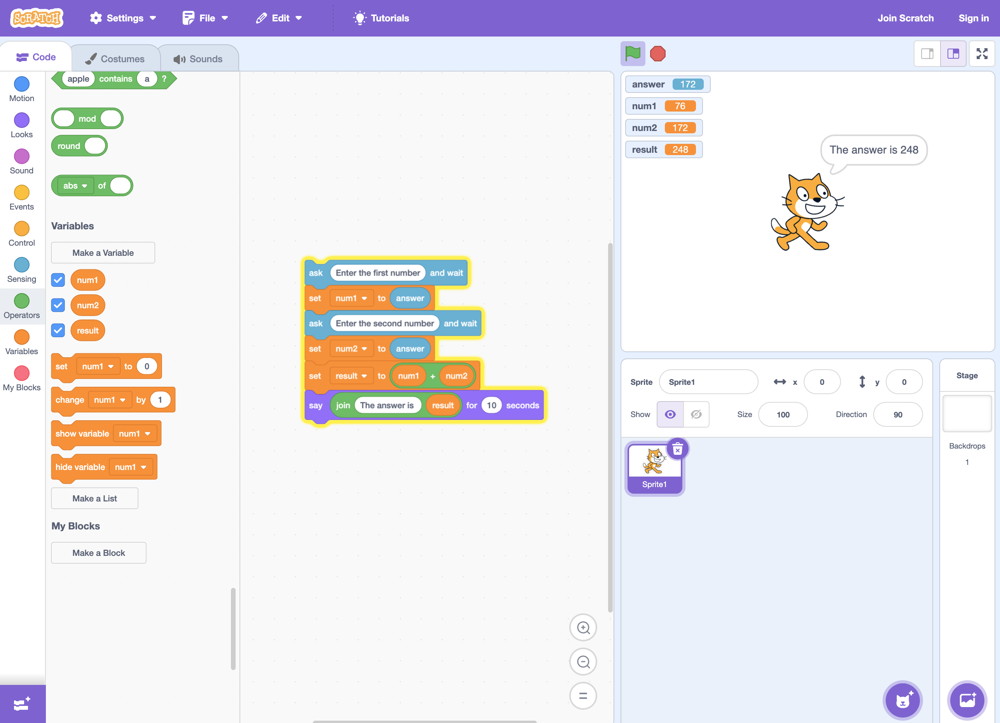
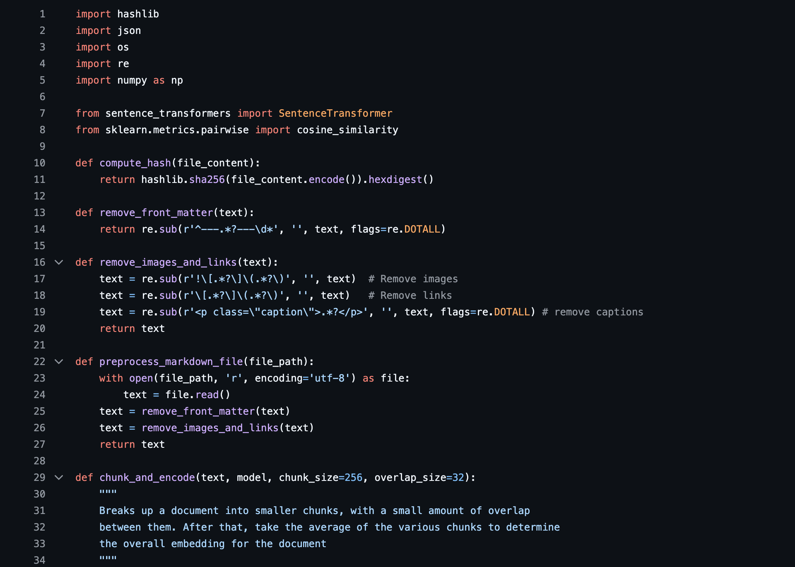
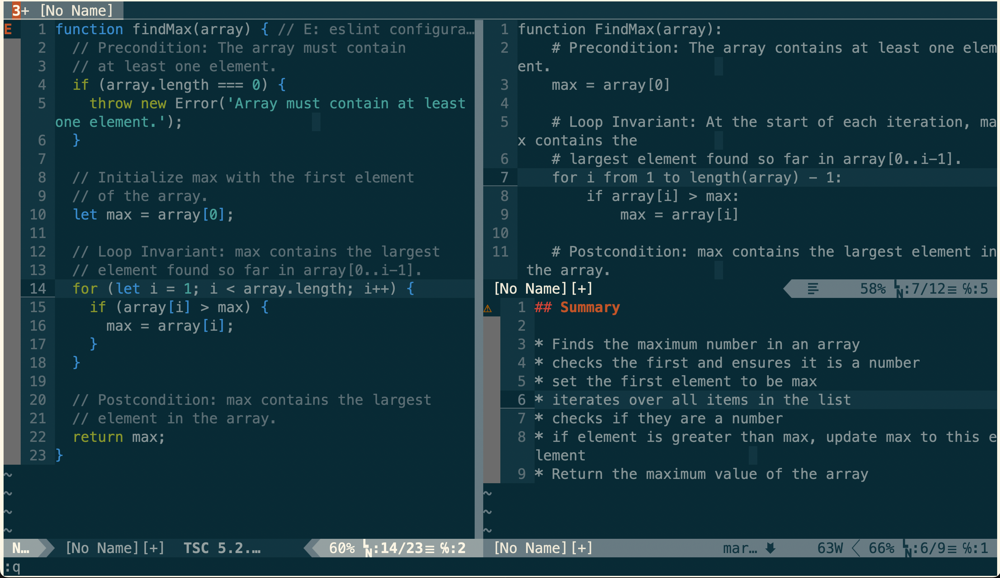
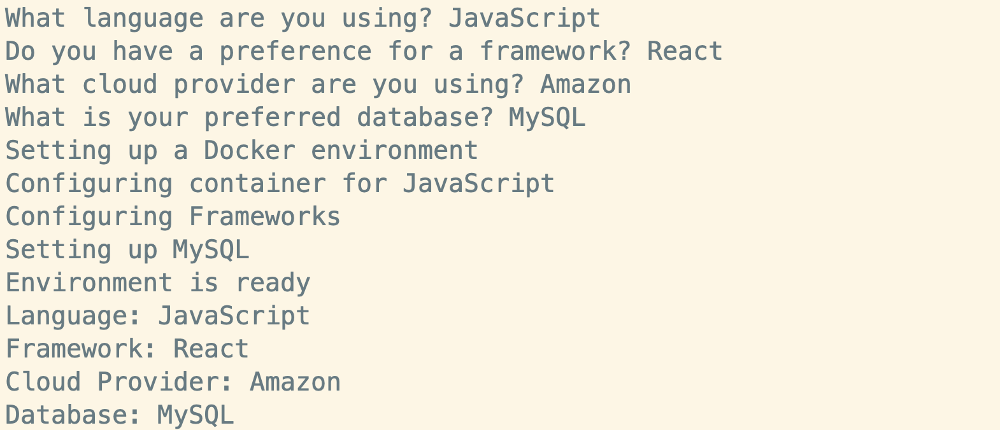
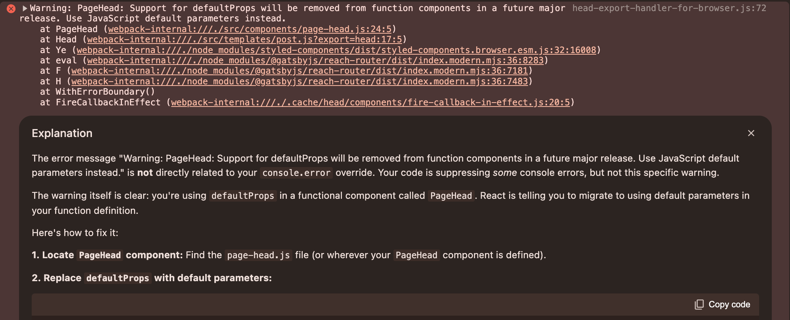

At the back end of 2024, [most developers at this point are using some sort of
LLM AI assistance](https://github.blog/news-insights/research/the-state-of-open-source-and-ai/)
in their coding practice. For some this might be [Github Copilot](https://github.com/features/copilot)
integrated into their IDE at work, for others this may be the use of
[Claude](https://www.anthropic.com/claude) or [V0 for first draft code
origination](https://v0.dev/), or it may be as mundane as using
[ChatGPT](https://chatgpt.com/) or [Gemini](https://gemini.google.com/) for
error clarification and debugging support. Software engineers are [mostly
considering AI a net
benefit](https://stackoverflow.blog/2024/07/24/developers-want-more-more-more-the-2024-results-from-stack-overflow-s-annual-developer-survey/),
helping them be more productive.

This suggests that developers are, by and large, internalising the idea of AI
as a tool rather than a competitor. Also, developers are reinforcing their
belief that their value is less about lines of code produced and more about the
outcomes as a result of the problems solved.

Software engineering has always had problem solving as its primary function,
however, in the period of extreme digitalisation through the late 1990s to mid
2010s, development started being seen by many parts of business as a volume play.
Lines of code produced and numbers of errors in production became the criteria
for success. Teams were measured on output against cost - leading to waves of
outsourcing, then offshoring, as code was treated as a manufactured good. All
the while businesses needed rapid process digitisation, volume of output was
the primary goal.

But this came at a price.

As we reach the midpoint of the 2020s, many organisations are dealing with huge
amounts of complexity, lack of explainability in their code bases (especially
with legacy code), and there are still systemic skill shortages of software
engineers in most markets, notwithstanding some of the big-tech layoffs.

> A software engineer is someone who looks both ways - even when crossing a one
> way street.

AI assisted development can help us keep pace with the volume aspects of modern
software engineering, however, as developers we are better utilised thinking
about and solving problems conceptually and spending less time
cranking out code. The code is the _byproduct_ of solving the problem not
the other way around.


*Sketching an approach before starting work. (cc) ajfisher - Flux.Dev*

Typically, most engineers write a quick sketch of what they want to do
before they start to write code in a rough form called pseudocode. Every
knowledge worker engages in this process to some extent, as dictated by the
medium of their work. This could be a dot point outline for a writer or
strategist, a literal set of sketches for a director or cinematographer, or a
set of unstyled slides by a manager creating a presentation.

The method may change, but the purpose is the same. By sketching something out
conceptually, you think through the core problem you are trying to solve -
whether that’s telling a story, building the arguments of a business case, or
structuring the logic of a program. This is done before getting stuck into the
low level detail that necessarily entails a great deal of implementation
messiness (or, in the case of powerpoint, time spent nudging and styling).

For inexperienced or learning developers (as with most skill-based professions)
this transition from high level conceptual thinking to low level implementation
can be tricky. Knowledge and experience both play a part in this but <b>ultimately
you need to get from a concept like “add the product into the user’s shopping
cart” to the nitty gritty details of how to do that</b> in the system and language
you are working with. This step is challenging because you need to map the
problem definition (what do I want to do?) to the capabilities of the tool
you’re going to use to do it (how does my programming language allow me to
implement this?).

Even for experienced developers, there is cognitive load involved
in this activity that creates friction in the process - not least when you need
to read some pre-existing code and then turn that into a conceptual map in your
mind about what the code is doing in the system before you can tackle the
problem at hand.

LLM AIs can assist this process because, fundamentally, they are *language*
tools. This means if I ask an LLM to write me some code that meets some
criteria such as “build a javascript function that takes two numbers and adds
them together”, it can do a pretty good job of translating that into something
that works (or works well enough). This is why a lot of junior developers have
jumped headfirst into using LLMs to support their development as it allows them
to pose a task and get an answer. More experienced developers use the same
tooling - but with more direction - to get the LLM to produce the boilerplate
code they know they will need and then assume that they will fill in the
details.


*ChatGPT is capable of producing good enough code in 2024. ajfisher*

Both of these approaches work and have lead to some productivity
increases for some teams (at least for routine work).

The AI tools we have available to us now are fairly capable for
boilerplate code or specific task generation (eg Copilot), but they are limited
in bridging the gap between concept and implementation. New reasoning models
like [o1](https://openai.com/o1/) or techniques like [Chain of
Thought](https://www.ibm.com/topics/chain-of-thoughts) bring this a step
closer, however they are really just improving task adherence and
completion rather than mapping from concept to implementation.

Current AI tooling does provide non-trivial incremental improvement to
developer productivity however they remain reactive - focussing on filling gaps
in code rather than helping engineers structure and think about the solutions
at the conceptual level. Inherently, this limits their potential impact -
especially in more complex projects that solve real problems where the
challenge is in bridging between the idea and execution.

Could we do better?

If we assume we have good enough LLM AIs available to us, and they can be
sufficiently integrated into our work systems, could we reimagine the way we
shift between high level concepts _about_ a system and the low level
implementation _of_ the system? Could we integrate LLMs not just to help with
code generation but also maintain a bidirectional relationship between
pseudocode and executable code, increasing both developer productivity as well
as software quality?

The elements I outline below might give us some of the steps we need to get us
closer to realising some of these opportunities.

## Pseudocode - a structured method for thinking

In a ground floor classroom with steel security bars across the windows and a
double-lock door that was nearly always shut, I sat through my first formal
computer science lessons. In the early 1990s, my school was lucky enough to
have an actual “computer lab” - a vault-like room I found myself in a couple of
times a week from year 9 through to completion in year 12 (not accounting for
the time spent sitting in the corridor after been thrown out of that room for
being a “difficult” student, but that’s another post). Packed with 25 Apple
PCs, it was here we would take the work we had been doing in theory in a
regular classroom during our other computing lessons and apply it to actual
computers in the lab.

The vast majority of my classmates didn’t have computers at home. At this
point, it was still rare to have a computer - some families had a games
console, but that was it.


*Probably a little nicer than my Year 9 computer room. ajfisher - Flux.Dev*

As a result, teachers couldn’t expect a student to have ready access to a
computer to write code. This provided my, and my classmates’ introduction to
pseudo code and structured logic. Computing being seen as part of mathematics,
it directly built on the logical reasoning skills we were taught in maths
lessons.

By using pseudocode, teachers could ensure some degree of equity in a period of
unequal access, and also made things relatively easy from a homework and
assessment standpoint. Instead of programming a function to take two numbers
and add them together you would write out that function in pseudocode on a
piece of paper. Bad handwriting aside, it would have made marking pretty
straightforward for a teacher too.

As you can see below, there is a little bit of structure to pseudocode, and it
vaguely looks like a  programming language. It’s just a series of
statements allowing you to express some logic. Even today, developers and teams
rely on similar approaches to think through how they will tackle a problem
conceptually.

```pseudocode
Function AddNumbers(a, b):
  result = a + b
  return result

- get the first number from input and assign to variable A
- get the second number from input and assign to variable B
- call the AddNumbers function with A and B and print the result
```

When we had access to the lab, our job would be to turn our pseudocode into
[Basic](https://en.wikipedia.org/wiki/BASIC) and see how well it functioned.
By having the structure of our approach already well thought through, it was
feasible to write the code in Basic during a lesson period and see if it
worked - thus beginning to anchor the relationship between problem solving
concept and the code that implements it.

```basic
10 INPUT "Enter the first number: ", A
20 INPUT "Enter the second number: ", B
30 GOSUB 100
40 PRINT "The sum of the two numbers is: "; RESULT
50 END

100 REM Subroutine to add two numbers
110 LET RESULT = A + B
120 RETURN
```

Using pseudocode, teachers provided a bridge between logical reasoning and
programming implementation. While this was driven from necessity, it was a good
way to build logical reasoning and conceptual thinking skills in students.

As I left school and went to uni, my computer science courses built on this
further by teaching algorithms and formalised ways of reasoning about them in
terms of complexity, performance and accuracy. These formal methods were
anchored to programming in [Pascal](https://en.wikipedia.org/wiki/Pascal_(programming_language))
which maps very well to structured pseudocode and is remarkably readable
(before ultimately we were moved on to [C](https://en.wikipedia.org/wiki/C_(programming_language))
which is decidedly less readable). As we started building more complex
applications, the core methods remained, and were used much as they are
today - work through the logical approach before sitting down to write the code.

```pascal
program AddTwoNumbers;

function AddNumbers(a, b: Real): Real;
begin
    AddNumbers := a + b;
end;

var
    num1, num2, result: Real;
begin
    Write('Enter the first number: ');
    ReadLn(num1);
    Write('Enter the second number: ');
    ReadLn(num2);

    result := AddNumbers(num1, num2);

    WriteLn('The sum of the two numbers is: ', result:0:2);
end.
```

The benefit of teaching like this is that you focus on the problem solving part
of the learning. You force the learner to think through the problem and break
it down into tasks, each of which can be broken down further. You also largely
remove syntax as a concern. As you can see, the jump from pseudocode to Basic
or Pascal brings with it additional syntactical structure, and these become
places where a learner fails - a missed semicolon in Pascal or a jump to the
wrong line number in Basic brings the program to a halt for example.

The counter argument for this method of teaching is that it is astonishingly
dry. Formalised reasoning has its place, but being structured around the
formal, mathematical roots of computer science can be off putting.
Additionally, as computers became considerably cheaper and more accessible to
students, there was a desire to move more towards “getting outcomes” and
learning logic as a byproduct of the process. This was in part driven by the
goal of industry and government to produce “coders” not “computer scientists”.


*Scratch: learning to program with a cat is far more interesting. ajfisher*

Using visual programming environments like Scratch or high level
pseudocode-like programming languages like Python, this approach took off.
Learners could jump right into an environment that was easy enough to learn
with few syntax quirks and then get a result - a cat that moves around a
screen in Scratch, or a program to interactively guess a number in python.

The errors one experiences in getting an environment up and running or when
the code fails are all considered part of the learning process to help the
would be programmer learn how to debug as they graduate to bigger systems.

This process is less formal, but over time builds logical concepts and
hopefully keeps more people interested, allowing them to transition into
considering programming as a career.

Regardless of the way one learns to think through concepts, structured thinking
remains fundamentally at the heart of all knowledge work and it is particularly
useful for development.

As teams work together, we use these methods of structured thinking to
collaborate. In most multidisciplinary teams, only a small fraction of those in
the team are software engineers wiring code. Thus <b>we use structured methods
such as requirements documents or business process maps so we can communicate
effectively and work through the fundamental concepts</b> of what we’re seeking to
achieve. This helps align vision and clarity across the whole team as you get
into implementation.

Pseudocode is often a part of this process. As a software engineer goes through
the requirements, she may use those requirements to sketch out an approach,
which she shares with other engineers and team members who may add comments or
refine the logical design. From there, she is likely to turn that pseudocode
into comments in the first draft of some code and then start filling in
details. Beginning with all the boilerplate code and then “stubbing out”
functions or API calls she will implement later in more detail.

This process of increasing fidelity is an extremely common pattern and used
across most knowledge workers. In late 2024, our software engineer above is
probably also dropping some of that pseudocode into an AI code generator such
as Github Copilot or ChatGPT, which is helping to produce the routine parts of
the first draft code.

<video autoplay muted playsinline controls>
    <source src="/assets/native-ai-codegen.mp4" type="video/mp4"/>
    <source src="/assets/native-ai-codegen.webm" type="video/webm"/>
</video>

<p class="caption">Using Github Copilot to build example code.
Yes, I still use Vim. (cc) ajfisher</p>

Pseudocode still serves as a valuable tool for structured thinking, however
with the increasing complexity of modern software and the expanding
capabilities of AI tools, there is an opportunity to rethink how we transition
between conceptual problem-solving and writing code.

Coupled with AI tooling, pseudocode could be leveraged not just as a
transitional step but as a bridge that allows us to move seamlessly between
concept and implementation. But, can we push the tools to help developers spend
more time thinking conceptually and code more effectively?

## Bridging the concept to implementation gap

Even though most engineers will at least start with some form of
pseudocode-like outline, potentially as comments in their files, as fidelity
increases these comments begin to disappear. The initial comments likely get
consumed into the implemented code and we lose some of the conceptual elements
along the way.

A good team might maintain some solid comments that explain what the function
or the code is doing, and even how it relates to the wider system. However, as
the code ages, teams turn over, and more modifications are made, unless
outstanding processes are maintained on code documentation, there is likely to
be drift between meta commentary about the code conceptually and what the code
is actually doing. Unfortunately, most developers are KPI-ed on clearing
tickets and code shipped to production, not writing docs.


*It's easy to get overwhelmed and not maintain the documentation side of
systems when you have to deliver - (cc) ajfisher Flux.Dev*

But what if we don’t drop down to the lower level in the first place?

What if, instead of just doing a sketch in pseudocode then transforming that
into executable code, we wrote slightly more formalised and slightly more
detailed pseudocode and used an LLM tool to do the conversion into the
underlying programming language we want?

We are currently so used to google, we inherently treat LLM AIs as _answer
engines_ - that is “Can you write me a function in javascript that adds two
numbers together?”

We’re only just working out the implications of how we use LLM AIs
as _language engines_ instead?

> Style transfer lends itself well to programming

We’ve seen examples where an LLM [converts text
from one language to another](https://about.fb.com/news/2020/10/first-multilingual-machine-translation-model/)
([increasingly in voice as well](https://www.youtube.com/watch?v=WzUnEfiIqP4)).
This form of style transfer lends itself well to programming languages because
there’s just so much programming content on the internet. A number of
programmers will take a function written in one language that they have copied
online and ask an LLM to convert it to their preferred language. This isn’t
new - but it is a powerful tool.

Say we baked into our development tools a layer that can take developer created
pseudocode and then, in real time, the AI tool does the conversion into the
lower level language.

For example, a developer might want to find the largest value in a list and so
write out the pseudocode below:

```pseudocode
function FindMax(array):
    # Precondition: The array contains at least one element.
    max = array[0]

    # Loop Invariant: At the start of each iteration, max contains the
    # largest element found so far in array[0..i-1].
    for i from 1 to length(array) - 1:
        if array[i] > max:
            max = array[i]

    # Postcondition: max contains the largest element in the array.
    return max
```

We've added some additional structure and using a more formalised notation
with pre and post conditions to highlight expectations of how the function
performs. We also use a loop invariant to provide clarity over our assumptions
about what is happening inside the loop.

With such instructions, using today’s AI tools, a lot of this conceptual
structure can get stripped out in the translation process. But, by preserving
these comments and maintaining formal structures, LLMs could produce more
readable and robust code.

An example of what that looks like with our future integrated AI development
partner might be the JavaScript code below:

```javascript
function findMax(array) {
    // Precondition: The array must contain at least one element.
    if (array.length === 0) {
        throw new Error('Array must contain at least one element.');
    }

    // Initialize max with the first element of the array.
    let max = array[0];

    // Loop Invariant: max contains the largest element found so far in array[0..i-1].
    for (let i = 1; i < array.length; i++) {
        if (array[i] > max) {
            max = array[i];
        }
    }

    // Postcondition: max contains the largest element in the array.
    return max;
}
```

You can see the mapping easily enough because the LLM has kept the comments and
the overall structure of the logic so this works pretty well. Even if I’m not a
great JavaScript developer, I could take that code, try it out, and see if it
worked. If I was a learner of the language, I could put the pseudocode and JS
side by side and start to map the conceptual logical elements to the underlying
language constructs quite effectively, improving my ability to understand
what’s going on.

At this point we’re very much still in the territory of the current, albeit
quite manual, processes that Generative AI tools support in 2024.

To take this further though, as the developer writes the pseudocode, the LLM
could provide realtime feedback, making recommendations or highlighting gaps in
the logic that need improvement. For example, the AI may suggest making
improvements to the original pseudocode to check for valid numbers and to
handle edge cases more gracefully such as the example below:

```pseudocode
function FindMax(array):
    # Precondition: The array contains at least one element.
    if length(array) == 0:
        throw Error("Array must contain at least one element")

    max = array[0]

    # Precondition: The first element must be a valid number.
    if not IsNumber(max):
        throw Error("All elements in the array must be valid numbers")

    # Loop Invariant:
    # At the start of each iteration, max contains the largest element found
    # so far in array[0..i-1].
    for i from 1 to length(array) - 1:
        # Precondition: Each element must be a valid number.
        if not IsNumber(array[i]):
            throw Error("All elements in the array must be valid numbers")

        if array[i] > max:
            max = array[i]

    # Postcondition: max contains the largest element in the array.
    return max
```

As a learner, this gives insight to instruct me on best practices I should
adopt as I learn to program. For a more experienced developer, these are all
things I’d have most likely done anyway - even if I’d have glossed over them in
my sketch - because they are good practices. Now I can be more explicit about
what code I want to produce.

With this structure, the LLM assistant could construct test cases based on the
pseudocode and as the produced code, supporting a rapid, iterative, test
driven development approach such as that below (snipped for brevity to just a
few cases):

```javascript
// Test case 1: Typical case with positive numbers
try {
    console.log(findMax([1, 3, 5, 2, 4])); // Expected output: 5
} catch (error) {
    console.error(error.message);
}

// Test case 2: Empty array (should throw error)
try {
    console.log(findMax([])); // Expected output: Error "Array must contain at least one element"
} catch (error) {
    console.error(error.message);
}

// Test case 3: Array with non-number elements (should throw error)
try {
    console.log(findMax([1, 2, 'three', 4])); // Expected output: Error "All elements in the array must be valid numbers"
} catch (error) {
    console.error(error.message);
}
```

Having this joined up way of working allows the developer to think logically
and algorithmically to solve the problem at hand and relies on the LLM to
provide the immediacy of being able to create and run executable code then get
feedback. Some IDEs support aspects of this, but having it fully integrated
such that the developer primarily interacts with the logical layer and then
gets real time feedback and executable code iteration at the same time would be
a benefit for learners and experienced developers alike.

The developer may need to start to handle edge cases or fill in
specific details about how APIs are called - especially if they are internal.
At this stage, they will probably want to make edits to the underlying
produced code to carry it forward. In our example above we might need to add
specific checks to ensure the function is called with an Array of items, or the
array has an item that contains `Infinity`.

All this being said, as a byproduct of this process, the developer will also
produce an artefact that represents the logical approach for the code they have
produced - which can be stored and referenced by themselves, or others. This
could even be consumed by other systems such as documentation generators to
derive secondary high value assets.

This approach has particular benefits for learners as it links together the
structured thinking (what I want to do) with an immediacy of outcome (I can see
it doing). This allows a learner to scaffold their knowledge as it directly
ties the algorithm back to the code that is produced. As mentioned above,
having <b>a feedback mechanism can support illustration of best practices</b> which
the learner can see implemented in a way that would normally occur by working
with a more senior engineer or through code review. In situations where an
inexperienced developer is working or learning solo (eg at school or in a very
small team) this feedback mechanism would actively support their learning
process and help prevent them from developing bad habits.

Aspects of this exist in 2024 in some IDEs already, as well as developers
manually throwing code snippets or lists of requirements at ChatGPT or Gemini
and getting some code back. However, in most cases this process is
disconnected and misses a lot of context. Invariably, it involves a lot of
copying and pasting between applications to make it work(ish).

Workflow challenges aside, this process does work and I know a number of
developers who use these LLM features to enhance their learning or improve
productivity by doing exactly the techniques above.

A more integrated approach would undoubtably speed this process up, but
assuming we had a tightly integrated development environment, we could take
this idea even further.

With the right integration, this process could go beyond just generating code -
it could create a dynamic, realtime collaboration between developers and AI,
allowing both to operate effectively at multiple levels of abstraction. An idea
of what this might look like is what we’ll explore next.

## Realtime, bidirectional human-AI collaboration

Developers spend a lot of time reading code - many times the amount of time
spent writing it.

Guido van Rossum, creator of the Python programming language observed, “Code is
read much more often than it’s written” - leading him to many of the design
decisions that underpin the core concepts of the language. As a result, Python
is probably the most readable programming language we have available for
general purpose programming.

Even acknowledging the readability of Python code is generally outstanding,
anyone trying to wrap their head around an uncommented list comprehension for
the first time will likely struggle to understand what is going on. Take for
example the snippet below:

```python
people = [("Alice", 22), ("Bob", 17), ("Charlie", 18), ("David", 15), ("Eva", 30)]
adults_uppercase_names = [name.upper() for name, age in people if age >= 18]
print(adults_uppercase_names)  # Expected output: ['ALICE', 'CHARLIE', 'EVA']
```

The centre line, even with good naming, may be difficult for non Python
programmers to understand. In one very terse line that code:

* goes over the data that is in the list of _people_ noting that the _name_ is
  always the first item and the _age_ is the second item in each set.
* If the _age_ part is greater than or equal to 18 then keep those elements,
  throw everything else out.
* For those people that are left, take the  _name_ and convert it to uppercase.
* Assign the uppercase names as a list to the _adults_uppercase_names_ variable.

That’s quite a lot of things happening in one very short line of code.

Once you understand the structure, it is relatively straightforward to see
what’s going on, but it’s also ripe for being incomprehensible. I’ve seen some
extremely clever Python list comprehensions over the years that do nothing for
code readability (some with many paragraphs of explanation as to what is going on).


*Some of the python code that drives the post recommendations on site - (cc) ajfisher*

When a new developer starts on an existing project, the first thing they do is
start reading through the code alongside any documentation that exists. They
conceptually assemble all of the building blocks into a mental model that
allows them to understand how the system is functioning. Sometimes the
underlying logic lacks context or is so difficult to follow that the programmer
will just put it in a mental black box labelled, “I think this function does
X?” - but they aren’t sure, and will never tinker with it for fear of blowing
everything up.

This process is similar to a builder doing a survey of a site to understand
where the electrical, gas, and water pipes are before they start digging and
potentially causing a lot of damage (or clean up).

Even with good development hygiene (good naming, logical models, comments,
documentation, tests), <b>developers will spend a significant amount of time
mapping backwards from implemented code to their conceptual understanding</b> of it
so they can begin to reason about it. Once the programmer feels confident in
their understanding they start to work out how they would change the system.

This is where I think an LLM AI partner can help improve this process.

LLMs are incredible translation tools. As we saw above, we can write some
pseudocode to find the maximum number in a list and it produced code to do
this. We added some conditions and it refined the code, and made some test
cases to help validate it was working correctly.

We could use this same process to go the other way as well. We provide some
code and ask the LLM to provide a pseudocode summary of that code. For example,
using [some existing code for a
plugin](https://github.com/ajfisher/ajfisher.me/blob/master/site/plugins/gatsby-remark-transformer-pullquotes/index.js)
I wrote for this site to build the pull quotes, we can generate the pseudocode
and get an explanation about what is going on.

```pseudocode
# This function looks for paragraphs in the markdown content and
# checks if they contain <b> tags. If a <b> tag is found, the
# paragraph is transformed into a special pull-quote section.

Function ProcessMarkdown(markdownAST, pluginOptions):
# Precondition: markdownAST is a valid abstracty syntax tree of markdown content
    # Step 1: Go through each paragraph in the markdown content.
    For each paragraph in markdownAST:

	    # set up some variables to keep track of the <b> tags
      Set bfound = False
      Set bindex = None

      # Step 2: Look for a <b> tag within the paragraph.
      For each element in the paragraph:
        If the element is an HTML tag and is a <b> tag:
          Mark that a <b> tag was found (bfound = True)
          Remember where the <b> tag is located (bindex = its position)

      # Step 3: If a <b> tag was found in the paragraph:
      If a <b> tag is found:

        # Find the text right after the <b> tag.
        Set pullquote = the text inside the <b> tag

        # Make the first letter of the pullquote capitalized.
        Capitalize the first letter of the pullquote

        # Replace any quotation marks in the pullquote
        # with HTML-friendly quotes.
        Change " characters to &quot; in the pullquote

        # Convert the entire paragraph into plain text for later use.
        Set text = the full text from the paragraph

        # Step 4: Create new HTML content for the paragraph.
        Build a new paragraph element with the text
        Add pullquote to the `data-pullquote` attribute of the paragraph element.
        Add the `has-pullquote` class to the paragraph element

        # Step 5: Replace the old paragraph with the new HTML.
        Change the paragraph to be of type HTML and remove its original contents.
        Replace the AST node with the new paragraph element.

    # Step 6: Return the modified markdown content (markdownAST).
    Return the updated markdownAST
```

This is a pretty good representation of what’s going on, and the steps link
directly back to the implemented code. As well as our structured logical, model
it’s possible to get an even higher level summary:

```
* Look for paragraphs in the markdown content.
* Check for <b> (bold) tags inside those paragraphs.
* If a bold tag is found:
  * Extract the text right after the bold tag.
  * Capitalise the first letter of that text.
  * Format any quotation marks for safe HTML display.
* Replace the paragraph with a new HTML block that highlights the extracted
  text as a pull-quote.
* Return the modified markdown content with these changes.
```

This is excellent context for a new developer on the project, especially if
they were still learning and weren’t sure what was going on.

Even using manual processes to move information between development tools and
AI tools, this is helpful but in a more fully integrated environment this
creates a huge amount of power very quickly.

Very quickly, I can see a reasonable summary of the code I’m working on and a
side by side representation of the pseudocode and the executable code. Having
all of this together starts to create some interesting opportunities for
development.

With all of this in one place, and the AI tooling having a view of the code
windows, edits in one location can get translated to another in realtime.


*Entirely mocked up, but with linked context and AI assistance this could
be powerful. (cc) ajfisher*

By editing the pseudocode, changes become reflected in the code base. This will
help learners anchor their understanding on how the programming language
functions. A more experienced developer may recognise a logic gap in pseudocode
and address it, which immediately gets reflected in the underlying code.

Going the other way, making edits to the lower level executable code will
result in the pseudocode getting updated in realtime. This means the code
repository will always have a structured, logical representation of what the
code is doing.

Most importantly, this structured, pseudocode representation will always be at
*whatever level of abstraction I am looking at*. This could be a function, a
class, a module or a whole file.

In a fully integrated environment, the system would maintain links between
blocks of code which will improve code translation integrity as the LLM’s focus
can be guided (it won’t be regenerating an entire function, just because a
small edit was made in one part of it). An early peek at this future is already
evident in [Artifacts in Claude](https://www.claudeaiartifacts.com/en/) and
[Canvas in ChatGPT](https://openai.com/index/introducing-canvas/), but this is
just the start.

As a result of this bidirectional flow of change and context matching, the
barrier between what I do as a programmer and how I go about doing it begins to
break down. The translation all gets handled in the system directly, and I can
choose which level I want to engage with. As a developer using this system, <b>I
am likely to maintain a flow state more effectively and produce higher quality
outcomes</b> because I’m more directly solving problems in the most appropriate
way.

This will bring with it some new edge cases. Notably this occurs when the
changes made to pseudocode are incompatible with the underlying code. The
development environment will need to surface this new type of error in a way
that helps the developer reconcile these incompatibilities. Similarly, in very
complex code that is harder to abstract, there is the potential for drift
between the conceptual and executable code layers.

In either case, a developer may choose to opt out of realtime translation and
work more directly in the executable code layer, then rebuilding the pseudocode
at the completion of their work as a summarisation step instead (this could be
incorporated into build tooling).

For some non-routine domains, <b>the LLM AI tools may even have specialisations
which can be added to the development environment</b> to assist the programmer.
This could be for applications that are more complex (such as gaming or
distributed event driven systems) or where highly specific knowledge is
required (such as finance, medicine or compliance systems).

Taking this to it’s logical conclusion, one can envisage an integrated
environment where the tooling is also supporting the running of the executable
code produced.

Great strides have been made in this area over recent years with embedded
execution consoles in our IDEs and we’ve had live debuggers for decades. But
all of this presupposes that the developer has got their environment up and
running properly in the first place.


*We all get frustrated when you can't work something out you think should be easy.
(cc) ajfisher - Flux.Dev*

That process of environment set up is still a challenge - even for experienced
developers starting a new project or landing in a very mature one, and this is
even more challenging for a beginner. The number of beginners I’ve had come to
a workshop with old versions of NodeJS or Python that cause huge conflicts
because they don’t use virtual environments or containers is astonishing. It’s
because they don’t know how to do it or even that it’s a valuable way to set
up.

Imagine a scenario where some basic questions or an instruction to the AI
tooling does the set up and configuration of a virtual development environment
for you using sensible defaults that reflect a set of current best practices
for developer experience, security, package management etc.

This would probably lean on existing tools like docker for portability,
along with the ability to leverage great defaults, and a wide community base of
developed images and be extended to run the generated code from the development
environment. With tools like docker already integrated into most development
flows, once you had an LLM integrated development tool, linking this part up
would be comparatively straightforward.


*A theoretical application creator using LLM support - (cc) ajfisher*

For developers in a bigger team, this process would leverage existing patterns
for environment creation based on established DevOps guidelines set by the
technology function of the business. This would be an enterprise-wide
configuration - much like how organisations already use things like [Amazon’s
Well Architected
Framework](https://aws.amazon.com/architecture/well-architected/) to have a
sensible starting points and account landing zones that have good defaults
across the pillars.

The final part of this advanced development environment would be to link the
debugging process to AI tooling to support programmers.

Google has already released some [limited tools in
Chrome](https://developer.chrome.com/docs/devtools/console/understand-messages)
to help web developers debug front end code. It shows you potential reasons for
the error and can even use the context of the running code from the browser and
link that back into Gemini and Google Search to deliver a powerful debugging
experience to a web developer. Just this week as I was writing this the Chrome
team [have extended
this](https://developer.chrome.com/docs/devtools/ai-assistance/) to allow
prompting and styling assistance.


*Chrome via Gemini, now supports AI debugging of front end code. ajfisher / Google*

Building on these ideas, debugging can be augmented further by linking the
errors through the low level code back up to the higher level pseudocode. This
helps highlight the difference between errors such as type mismatches or syntax
problems with logical bugs like off by one errors or side effects.

For learners, this will help them understand the nature of these issues so they
can see how they manifest and the different ways to resolve them. For more
experienced developers, this will speed them up considerably by helping them
zero in on where the likely causes might be and  identify the problems.

A development environment that provides realtime translation between the
high-level, conceptual logic of pseudocode, and the lower level executable code
would be a benefit for experienced and beginning developers alike. Add to this
the ability to build and manage environments by answering a few questions, and
bring to bear a more advanced debugging capability and this all starts to
reshape what developer experience looks like.

For over 50 years, development environments have had a drip feed of
enhancements that drive programmer productivity, however at their heart they
are mostly a text editor with some auto-complete smarts, a window into a file
system and a command line console. The integrations have got better, the
autocomplete is smarter and we can change our fonts or flip to dark mode. <b>A
programmer starting university in 2024 or 2004 or 1974 would all have
remarkably similar experiences of writing code</b> into a text file and then
getting the computer to run it.

This concept reimagines what development might look like. An AI-native approach
to the development environment doesn’t do away with the text editor, but it
does fundamentally change the way a programmer authors code and runs it -
transforming the process from a series of discrete steps to one of partnership
and dialogue between the developer, the AI and the code. In the final section,
I’ll look at what a new model of development practice might look like.

## A different model of development

Shifting toward a more AI-native model of development, that fundamentally
rethinks the role of the programmer in the process and their relationship with
their current tooling presents some interesting new opportunities for software
development.

Using an integrated LLM AI as part of the workflow shifts from being a reactive
tool that is essentially a glorified autocomplete (eg Copilot or even Chat GPT
/ Claude in 2024) to being a proactive development partner - where the tool is
bridging multiple layers of abstraction and providing realtime translation
under the direction of the developer ([more like pair
programming](https://en.wikipedia.org/wiki/Pair_programming)). As with all good
partnerships, this is bidirectional - where the tool provides clear
(deterministic) feedback on inputs, as well as contextual (inferential)
insights to help improve the overall quality and clarity of the produced
artefacts.

By taking an AI-native approach, many repetitive tasks can be pushed away from
the developer. We already do this by using frameworks, libraries, utility
functions and greater levels of abstraction and have done for decades. This
allows developers to keep more time focussed on the tasks that are higher
cognitive load and also more likely to be higher value. Utilising the LLM to do
the raw production work at scale will keep the developer more “in the flow”,
thinking about the problem they are working on and less likely to need to get
tripped up by trivialities.


*Tooling will be enhanced under this model, rather than replaced - (cc) ajfisher Flux.Dev*

Because this interaction becomes a dialogue between developer and AI Assistant
in realtime, constraints and assumptions will be expressed that can be used to
immediately generate a wide ranging battery of tests to prove the validity of
the code. Coupled with existing test automation processes, feedback can be
provided in real time on performance and test completion. This will naturally
lead to improved quality, but coupled with the other conceptual artefacts such
conceptual models and logical pseudocode, taken together, these artefacts will
raise the [reasonability of the
code](https://the-whiteboard.github.io/coding/debugging/2016/04/07/reasonable-code.html)
base for future developers and other team members.

This changed model of creation is extremely empowering for learners and
experienced developers alike.

Beginners establish a better understanding of the connection between concepts
and executable code - which they need to learn to become successful
programmers. More experienced developers get significant productivity
improvements on the code output side of things, allowing them to use their
brainpower to solve significantly more complex business problems - which leads
to better organisational outcomes and value creation.

## Risks and challenges of AI-native development

It is at this point that it’s worth noting some of the downside risks and
potential flaws in this proposed development model.

The most obvious concern, and one we are already beginning to see is that
developers start to become too dependent on AIs to write code. Some teams are
already [citing this
problem](https://blog.venturemagazine.net/has-ai-made-developers-dumb-e45eb769ef17)
and this isn’t just limited to junior developers using AI as a crutch.

Development is a memory based skill and like any other, it will atrophy through
lack of use.

Junior developers are particularly prone to this. As they copy and paste code
between Chat GPT or Gemini and their IDE without necessarily understanding the
logic behind it - they are inherently focusing on speed to complete their tasks
(see my opening points regarding output based KPIs). This potentially leads to
[security
issues](https://www.theregister.com/2024/03/28/ai_bots_hallucinate_software_packages/)
and leaving the developer entirely unable to reason critically about what the
code is doing or any errors that occur.

Fundamentally, this is because the logical concepts of the problem are not
being linked to the produced code. This is why I believe this process needs to
be a realtime dialogue using structured methods like pseudocode to direct what
is happening as it intuitively links these two sides together.

The other major concern with this model of development is whether the LLM AI
can perform in all contexts. For a number of general domains is likely okay
given the current crop of frontier models’ performance. That said, there are
undoubtably a number of complex domains - particularly in finance, medicine and
engineering that have extremely specific rules, algorithms and compliance
requirements and <b>the Developer Assistant will simply be at a loss for what
approach to take</b>.

Fine tuning of the models or “plugins” that are used to hand off specific
scenarios to dedicated “specialist AI” components for domain specific needs
could be ways this problem is addressed. This would involve referencing other
sources of trust such as required compliance checks in finance or diagnostic
rules in medicine. These models will also need to be maintained to ensure
alignment with evolving standards - especially those related to compliance
needs.

This is being viewed very much through the lens of current 2024 LLMs however,
and as has repeatedly been noted, these models are the least advanced AI will
ever be. So with time, perhaps generalised future models will have a sufficient
grasp of domain complexity that they will be able to perform acceptably.

Regardless, this is likely to be a challenge for the foreseeable future so
methods for either hand off or being able to call internal APIs that “package
up” compliant methods consistently may be ways to address this particular
issue. This latter approach is no doubt already widespread as it assists with
audit, compliance and consistency anyway.

## Not Developer vs AI, Developer plus AI

This model of development that I’ve outlined unfortunately doesn’t currently
exist as of October 2024, but the ways we see developers embracing LLM AIs,
code generation tools and Co Pilot-like assistants give pointers towards future
opportunities to rethink how software engineers work.

[Research shows
us](https://blog.tidelift.com/how-much-time-do-developers-spend-actually-writing-code)
that developers are only spending about a third of their time actually writing
code. Another third of their time is spent doing “toil work” - writing tests,
doing documentation, debugging, or maintaining code. The final third is largely
meetings and other orchestration activities relating to collaboration.

Even using an output-centric approach for assessing potential productivity
gains, the AI-native model of development I’ve proposed would be a benefit.
Improved code-generation would increase developer productivity, and improved
automation would decrease the toil work on an average developer. This would
create a virtuous circle - creating more developer time that could be spent on
creation which would then be completed at higher velocity.

But, more code output doesn’t necessarily result in better outcomes.

My view on this cycle of improvement due to AI-native development is that
removing some of the code and artefact generation from the developer will allow
them to spend more time thinking about and solving higher value problems. More
time available for creation and problem solving, backed up by a robust AI
development partner that can do a sizeable chunk of the code creation, will
allow developers to spend more time working through much more difficult
challenges.

Over time, <b>this approach will yield competitive advantages for organisations
that can deploy their developer capital</b> towards these more challenging
problems. It will also lead to greater innovation opportunities as developers
are less constrained by putting out fires, testing or time-consuming
maintenance. It’s hard to innovate when you’re constantly doing hygiene
activities.

I feel very optimistic about the opportunity that is beginning to manifest as I
look at the potential combination of developers augmented by AI partners.

Right now, AI is already being used by engineers and while some are using it
effectively and collaboratively, it’s somewhat disconnected from our core
tooling. This results in lots of copy-pasting between systems which slows
developers down and potentially presents security risks. But the desire is
clear.

By leveraging the power of an LLM to provide realtime translation between two
points, there is an interesting opportunity to be able to partner the developer
and AI assistant to go between the high level conceptual logic and the low
level executable implementation seamlessly. Augmenting this further via
bidirectional translation between the layers, realtime feedback loops,
automated test production and ability build and run development environments
and this fundamentally changes the developer experience.


*Future development could be faster and very high value - (cc) ajfisher Flux.Dev*

By bringing this all together into a new, AI-native approach to software
development, this could result in truly significant productivity improvements,
more creative problem solving and we enable more of our global software
engineering talent to work on harder problems. This could also act as wayfinding
for other professions who will follow behind software engineers and
need to look for patterns of integrating human and AI capabilities together.

There is some way to go from our current development methods in 2024 to the
future I’ve outlined in this essay, however I think we’re on track to seeing
something like this become feasible in the next few years. And there will be
the need too.

This will be driven by the next wave of digital and AI transformation in
business, yet again requiring more software engineering talent than the world
produces, and the inexorable process of automation that all developers embrace
to help improve productivity.

Software engineers have always been forced to embrace change in working methods
and this transition to AI-native ways of working will prove no different. The
process itself will be uncertain, undoubtably with false starts and false
promised, but on the other side, there are some big opportunities to tackle
significant problems ahead.

If you’re working on something like what I’ve described as AI-native
development, or have insights or similar challenges as I’ve discussed, or are
curious about this journey, reach out - I’d love to connect and share
perspectives on this topic or potentially support your efforts.
