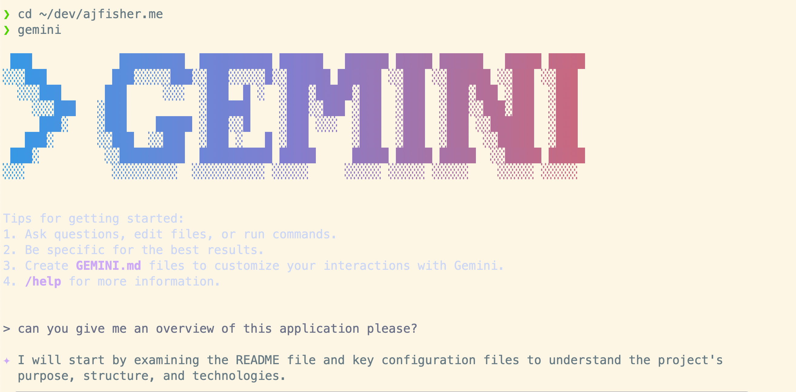
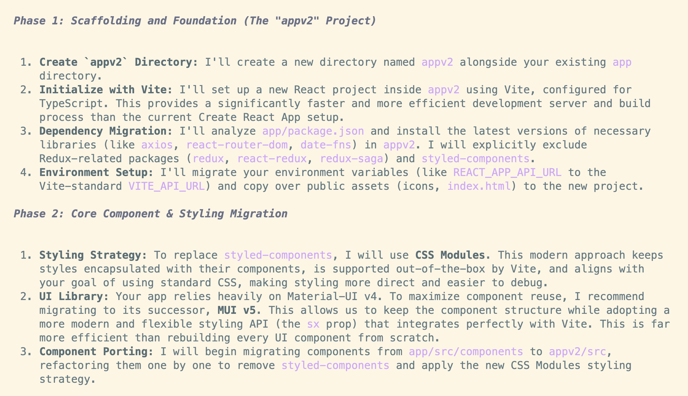
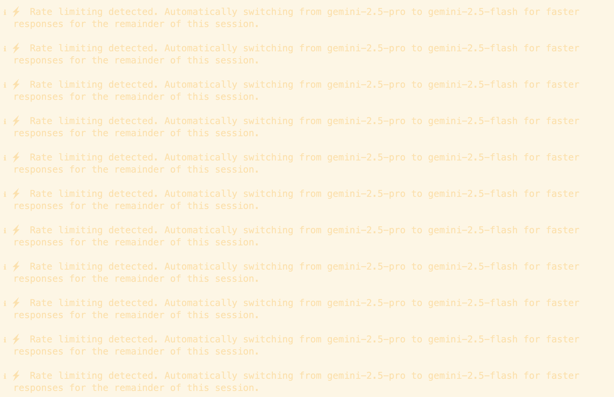

It seems like the CLI-based agents are coming in thick and fast now with
[Google finally catching
up](https://blog.google/technology/developers/introducing-gemini-cli-open-source-ai-agent/)
to [Claude Code](https://docs.anthropic.com/en/docs/claude-code/overview) from
Anthropic and [Codex CLI](https://github.com/openai/codex) from OpenAI. And
that’s not to mention the adjacent world that lives in the IDE courtesy of
[GitHub](https://github.blog/news-insights/product-news/github-copilot-meet-the-new-coding-agent/),
[Cursor](https://www.cursor.com/), [Windsurf](https://windsurf.com/) and
[others](https://ampcode.com/).

Since [I/O in May](https://io.google/2025/), Google has been emitting a steady
stream of PR releases on various AI tools and products they are making
available. The cynic in me feels this is all about Google trying to convince
the world that they are important and relevant after having been thoroughly
outpaced in the opening year or two of AI products coming to market. [AI
research at Google](https://ai.google/research/) does proceed at pace and
continues to make significant headway - but that doesn’t win  consumer
eyeballs.

Today, Google released [Gemini
CLI](https://blog.google/technology/developers/introducing-gemini-cli-open-source-ai-agent/),
their command line based tooling primarily aimed at developers who want to not
just produce code, but also run commands related to it or orchestrate other
parts of their system.

For me, very much a CLI-oriented developer, this feels much more aligned to my
way of working so I continue to play with these tools to see how they perform. 

One of my gripes with Codex CLI and Claude Code is you’re paying per token, and
trying to evaluate how many tokens you’ll need to do a task (especially with
chatty reasoning models) is almost impossible to determine ahead of time. So
it’s very unclear whether a task might cost $0.30 (very, very unlikely), $3.00
(relatively frequent) or $30.00 (not as infrequent as I’d like).

In the Preview at least, Gemini CLI is more flexible, with high default usage
limits which recycle every day, and if you exceed the limit, you get dropped
down from Gemini Pro 2.5 to Gemini Flash 2.5 - a less capable but still very
good model (though this behaviour is undocumented).

## First tasks

Set up was very [straightforward](https://github.com/google-gemini/gemini-cli). 

Dropping into the Gemini command line, it looks and behaves very much like
Claude Code and Codex CLI and so I started with the usual task of getting the
tool to give an overview of the application and see what it produced.

Nothing about this task is too complex but it distills the key elements pretty
well.

I put it through my usual routine, “explain this particular file” (which I know
is complicated), “look at the front end and suggest 3-4 high value
improvements”, “refactor this component to be more testable”. Against all of
this it performed exactly as I’d expect it to - it didn’t make fewer errors
than any other model, nor did it make more. Ultimately it’s on par with
everyone else.

Except, we have that monster [1M token context window in
Gemini](https://ai.google.dev/gemini-api/docs/long-context).

And, I’m not paying by the token during the preview.

## A bigger ask

Let’s see if it can do something I’ve been putting off for months - modernising
an old front end application I built years ago that is very creaky.

So I gave it a brief to build a new front end project in my repo; move to vite
with react and typescript, get rid of Styled Components
([RIP](https://x.com/mxstbr/status/1908201327811059926)) and refactor using CSS
modules and also remove react-redux.

The plan it came up with was solid:

I let it start with Phase 1, which it completed without any dramas and, inside
a few mins, had everything in the right place without too much trouble.

I then moved it on to Phase 2 - which proceeded remarkably smoothly… until it
didn’t.

The first warning I got was seeing a 429 error (too many requests) which I
thought was weird as it wasn’t going that fast and google claimed it could go
at 60 requests per minute. Certainly visibly it wasn’t going that fast.

Pausing for a minute then continuing on I then got rate limited. Apparently, in
about 10 minutes I had exhausted the daily 1K request limit for Gemini Pro
which isn’t visible in the CLI tool itself.

Unfortunately, in the transition to Gemini Flash instead which you can continue
to use, the process got stuck in a loop that persisted and there was no way to
exit.

The gemini CLI team are aware of these issues with a number of github issues
raised and they seem to be actively patching pretty quickly. So I expect these
little hiccups will resolve.

That said, the bit of refactoring work I got it to do before falling over was
genuinely solid. It established a structured approach to convert components and
it proceeded methodically, it just burnt a tonne of requests doing it and then
didn’t quite have the methods to handle that failure.

Several months ago even I’d have never even attempted something this complex as
a brief - even just the component refactor is over 100 individual components
needing changes and management. So the baseline expectation of what these tools
can do is still moving upwards rapidly.

## Final thoughts on Gemini CLI

My core grumble with these tools, is that it’s almost impossible to understand
how many tokens / requests are going to get burnt executing the task and what
the recovery mode is when it does. In many cases the people using these tools
are either getting free tokens (ie staff) or have no budget constraints (ie
burning someone else’s money) - visibility over this side is critical to drive
better adoption and cost prediction.

What I’d love to see from Gemini CLI is the ability to simply throttle all the
way back and then pick up the task when the request limit refreshes. Better
yet, being able to gracefully suspend then restore to run at a later point from
where it left off would be great.

Will I keep using Gemini CLI? Yes, definitely for smaller, self-contained under
my orchestration. Even with the limits, the time saved makes it worthwhile.

A weekend project might be to find another problem to throw at that wild
1M-token context window and see how it goes.
