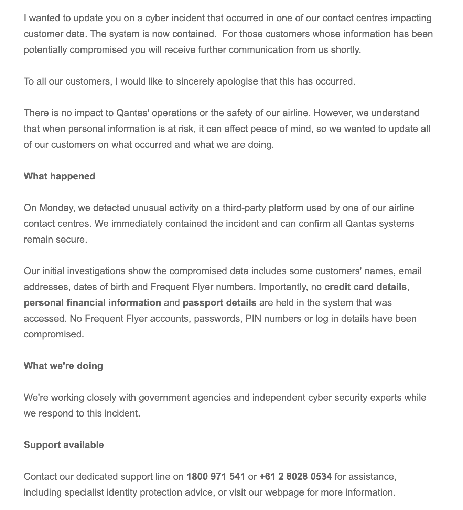

Data breaches come with such regularity now, that getting annoyed about any
one in particular feels nonsensical. That said, while the frequency may be
increasing, we can't accept this becoming normal.

We’ve hit the point where essentially no personal information given to a
business can be considered secure, and that it’s only a matter of time before a
breach occurs. This doesn't mean surrendering and letting bad actors run
roughshod, it means managing this risk as though this is the case.

It wasn’t really a surprise then, that this week Australia’s flagship airline,
Qantas, [announced that they had a data
breach](https://www.qantas.com/au/en/support/information-for-customers-on-cyber-incident.html)
that affected 6M customers. In the grand scheme of the hundreds of millions of
people affected in recent breaches, this barely ranks at all. Even in Australian
terms it’s not an [Optus](https://en.wikipedia.org/wiki/2022_Optus_data_breach)
or a [Medibank](https://en.wikipedia.org/wiki/Medibank#2022_cyberattack) in
terms of scale.

Exhibiting a bit of gallows humour, as I was about 99% confident my details
would be in the data, I took to
[BlueSky](https://bsky.app/profile/ajfisher.social/post/3lswvoeq7o22w) and
[LinkedIn](https://www.linkedin.com/posts/andrewfisher_privacy-qantas-security-activity-7345975837722034178-_IzI/)
to note that Qantas would now work through the “Data Breach PR Playbook”:

1. Acknowledge the incident (only because of the [mandatory breach disclosure
   laws from 2018](https://www.oaic.gov.au/privacy/notifiable-data-breaches))
2. Downplay the impact of the data loss (no credit card, passport info of
   passwords leaked)
3. Send out some comms to affected customers that reiterates the above but adds
   "be on the alert for scams that look like they are from us". (What I called
   "hearts and minds" comms).

The dismissiveness regarding personal information that accompanies this
playbook irritates me no end.

In 2025, changing a password or blocking and reissuing a Credit Card are so
trivial as to almost be a non-event for most people.

However, information like my name and date of birth are effectively immutable
and, in a highly digitised economy like Australia, being forced to change my
phone number or email address is going to affect everything from my utility
bills, to notifications from my kid's school to contact details with my doctor.
Changing them is possible, but it’s practically very difficult and time
consuming - with big implications when I do.

*Screenshot of email sent from Qantas about data breach*

When it came time to issuing their statement to affected customers a few hours
later, Qantas even doubled down on this message, reiterating that no card
details or passwords had been stolen. They mentioned the other points that had
been lost in passing (and only really because the law forces you to have to say
what was disclosed).

## Proliferating fraud potential

Yes, credit card numbers and identity theft are real problems, and cost the
community a huge amount annually. But in terms of fraud, this is becoming small
beer.

[Targeted, sophisticated, personalised
scams](https://en.wikipedia.org/wiki/Pig_butchering_scam) are now estimated to
be worth hundreds of billions (yes, with a B) of dollars a year and growing. And
that could be underestimated.

These scams don’t require credit card numbers or identity - what they
require is trust and connection.

With a data breach of this type, information like date of birth
allows scammers to do segmentation and potentially target messaging
at particular cohorts in different ways to maximise effect (eg a professional
connection vs a potential love interest).

*The more data for personalisation the better for scammers. (cc) ajfisher - Flux.Dev*

This data, along with that from other breaches, adds to the potential detail a
scammer can draw on to craft a plan to make contact with, then swindle their
intended victim.

Downplaying the importance of these details being breached is an absolution of
responsibility on behalf of the company who held that data in the first place.
However, it also doesn’t alert the customer to the potential implications of
this data being leaked, and disempowers them in the ongoing fight against scams.

Not withstanding more sophisticated scams, the ability of fraudsters to build a
replica of the Qantas rewards store to capture login credentials is virtually
trivial. These could then be used to login as a customer, redeem their points
against gift cards and then be launder them for cash - a potentially
lucrative pay day with almost zero recourse.

## Personal data is toxic waste

The teams I work with get sick of me talking about this. We might need to
capture personal information to facilitate outcomes via digital platforms (eg
you will need to fill in your personal info if you want something shipped from
an online store) - but only capture what is necessary and only send it as far
as is required.

Yes, there are tradeoffs inherent in this decision but in many organisations
the desire for more data, "just in case", is a powerful force driving that
discussion.

*Consider long term PII as a toxic byproduct of our systems*

Qantas clearly care about the security of personal information so much that
they let a third party have access (noted by them) to personal details of 6
million customers.

I suspect the reason for this is entirely mundane, and is something like
managing an outsourced contact centre to deal with customer support. This is
speculation on my part, but is not uncommon for many enterprises in my experience.

Given 6 million records is probably the full active base of customers Qantas
have, why would a third party need access to all of that information? Why are
the whole customer records being synced?

Even assuming it’s a customer contact automation platform of some type (eg
Salesforce), why would there be a level of access that could cause that type of
breach? And why that level of personal information stored in it (such as dates
of birth)?

These will be some of the questions that need to be answered as part of this
process - though I suspect they won't be tackled head on because orgs only care
about "scary" details like passport numbers, credit card details and passwords
due to customer perception that this is "serious".

## Personal data storage needs a rethink

If you design systems assuming that eventually they may be breached, your
design decisions fundamentally change.

This assumption starts a different line of questioning regarding what happens
if a breach occurs in a system.

Organisations need to completely rethink their privacy and data storage
practices and orient towards an assumption of disclosure and the implications
of that, rather than the mistaken belief they can protect all data in all
systems all the time. This is provably incorrect.

If you adopt this mindset then the design of your system changes:

- The best security of personal information is not capturing it in the first
  place. Do you actually need this data and if so, what for?
- Expire and then purge data when it’s no longer needed (compliance and
  regulatory requirements may drive the timing of this). If the process
  requiring the data is finished, why hang on to it?
- Tokenise sensitive data, refer to it and then use it “just in time” to do the
  action you require. Why do we need someone’s email address in every system?
  Why not hold a reference to an encrypted version instead right up to the
  point of sending an email.

Privacy by design takes more effort up front and requires architectural
discipline to achieve in a meaningful way across the enterprise. Likewise, many
vendors need to support things like just in time token exchange in their
systems.

But, just because something is hard, doesn’t mean it isn’t worthwhile.

It is becoming increasingly rare for major data breaches of credit card
information to occur. This is a result of legislation and fines, ensuring that
businesses are taking this seriously as well as technology systems being
improved to no longer require storage (such as card tokenisation for repeat or
recurring purchases).

The <b>improvements made relating to card security has been a sustained and
collaborative effort by all players</b> in the system. This came by recognising
that there was a problem that needed action, and then working through the detail
over long periods of time to drive the outcome.

None of this stuff is easy, but as we have seen this week with Qantas and the
dismissiveness that still occurs around the disclosure of personal information,
we're still some way away from getting everyone to agree that there’s a problem
that needs solving here.

I'm hopeful we'll get there eventually, and also hopeful that governments
legislate harder to create incentives for organisations to design
appropriately. In the same way that environmental and waste laws drive
organisational behaviour, if we start treating personal data as a toxic
byproduct of digital services then legislation to protect from these byproducts
makes sense. Legislation like the
[GDPR](https://en.wikipedia.org/wiki/General_Data_Protection_Regulation)
(with the teeth that come from fines) and the
[CCPA](https://en.wikipedia.org/wiki/California_Consumer_Privacy_Act) are good
examples of a starting point but need to go wider, deeper and have tough fines
so the calculus of deterrence makes sense for companies to take action.
